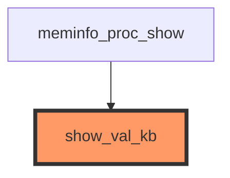

# Kernel-GraphRAG Sentinel

**AI-Powered Linux Kernel Code Analysis & Impact Assessment**

Kernel-GraphRAG Sentinel is an intelligent analysis tool that parses Linux kernel C code, builds comprehensive call graphs in Neo4j, tracks data flows, maps test coverage, and provides AI-powered impact analysis for code changes. Now with **data flow analysis** for security research and vulnerability detection.

[](https://www.python.org/downloads/)
[](https://neo4j.com/)
[](LICENSE)

---

## 🎯 Features

### Core Analysis (v0.1.0)
- **📊 Call Graph Analysis**: Multi-hop function call chain traversal (up to N hops)
- **📈 Call Graph Visualization**: Export call graphs in Mermaid, Graphviz DOT, and JSON formats
- **🧪 Test Coverage Mapping**: Automatic KUnit test-to-function mapping
- **🔍 Impact Assessment**: Analyze the impact of modifying any kernel function
- **🤖 LLM-Powered Reports**: AI-generated natural language impact analysis with embedded Mermaid diagrams
- **⚡ Risk Evaluation**: Identify critical uncovered functions

### Data Flow Analysis (v0.2.0) ⭐ NEW
- **🔄 Variable Tracking**: Extract and track all variables (parameters, locals, globals)
- **📍 Data Flow Analysis**: Intra-procedural flow tracking (assignments, operations, returns)
- **🔒 Security Analysis**: Taint analysis, buffer overflow detection, dead code identification
- **🗺️ Flow Visualization**: Neo4j-based data flow graphs with Cypher queries
- **🔎 Dependency Analysis**: Understand variable dependencies and data propagation

### LLM Support (Enhanced in v0.2.0)
- **5 LLM Providers**: OpenAI, Google Gemini, Anthropic Claude, Ollama, **LM Studio** (GUI local LLM)
- **Structured Reports**: Professional 10-section reports with call graph diagrams
- **FREE Options**: Ollama and LM Studio for unlimited local usage

### Infrastructure
- **🌳 Tree-sitter Parsing**: Accurate C code AST extraction with macro preprocessing
- **🗄️ Neo4j Graph Database**: Efficient storage and querying of code relationships
- **🖥️ CLI Interface**: User-friendly command-line tool with 8+ commands
- **📝 YAML Configuration**: Flexible configuration management
- **🔧 Subsystem Auto-detection**: Automatic detection of kernel subsystem boundaries

---

## 🏗️ Architecture

```
┌─────────────────────────────────────────────────────────────┐
│                    Kernel Source Code                        │
│                    (Linux 6.13+)                             │
└───────────────────────┬─────────────────────────────────────┘
                        │
        ┌───────────────▼────────────────┐
        │    Module A: C Code Parser      │
        │  • tree-sitter AST extraction   │
        │  • GCC preprocessor integration │
        │  • Function/call detection      │
        └───────────────┬─────────────────┘
                        │ (Functions, Calls)
        ┌───────────────▼─────────────────┐
        │  Module D: Data Flow Analysis    │ ⭐ NEW in v0.2.0
        │  • Variable tracking             │
        │  • Flow graph building           │
        │  • Security pattern detection    │
        └───────────────┬─────────────────┘
                        │ (Variables, Flows)
        ┌───────────────▼─────────────────┐
        │  Module B: Graph Database        │
        │  • Neo4j storage                 │
        │  • Node/relationship management  │
        │  • Batch ingestion               │
        └───────────────┬─────────────────┘
                        │ (Graph Data)
        ┌───────────────▼─────────────────┐
        │  Module C: KUnit Test Mapper     │
        │  • Test file parsing             │
        │  • Function coverage mapping     │
        │  • COVERS relationships          │
        └───────────────┬─────────────────┘
                        │
        ┌───────────────▼─────────────────┐
        │  Impact Analysis Module          │
        │  • Multi-hop call traversal      │
        │  • Data flow analysis            │
        │  • Test coverage assessment      │
        │  • Risk level calculation        │
        │  • LLM-powered report generation │
        └──────────────────────────────────┘
```

---

## 🚀 Quick Start

### Prerequisites

- Python 3.12+
- Neo4j 5.14+ (local installation or Docker)
- Linux kernel source tree (tested with 6.13+)
- 4GB+ RAM recommended

### Installation

1. **Clone the repository**

```bash
git clone https://github.com/yourusername/kernel-graphrag-sentinel.git
cd kernel-graphrag-sentinel
```

2. **Install Python dependencies**

```bash
pip install -r requirements.txt
```

3. **Install Neo4j**

Option A: Using the provided script (Ubuntu/Debian)
```bash
sudo ./scripts/install_neo4j.sh
```

Option B: Using Docker
```bash
docker run -d \
  --name neo4j \
  -p 7474:7474 -p 7687:7687 \
  -e NEO4J_AUTH=neo4j/password123 \
  neo4j:5.14
```

4. **Configure environment**

```bash
cp .env.template .env
# Edit .env with your settings
export KERNEL_ROOT=/path/to/linux-6.13
export NEO4J_PASSWORD=password123
```

5. **Verify installation**

```bash
python3 src/main.py version
```

### First Analysis

Run the complete analysis pipeline on a kernel subsystem:

```bash
# Extract, ingest, and map tests for /proc filesystem
python3 src/main.py pipeline fs/proc

# Analyze a specific function (show_val_kb formats memory statistics for /proc/meminfo)
python3 src/main.py analyze show_val_kb --max-depth 3

# Generate AI-powered impact report
python3 src/main.py analyze show_val_kb --llm --output report.md

# View database statistics
python3 src/main.py stats
```

---

## 📖 Usage Guide

### CLI Commands

The `main.py` CLI provides comprehensive kernel analysis capabilities:

#### 1. **Ingest Subsystem**

Extract and ingest kernel code into Neo4j:

```bash
python3 src/main.py ingest fs/ext4
python3 src/main.py ingest fs/ext4 --clear-db  # Clear DB first
python3 src/main.py ingest net/ipv4 --skip-preprocessing
```

**Output:**
- Functions extracted and stored
- Call relationships mapped
- File and subsystem hierarchy created

#### 2. **Map Test Coverage**

Map KUnit test cases to tested functions:

```bash
python3 src/main.py map-tests fs/ext4
```

**Output:**
- Test cases identified
- COVERS relationships created
- Coverage statistics

#### 3. **Analyze Function Impact**

Comprehensive impact analysis for any function:

```bash
# Standard impact analysis
python3 src/main.py analyze show_val_kb

# Deeper analysis (up to 5 hops)
python3 src/main.py analyze show_val_kb --max-depth 5

# Save to file
python3 src/main.py analyze show_val_kb --output report.txt

# AI-powered natural language report (requires LLM configuration)
python3 src/main.py analyze show_val_kb --llm

# Compare different LLM providers
LLM_PROVIDER=anthropic python3 src/main.py analyze show_val_kb --llm
LLM_PROVIDER=gemini python3 src/main.py analyze show_val_kb --llm
LLM_PROVIDER=ollama python3 src/main.py analyze show_val_kb --llm
```

**Standard Output:**
```
IMPACT ANALYSIS: show_val_kb
================================================================================
File: /workspaces/ubuntu/linux-6.13/fs/proc/meminfo.c

SUMMARY
  Direct callers:       49
  Indirect callers:     0
  Direct callees:       0
  Indirect callees:     0
  Direct test coverage: 0
  Indirect test coverage: 0
  Total call chains:    1

RISK ASSESSMENT
  Risk Level: CRITICAL (widely used, no test coverage)
```

**LLM-Powered Output Example:**

See comprehensive example reports in `docs/examples/reports/` directory comparing 5 LLM providers:
- **Anthropic Claude Haiku 4-5** (203 lines) - Best quality, recommended for production
- **OpenAI GPT-5 Mini** (171 lines) - Most comprehensive OpenAI model
- **Gemini 3.0 Pro** (74 lines) - Balanced speed and quality, free tier
- **Ollama Qwen3-VL 30B** (150 lines) - Unlimited local usage
- **LM Studio** (local model) - FREE GUI-based local LLM ⭐ NEW

#### 4. **Data Flow Analysis** ⭐ NEW in v0.2.0

Track variables and analyze data flows for security research:

```bash
# Ingest data flow information for a subsystem
python3 src/main.py ingest-dataflow fs/ext4

# Analyze variable data flows
python3 src/main.py dataflow inode --max-depth 5 --direction both

# Track specific variable in a function
python3 src/main.py dataflow buffer --function ext4_file_write_iter

# Query data flows directly
python3 src/main.py query "
MATCH (v:Variable {is_parameter: true})
WHERE v.scope = 'ext4_file_write_iter'
RETURN v.name, v.var_type
"
```

**Security Analysis Examples:**

```bash
# 1. Taint Analysis - Find user-controlled input flows
python3 src/main.py query "
MATCH path = (source:Variable)-[:FLOWS_TO*1..7]->(sink:Variable)
WHERE source.name =~ '.*user.*'
RETURN source.scope, source.name, sink.name, length(path) as depth
ORDER BY depth LIMIT 20
"

# 2. Buffer Tracking - Find buffer variables and sizes
python3 src/main.py query "
MATCH (buf:Variable), (size:Variable)
WHERE buf.var_type CONTAINS 'char'
  AND size.name =~ '.*size.*|.*len.*'
  AND buf.scope = size.scope
RETURN buf.scope, buf.name, size.name
"

# 3. Dead Variable Detection - Find unused variables
python3 src/main.py query "
MATCH (v:Variable)
WHERE NOT (v)-[:USES]->() AND NOT (v)-[:FLOWS_TO]->()
  AND v.is_parameter = false
RETURN v.name, v.scope, v.file_path
LIMIT 50
"
```

**Output:**
- Variable definitions and uses extracted
- Data flow relationships mapped
- Security patterns identified
- Neo4j graph ready for complex queries

**Documentation:**
- [Data Flow Analysis Guide](docs/dataflow_analysis_guide.md) - Complete user guide
- [Query Examples](docs/examples/dataflow_query_examples.md) - 22 practical Cypher queries

Sample output (Anthropic Claude):
```markdown
# Impact Analysis Report: show_val_kb Modification

## Executive Summary
- Function: show_val_kb (fs/proc/meminfo.c)
- Risk Level: 🔴 HIGH - Critical /proc/meminfo interface
- Impact: System monitoring tools, OOM killers, memory management

## 1. Code Affected by Change
**Primary Impact:** /proc/meminfo formatting (49 call sites in meminfo_proc_show)
**Downstream Impact:**
- procps suite (free, top, vmstat)
- System monitors (htop, glances)
- Cloud agents (Prometheus, Datadog)

## 2. Tests to Run
**Mandatory:**
- LTP fs/proc test suite
- Kselftest tools/testing/selftests/proc/
- Userspace tool validation (free -k, vmstat -s)

## 3. New Tests Recommended
- [ ] Format consistency test (before/after diff)
- [ ] Boundary value testing (zero, TB+ memory)
- [ ] KUnit test for show_val_kb directly

## 4. Risk Level: HIGH
**Rationale:** /proc/meminfo is a stable ABI. Breaking format = breaking userspace.
49 call sites means single bug affects all memory statistics output.

## 5. Implementation Recommendations
✓ Preserve exact output format ("%12lu kB\n")
✓ Golden image comparison in patch description
✓ Test on 32-bit and 64-bit architectures
✓ Verify no integer overflow for large memory systems
```

#### 4. **Complete Pipeline**

Run full analysis in one command:

```bash
python3 src/main.py pipeline fs/ext4
```

This executes:
1. Ingest subsystem code
2. Map test coverage
3. Display statistics

#### 5. **Database Statistics**

View current database state:

```bash
python3 src/main.py stats
```

**Output:**
```json
{
  "Function_count": 1121,
  "TestCase_count": 13,
  "File_count": 37,
  "CALLS_count": 2254,
  "COVERS_count": 17
}
```

#### 6. **Top Functions**

Identify most frequently called functions:

```bash
python3 src/main.py top-functions --limit 20
python3 src/main.py top-functions --subsystem ext4 --min-callers 10
```

**Output:**
```
TOP CALLED FUNCTIONS (min 5 callers)
  1. ext4_get_inode_loc               (28 calls) - inode.c
  2. ext4_free_blocks                 (23 calls) - mballoc.c
  3. ext4_map_blocks                  (22 calls) - inode.c
```

#### 7. **Export Call Graph Visualization**

Export call graphs in various formats for visualization:

```bash
# Export as Mermaid diagram (for GitHub, VS Code, documentation)
python3 src/main.py export-graph show_val_kb --format mermaid

# Export as Graphviz DOT format (for rendering with dot/graphviz)
python3 src/main.py export-graph show_val_kb --format dot -o show_val_kb.dot
# Render: dot -Tpng show_val_kb.dot -o show_val_kb.png

# Export as JSON (for custom processing/visualization)
python3 src/main.py export-graph show_val_kb --format json

# Control graph depth and direction
python3 src/main.py export-graph show_val_kb --max-depth 2 --direction callers
python3 src/main.py export-graph show_val_kb --max-depth 3 --direction both
```

**Available Formats:**
- `mermaid`: GitHub-compatible diagram syntax (view in VS Code, GitHub, or https://mermaid.live/)
- `dot`: Graphviz DOT format for professional graph rendering
- `json`: Structured data with nodes, edges, and statistics

**Direction Options:**
- `callers`: Show only functions that call the target
- `callees`: Show only functions called by the target
- `both`: Show both callers and callees (default)

**Example Mermaid Output:**


**Note:** LLM-powered reports (`--llm` flag) automatically include embedded Mermaid diagrams in the report output.

#### 8. **Generate Configuration**

Create configuration template:

```bash
python3 src/main.py init-config --output my-config.yaml
```

---

## ⚙️ Configuration

### YAML Configuration File

Create a configuration file for your analysis:

```yaml
# examples/analyze_ext4.yaml
kernel:
  root: /workspaces/ubuntu/linux-6.13
  subsystem: fs/ext4

neo4j:
  url: bolt://localhost:7687
  user: neo4j
  password: password123

preprocessing:
  enable_cpp: false  # Enable GCC preprocessor
  kernel_config: .config

analysis:
  max_call_depth: 3
  include_indirect_calls: true
  max_results: 100

llm:
  provider: gemini  # openai, gemini, anthropic, ollama
  model: gemini-3-flash-preview
  api_key: ${GEMINI_API_KEY}
  temperature: 0.7
```

**Supported LLM Providers:**
- **OpenAI**: GPT-4, GPT-5 Nano/Mini (reasoning models)
- **Google Gemini**: Flash/Pro models (uses `google-genai` package)
- **Anthropic**: Claude Haiku 4-5 (best quality)
- **Ollama**: Local models (qwen3-vl:30b, unlimited usage)

See `docs/llm_provider_guide.md` for detailed setup and `examples/reports/` for quality comparison.

Use the configuration:

```bash
python3 src/main.py --config my-config.yaml pipeline fs/proc
```

### Environment Variables

Override configuration with environment variables:

```bash
export KERNEL_ROOT=/custom/path/to/linux
export NEO4J_URL=bolt://remote-server:7687
export NEO4J_PASSWORD=secret

# LLM provider configuration
export LLM_PROVIDER=anthropic
export ANTHROPIC_API_KEY=your-key-here
```

**Environment Variable Precedence** (highest to lowest):
1. Command-line environment variables: `LLM_PROVIDER=gemini python3 src/main.py ...`
2. Shell environment variables: `export LLM_PROVIDER=gemini`
3. `.env` file values

This allows easy provider switching without modifying configuration files:
```bash
# Use Anthropic for this analysis
LLM_PROVIDER=anthropic python3 src/main.py analyze show_val_kb --llm

# Use Gemini for quick test
LLM_PROVIDER=gemini python3 src/main.py analyze show_val_kb --llm
```

---

## 📚 Example Reports & Documentation

The `examples/` directory contains comprehensive documentation and real-world analysis examples:

### LLM Provider Comparison Reports

All reports analyze the same function (`show_val_kb` from `fs/proc/meminfo.c`) for direct quality comparison:

| Provider | Model | Lines | Time | Quality | Best For |
|----------|-------|-------|------|---------|----------|
| **Built-in** | rule-based | 38 | <1s | ⭐⭐⭐ | CI/CD, baseline |
| **Anthropic** | claude-haiku-4-5 | 203 | 18s | ⭐⭐⭐⭐⭐ | Production |
| **OpenAI** | gpt-5-mini | 171 | 40s | ⭐⭐⭐⭐⭐ | Comprehensive |
| **OpenAI** | gpt-5.2 | 156 | 38s | ⭐⭐⭐⭐⭐ | Latest GPT |
| **Gemini** | 3.0-pro | 74 | 15s | ⭐⭐⭐⭐ | Balanced |
| **Ollama** | qwen3-vl:30b | 150 | 45s | ⭐⭐⭐⭐ | Unlimited local |

**View Reports:** `examples/reports/` directory (10 reports total)
**Documentation:** `examples/README.md` - comprehensive guide with 30+ query examples
**Setup Guide:** `docs/llm_provider_guide.md` - provider configuration & troubleshooting

---

## 📊 Example Analysis Results

### Case Study: ext4_mb_new_blocks_simple

```bash
$ python3 src/main.py analyze ext4_mb_new_blocks_simple --max-depth 3
```

**Analysis Output:**

```
IMPACT ANALYSIS: ext4_mb_new_blocks_simple
================================================================================
File: /workspaces/ubuntu/linux-6.13/fs/ext4/mballoc.c

SUMMARY
--------------------------------------------------------------------------------
  Direct callers:       1
  Indirect callers:     11 (2-3 hops)
  Direct callees:       4
  Indirect callees:     14 (2-3 hops)
  Direct test coverage: 1
  Indirect test coverage: 0
  Total call chains:    12

DIRECT CALLERS (functions that call this function)
--------------------------------------------------------------------------------
  1. ext4_mb_new_blocks (mballoc.c:6154)

INDIRECT CALLERS (multi-hop call chains)
--------------------------------------------------------------------------------
  1. ext4_alloc_branch (indirect.c) [depth: 2]
      Chain: ext4_alloc_branch → ext4_mb_new_blocks → ext4_mb_new_blocks_simple
  2. ext4_ext_map_blocks (extents.c) [depth: 2]
      Chain: ext4_ext_map_blocks → ext4_mb_new_blocks → ext4_mb_new_blocks_simple
  3. ext4_map_blocks_es_recheck (inode.c) [depth: 3]
      Chain: ext4_map_blocks_es_recheck → ext4_ext_map_blocks →
             ext4_mb_new_blocks → ext4_mb_new_blocks_simple

TEST COVERAGE
--------------------------------------------------------------------------------
  Direct coverage:
    - test_new_blocks_simple (mballoc-test.c)

RISK ASSESSMENT
--------------------------------------------------------------------------------
  Risk Level: MEDIUM-HIGH (used often, limited test coverage)
================================================================================
```

**Insights:**
- Function has 1 direct caller but 11 indirect callers
- Call chains extend up to 3 hops deep
- Has 1 test covering it directly
- Risk level is MEDIUM-HIGH due to widespread usage with limited testing

---

## 🗂️ Project Structure

```
kernel-graphrag-sentinel/
├── src/
│   ├── main.py                # CLI entry point
│   ├── config.py              # Configuration management
│   ├── module_a/              # C Code Parser
│   │   ├── preprocessor.py    # GCC preprocessor integration
│   │   ├── parser.py          # tree-sitter C parser
│   │   └── extractor.py       # Function/call extraction
│   ├── module_b/              # Graph Database
│   │   ├── graph_store.py     # Neo4j driver integration
│   │   ├── schema.py          # Graph schema definitions
│   │   └── ingestion.py       # Data ingestion pipeline
│   ├── module_c/              # KUnit Test Mapper
│   │   ├── kunit_parser.py    # Test file parsing
│   │   └── test_mapper.py     # Test-to-function mapping
│   └── analysis/              # Impact Analysis
│       ├── queries.py         # Cypher query templates
│       ├── impact_analyzer.py # Impact analysis engine
│       ├── llm_reporter.py    # LLM report generation
│       └── graph_exporter.py  # Call graph visualization (Mermaid, DOT, JSON)
├── scripts/
│   ├── install_neo4j.sh       # Neo4j installation script
│   └── setup_tree_sitter.sh   # tree-sitter setup
├── examples/
│   ├── README.md              # Comprehensive examples documentation
│   ├── analyze_ext4.yaml      # Example configuration
│   ├── query_examples.md      # 30+ Neo4j Cypher query examples
│   └── reports/               # 10 LLM provider comparison reports
│       ├── rule-based-report.md            # Non-LLM baseline
│       ├── anthropic-claude-haiku-4-5-report.md
│       ├── openai-gpt5-nano-report.md
│       ├── openai-gpt5-mini-report.md
│       ├── openai-gpt5.2-report.md
│       ├── gemini-3.0-flash-report.md
│       ├── gemini-3.0-pro-report.md
│       ├── gemini-2.5-pro-report.md
│       └── qwen3-vl-30b-report.md
├── docs/
│   ├── architecture.md        # System architecture (1,200+ lines)
│   ├── neo4j_setup.md        # Neo4j installation & configuration
│   ├── macro_handling.md     # GCC preprocessor integration
│   └── llm_provider_guide.md # LLM provider comparison & setup
├── requirements.txt           # Python dependencies
├── .env.template              # Environment template
└── README.md                  # This file
```

---

## 🔬 Technical Details

### Supported Kernel Versions

Tested with:
- Linux 6.13
- Linux 6.12
- Should work with 6.x series

### Graph Schema

**Nodes:**
- `Function`: Kernel functions
- `TestCase`: KUnit test cases
- `File`: Source files
- `Subsystem`: Kernel subsystems

**Relationships:**
- `CALLS`: Function → Function (call relationship)
- `COVERS`: TestCase → Function (test coverage)
- `CONTAINS`: File → Function (containment)
- `BELONGS_TO`: File → Subsystem (hierarchy)

### Query Performance

**Benchmarks (ext4 subsystem):**
- Parsing: ~20 seconds for 37 files
- Ingestion: ~5 seconds for 1,121 functions
- Impact analysis: ~1 second per function (depth=3)

### Limitations

- **Macro expansion**: Optional GCC preprocessing (can be slow)
- **Function pointers**: Static analysis limitations
- **External calls**: Functions outside subsystem marked as external
- **Header files**: Currently analyzes .c files only

---

## 🧪 Testing

### Run Tests

```bash
# Unit tests
pytest tests/

# Specific module
pytest tests/test_parser.py

# With coverage
pytest --cov=src tests/
```

### Test a Different Subsystem

```bash
# Test with btrfs filesystem
python3 src/main.py pipeline fs/btrfs

# Test with networking stack
python3 src/main.py pipeline net/ipv4
```

---

## 🛠️ Development

### Code Quality

```bash
# Format code
black src/ tests/

# Type checking
mypy src/

# Linting
ruff check src/
```

### Adding New Features

1. Fork the repository
2. Create feature branch: `git checkout -b feature-name`
3. Implement changes with tests
4. Run test suite: `pytest tests/`
5. Submit pull request

---

## 📚 Use Cases

### 1. Code Change Impact Assessment

Before modifying a kernel function:
```bash
python3 src/main.py analyze <function_name>
```
Understand:
- What functions will be affected
- Which tests need to run
- Risk level of the change

### 2. Test Coverage Analysis

Identify untested critical functions:
```bash
python3 src/main.py top-functions --min-callers 20
```
Then check each for test coverage.

### 3. Subsystem Architecture Understanding

Build call graph for any subsystem:
```bash
python3 src/main.py ingest fs/ext4
python3 src/main.py stats
```

### 4. Refactoring Planning

Before refactoring, analyze call chains:
```bash
python3 src/main.py analyze <target_function> --max-depth 5
```

---

## 🐛 Troubleshooting

### Neo4j Connection Issues

```bash
# Check Neo4j status
sudo service neo4j status

# Start Neo4j
sudo service neo4j start

# Test connection
python3 -c "from src.module_b.graph_store import Neo4jGraphStore; Neo4jGraphStore().execute_query('RETURN 1')"
```

### Parsing Errors

If parsing fails:
1. Try with `--skip-preprocessing` flag
2. Check kernel source path: `echo $KERNEL_ROOT`
3. Verify tree-sitter installation: `python3 -c "import tree_sitter_c"`

### Performance Issues

For large subsystems:
- Use `--skip-preprocessing` for faster parsing
- Increase Neo4j heap size in `neo4j.conf`
- Run analysis in batches

---

## 🗺️ Roadmap

### Completed (v0.1.0)
- ✅ Tree-sitter C parser integration with macro preprocessing
- ✅ Neo4j graph database storage
- ✅ KUnit test mapping
- ✅ Multi-hop call chain analysis
- ✅ CLI interface with comprehensive commands
- ✅ YAML configuration with environment variable override
- ✅ LLM-powered natural language reports (4 providers: Anthropic, OpenAI, Gemini, Ollama)
- ✅ LLM provider comparison (10 example reports across all providers)
- ✅ Call graph visualization (Mermaid, Graphviz DOT, JSON export)
- ✅ Embedded Mermaid diagrams in LLM reports
- ✅ Subsystem auto-detection utility
- ✅ Multi-subsystem analysis (tested with ext4, btrfs, proc)
- ✅ Comprehensive documentation:
  - `docs/architecture.md` (1,200+ lines) - System architecture
  - `docs/macro_handling.md` (800+ lines) - GCC preprocessor integration
  - `docs/neo4j_setup.md` (700+ lines) - Database setup & tuning
  - `docs/llm_provider_guide.md` (643 lines) - LLM provider comparison
  - `examples/README.md` (700+ lines) - Examples & query library
- ✅ Google GenAI migration (updated from deprecated package)
- ✅ Environment variable precedence fix (command-line > .env)

### Planned (v0.2.0)
- [ ] Web UI for visualization
- [ ] Data flow analysis
- [ ] Struct field tracking
- [ ] Git integration for historical analysis
- [ ] Parallel preprocessing for large subsystems

### Future
- [ ] IDE integration (VS Code, Neovim)
- [ ] CI/CD pipeline integration
- [ ] Performance profiling integration
- [ ] Kernel module analysis

---

## 📄 License

This project is licensed under the MIT License - see the [LICENSE](LICENSE) file for details.

---

## 🙏 Acknowledgments

- **tree-sitter**: https://tree-sitter.github.io/
- **Neo4j**: https://neo4j.com/
- **Click**: https://click.palletsprojects.com/
- **Linux Kernel**: https://kernel.org/

---

## 📧 Contact & Support

- **Issues**: [GitHub Issues](https://github.com/yourusername/kernel-graphrag-sentinel/issues)
- **Discussions**: [GitHub Discussions](https://github.com/yourusername/kernel-graphrag-sentinel/discussions)

---

## 📊 Project Statistics

**Current Database (3 subsystems: ext4, btrfs, proc):**
- 4,188 Functions analyzed
- 10,003 Call relationships mapped
- 13 Test cases identified
- 17 Test coverage mappings
- 134 Source files processed
- 3 Subsystems ingested

**Documentation:**
- 4,000+ total documentation lines
- 10 LLM provider example reports
- 30+ Neo4j Cypher query examples
- 4 comprehensive guides (architecture, Neo4j, macros, LLM providers)
- Full CLI command reference

**Analysis Capabilities:**
- Multi-hop call graph traversal (up to 10 hops)
- Risk assessment (4 levels: LOW, MEDIUM, HIGH, CRITICAL)
- Test coverage tracking (direct and indirect)
- Cross-subsystem dependency detection
- AI-powered natural language reports (4 LLM providers)
- Subsystem boundary auto-detection
- Environment-based provider switching

---

**Built with ❤️ for the Linux kernel community**
