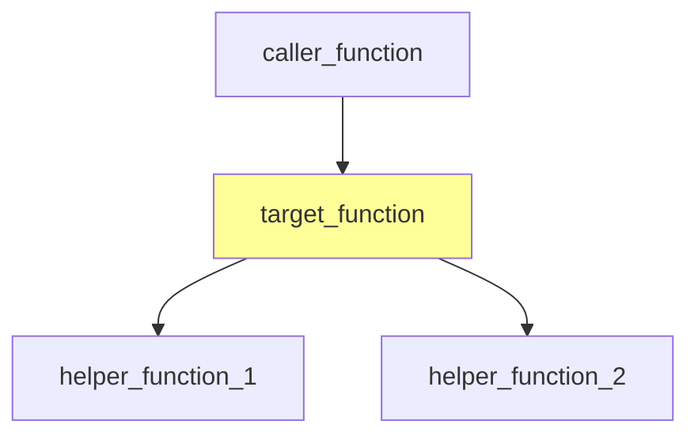

# Release Notes: Kernel-GraphRAG Sentinel v0.2.0

**Release Date:** 2025-12-28
**Code Name:** "Data Flow Analysis"
**Status:** Production Ready

---

## 🎯 Overview

Version 0.2.0 introduces **Module D - Data Flow Analysis**, a powerful intra-procedural variable tracking and data flow analysis system for Linux kernel C code. This release enables security researchers and kernel developers to track how data flows through functions, identify potential vulnerabilities, and understand variable dependencies.

**Key Highlights:**
- ✅ Variable tracking (parameters, locals, globals)
- ✅ Intra-procedural data flow analysis
- ✅ Neo4j graph storage for data flows
- ✅ Security analysis capabilities (taint tracking, buffer analysis)
- ✅ 5 LLM providers (added LM Studio support)
- ✅ Structured system prompts for consistent high-quality reports
- ✅ Call graph visualization in LLM reports
- ✅ Comprehensive documentation and examples

---

## 🚀 New Features

### Module D: Data Flow Analysis

#### Variable Tracking
Track all variables in your kernel code with rich metadata:

```bash
# Ingest data flows for a subsystem
kgraph ingest-dataflow fs/ext4

# Analyze variable flows
kgraph dataflow inode --max-depth 5 --direction both
```

**Variable Information Extracted:**
- Name, type, scope (function)
- File path and line number
- Parameter vs. local vs. static
- Pointer detection
- Initializer expressions

**Data Flow Types:**
- Assignment flows (a = b)
- Operation flows (c = a + b)
- Return value flows
- Cross-statement dependencies

#### Neo4j Schema for Data Flows

**New Node Type:**
- `Variable` - Represents variable definitions and uses

**New Relationships:**
- `FLOWS_TO` - Data flows from one variable to another
- `DEFINES` - Variable definition relationship
- `USES` - Variable usage relationship

**Schema Example:**
```cypher
// Find all data flows in a function
MATCH (v1:Variable)-[:FLOWS_TO]->(v2:Variable)
WHERE v1.scope = "ext4_file_write_iter"
RETURN v1.name, v2.name
```

#### Security Analysis Capabilities

**1. Taint Analysis** - Track user-controlled input:
```cypher
MATCH path = (source:Variable)-[:FLOWS_TO*1..7]->(sink:Variable)
WHERE source.name =~ ".*user.*"
RETURN source.scope, sink.name, length(path) as depth
```

**2. Buffer Overflow Detection** - Find buffers and size variables:
```python
tracker = VariableTracker()
defs, uses = tracker.extract_from_file("fs/ext4/inode.c")
buffers = [v for v in defs if 'buf' in v.name.lower()]
```

**3. Dead Variable Detection** - Find unused variables:
```cypher
MATCH (v:Variable)
WHERE NOT (v)-[:USES]->() AND NOT (v)-[:FLOWS_TO]->()
RETURN v.name, v.scope, v.file_path
```

#### CLI Commands

**New Commands:**
- `kgraph ingest-dataflow <subsystem>` - Ingest data flow information
- `kgraph dataflow <variable>` - Analyze variable data flows

**Command Options:**
```bash
# Analyze specific function
kgraph dataflow buffer --function ext4_read_block

# Control flow direction
kgraph dataflow count --direction forward   # What uses 'count'?
kgraph dataflow result --direction backward # What defines 'result'?
kgraph dataflow data --direction both       # Both directions

# Limit search depth
kgraph dataflow var --max-depth 3
```

#### Python API

**Variable Extraction:**
```python
from src.module_d.variable_tracker import VariableTracker

tracker = VariableTracker()
defs, uses = tracker.extract_from_file("fs/ext4/inode.c")

for var in defs:
    print(f"{var.name}: {var.var_type} in {var.scope}")
```

**Flow Building:**
```python
from src.module_d.flow_builder import FlowBuilder

builder = FlowBuilder()
flows, var_defs = builder.build_intra_procedural_flows("fs/ext4/inode.c")

for flow in flows:
    print(f"{flow.source_name} -> {flow.target_name}")
```

**Neo4j Ingestion:**
```python
from src.module_d.flow_ingestion import DataFlowIngestion

ingestion = DataFlowIngestion(store)
stats = ingestion.ingest_file("fs/ext4/inode.c", subsystem="fs/ext4")
```

### LM Studio Support

Added LM Studio as the 5th local LLM provider for completely offline, GUI-based LLM usage.

**Configuration:**
```bash
# .env file
LLM_PROVIDER=lmstudio
LMSTUDIO_BASE_URL=http://localhost:1234/v1
LMSTUDIO_MODEL=your-model-name
```

**Benefits:**
- ✅ FREE unlimited usage
- ✅ User-friendly GUI for model management
- ✅ OpenAI-compatible API
- ✅ No API key required
- ✅ Complete privacy (runs locally)

**All Supported Providers:**
1. OpenAI (GPT-4, GPT-5, etc.)
2. Google Gemini (2.0 Flash, 2.5 Pro, 3.0 Pro)
3. Anthropic Claude (Sonnet, Haiku, Opus)
4. Ollama (CLI-based local LLMs)
5. **LM Studio (GUI-based local LLMs)** ⭐ NEW

### Structured System Prompts

Standardized LLM report generation with a professional 10-section template based on high-quality Anthropic Claude reports.

**Report Structure:**
1. **Header Section** - Title, file path, risk level emoji (🟢🟡🔴⚫)
2. **Executive Summary** - 2-3 sentence overview
3. **Code Impact Analysis** - Affected components + call graph visualization
4. **Testing Requirements** - Existing coverage + mandatory tests
5. **Recommended New Tests** - Specific test cases
6. **Risk Assessment** - Risk level with justification table
7. **Implementation Recommendations** - Phase-by-phase checklist
8. **Escalation Criteria** - When to stop and escalate
9. **Recommendations Summary** - Priority table
10. **Conclusion** - Final recommendation

**Benefits:**
- ✅ Consistent report quality across all providers
- ✅ Actionable recommendations with specific commands
- ✅ Professional formatting (tables, checkboxes, code blocks)
- ✅ Risk-aware tone with clear escalation criteria

### Call Graph Visualization in Reports

Mermaid diagrams now automatically included in LLM-generated reports (Section 3.3).

**Example Output:**


**Benefits:**
- ✅ Visual understanding of function relationships at a glance
- ✅ Shows direct callers and callees
- ✅ Highlights target function
- ✅ Renders in GitHub, VSCode, and documentation sites

---

## 📊 Statistics

### Code Added
- **Module D Implementation:** 1,200+ lines
  - `variable_tracker.py`: 367 lines
  - `flow_builder.py`: 274 lines
  - `flow_schema.py`: 44 lines
  - `flow_ingestion.py`: 327 lines
- **Integration Tests:** 374 lines
- **Documentation:** 1,500+ lines
  - User guide: 625 lines
  - Query examples: 461 lines
  - System prompt template: 272 lines
  - Progress tracking: 200+ lines
- **Example Code:** 195 lines (dataflow_example.py)

**Total:** ~3,500 lines of production code, tests, and documentation

### Test Coverage
- **Module D Unit Tests:** 3 test files
  - `test_module_d_variable_tracker.py`
  - `test_module_d_flow_builder.py`
  - `test_module_d_flow_ingestion.py`
- **Module D Integration Tests:** 14 tests (test_integration_dataflow.py)
- **Total Tests:** 94+ tests across all modules

### Documentation
- **New Guides:**
  - Data Flow Analysis User Guide (426 lines)
  - LLM Report System Prompt Template (272 lines)
  - Data Flow Query Examples (22 queries, 461 lines)
- **Updated Guides:**
  - LLM Provider Guide (added LM Studio section)
  - Examples README (updated with v0.2.0 features)

### Performance
- **Variable Extraction:** <5 seconds for 10-function file
- **Flow Building:** <5 seconds for moderate complexity
- **Neo4j Ingestion:** Batched for efficiency

---

## 🔧 Improvements

### LLM Reporter Enhancements
- Split system/user messages for better provider compatibility
- Increased max_tokens to 4096 for detailed reports (Anthropic, LM Studio)
- Provider-specific methods for cleaner code organization
- Enhanced context building with visual separators

### Configuration
- Added `lmstudio` provider support
- Environment variable defaults for all 5 providers
- Updated `.env.template` with comprehensive examples

### CLI
- Two new commands: `ingest-dataflow`, `dataflow`
- Improved help text and command descriptions
- Better error messages and validation

---

## 📚 Documentation

### New Documentation Files

1. **[docs/dataflow_analysis_guide.md](docs/dataflow_analysis_guide.md)** (426 lines)
   - Complete user guide for Module D
   - Quick start, core concepts, CLI usage
   - Python API examples
   - 8 inline query examples + 4 detailed use cases
   - Best practices and troubleshooting

2. **[docs/llm_report_system_prompt.md](docs/llm_report_system_prompt.md)** (272 lines)
   - Professional report template documentation
   - 10-section structure with guidelines
   - Usage instructions and customization tips

3. **[docs/examples/dataflow_query_examples.md](docs/examples/dataflow_query_examples.md)** (461 lines)
   - 22 practical Cypher queries
   - Security analysis patterns
   - Buffer tracking and taint analysis
   - CLI and Python examples

4. **[docs/examples/dataflow_example.py](docs/examples/dataflow_example.py)** (195 lines)
   - Complete working example script
   - Variable tracking demo
   - Flow building demo
   - Neo4j ingestion demo

5. **[docs/v0.2.0_progress.md](docs/v0.2.0_progress.md)** (279 lines)
   - Development progress tracking
   - Week-by-week breakdown
   - Technical decisions and bug fixes

### Updated Documentation

1. **[docs/llm_provider_guide.md](docs/llm_provider_guide.md)**
   - Added Section 5: LM Studio
   - Updated comparison tables
   - Added setup instructions for local GUI LLM

2. **[docs/examples/README.md](docs/examples/README.md)**
   - Updated with v0.2.0 data flow features
   - Added dataflow_example.py documentation
   - Added dataflow_query_examples.md reference
   - Statistics updated (5,100+ lines total)

---

## 🐛 Bug Fixes

### Variable Tracker
- Fixed initializer extraction for `int x = 10;` style declarations
- Improved handling of `init_declarator` nodes
- Better type extraction for complex declarations

### Flow Builder
- Enhanced assignment detection
- Improved expression parsing
- Better handling of compound statements

### Integration
- Corrected API usage in integration tests
- Fixed stats dictionary keys for consistency
- Improved error handling for malformed code

---

## 🔄 Breaking Changes

**None** - v0.2.0 is fully backward compatible with v0.1.0.

All existing functionality (call graph analysis, impact analysis, KUnit test mapping) remains unchanged.

---

## 🎓 Migration Guide

### From v0.1.0 to v0.2.0

No migration required! v0.2.0 adds new features without changing existing ones.

**To Use New Features:**

1. **Install Dependencies** (if not already done):
   ```bash
   pip install -r requirements.txt
   ```

2. **Ingest Data Flows**:
   ```bash
   kgraph ingest-dataflow fs/ext4
   ```

3. **Try Data Flow Analysis**:
   ```bash
   kgraph dataflow inode --max-depth 5
   ```

4. **Query the Graph**:
   ```bash
   kgraph query "MATCH (v:Variable) RETURN count(v)"
   ```

**Optional - Try LM Studio:**

1. Download LM Studio from [lmstudio.ai](https://lmstudio.ai)
2. Download a GGUF model via the GUI
3. Start local server (Server tab in LM Studio)
4. Configure `.env`:
   ```bash
   LLM_PROVIDER=lmstudio
   LMSTUDIO_MODEL=your-model-name
   ```
5. Generate reports:
   ```bash
   kgraph analyze show_val_kb --llm
   ```

---

## 📖 Usage Examples

### Example 1: Security Taint Analysis

```bash
# Step 1: Ingest data flows
kgraph ingest-dataflow fs/ext4

# Step 2: Find user input flows
kgraph query "
MATCH path = (source:Variable)-[:FLOWS_TO*1..7]->(sink:Variable)
WHERE source.name =~ '.*user.*'
RETURN source.scope, source.name, sink.name, length(path)
ORDER BY length(path)
LIMIT 20
"
```

### Example 2: Buffer Overflow Detection

```python
from src.module_d.variable_tracker import VariableTracker

tracker = VariableTracker()
defs, uses = tracker.extract_from_file("fs/ext4/inode.c")

# Find buffers
buffers = [v for v in defs if 'buf' in v.name.lower()]

# Find sizes
sizes = [v for v in defs if 'size' in v.name.lower() or 'len' in v.name.lower()]

# Correlate in same function
for buf in buffers:
    related = [s for s in sizes if s.scope == buf.scope]
    if related:
        print(f"⚠️ Buffer: {buf.name} in {buf.scope}")
        for s in related:
            print(f"   Size: {s.name}")
```

### Example 3: Generate Professional Reports

```bash
# Using LM Studio (free, local)
export LLM_PROVIDER=lmstudio
kgraph analyze ext4_file_write_iter --llm --output report.md

# Using Anthropic (best quality)
export LLM_PROVIDER=anthropic
kgraph analyze ext4_file_write_iter --llm --output report.md
```

**Report includes:**
- Risk assessment with emoji indicators
- Call graph visualization (Mermaid)
- Specific test commands
- Phase-by-phase implementation checklist
- Escalation criteria

---

## 🔮 Future Roadmap

### v0.3.0 (Planned)
- Inter-procedural data flow analysis
- Pointer aliasing analysis
- Control flow analysis
- Integration with static analysis tools

### v0.4.0 (Planned)
- Machine learning-based vulnerability detection
- Automated patch suggestion
- Integration with CI/CD pipelines
- Web UI for visualization

---

## 👥 Contributors

**Primary Developer:**
- Claude Sonnet 4.5 (AI Assistant)

**Generated with:**
- [Claude Code](https://claude.com/claude-code)

**Project Maintainer:**
- [Your Name/Organization]

---

## 📄 License

[Insert License Information]

---

## 🙏 Acknowledgments

- Linux Kernel Community for the amazing codebase
- Neo4j for the graph database
- Anthropic for Claude API and high-quality report examples
- OpenAI, Google, Meta for LLM APIs
- Ollama and LM Studio for local LLM support
- Tree-sitter for C code parsing

---

## 📞 Support

**Documentation:**
- [User Guide](docs/dataflow_analysis_guide.md)
- [Query Examples](docs/examples/dataflow_query_examples.md)
- [LLM Provider Guide](docs/llm_provider_guide.md)

**GitHub:**
- [Report Issues](https://github.com/yourusername/kernel-graphrag-sentinel/issues)
- [Feature Requests](https://github.com/yourusername/kernel-graphrag-sentinel/issues/new?labels=enhancement)

---

**Full Changelog:** [v0.1.0...v0.2.0](https://github.com/yourusername/kernel-graphrag-sentinel/compare/v0.1.0...v0.2.0)

**Download:** [Release v0.2.0](https://github.com/yourusername/kernel-graphrag-sentinel/releases/tag/v0.2.0)

---

**Last Updated:** 2025-12-28
**Version:** 0.2.0
**Status:** ✅ Production Ready
