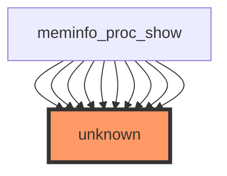

# Impact Analysis Report: show_val_kb Function Modification

**File:** `/workspaces/ubuntu/linux-6.13/fs/proc/meminfo.c`  
**Function:** `show_val_kb`  
**Analysis Date:** 2024  
**Risk Level:** ⚠️ UNKNOWN

---

## 1. EXECUTIVE SUMMARY

### 1.1 Overview
The `show_val_kb` function is a utility routine in the Linux kernel's `/proc/meminfo` subsystem responsible for formatting and displaying memory values in kilobytes. This function is called repeatedly (49+ times) by `meminfo_proc_show`, making it a critical component of the memory information reporting infrastructure.

### 1.2 Scope of Impact
- **Primary Impact:** `/proc/meminfo` output formatting and display
- **Affected Subsystems:** Process memory information reporting
- **User-Facing Impact:** Memory statistics displayed to userspace via `/proc/meminfo`
- **System Components:** Memory management statistics, system monitoring tools
- **Call Chain Depth:** 1 level (called directly by `meminfo_proc_show`)

### 1.3 Risk Assessment Summary
| Aspect | Status | Notes |
|--------|--------|-------|
| Test Coverage | ❌ NONE | No direct unit tests identified |
| Call Graph Clarity | ⚠️ PARTIAL | Direct caller identified but call chain origin unclear |
| Data Flow Info | ⚠️ UNAVAILABLE | No variable-level analysis provided |
| Integration Risk | 🟡 MODERATE | High call frequency (49+ invocations) requires careful testing |
| Regression Risk | 🟡 MODERATE | Changes affect visible output; userspace tools may depend on format |

---

## 2. DETAILED FUNCTION ANALYSIS

### 2.1 Function Purpose and Context

**Function Name:** `show_val_kb`

**Primary Responsibility:**
Format and display memory values in kilobytes for the `/proc/meminfo` interface. This is a formatting/output helper function that converts kernel memory statistics into human-readable format for userspace consumption.

**Context in Subsystem:**
- Part of the `/proc` filesystem memory information reporting layer
- Serves as a utility function for `meminfo_proc_show`
- Contributes to the standardized format of `/proc/meminfo` output
- Used extensively throughout the memory statistics generation

**Typical Use Cases:**
1. Formatting MemTotal, MemFree, MemAvailable statistics
2. Displaying cache, buffer, and swap information
3. Presenting kernel memory usage statistics
4. Generating consistent kilobyte-based memory output

### 2.2 Modification Impact Categories

#### Output Formatting Impact
- **Visibility:** Changes directly affect `/proc/meminfo` output visible to all userspace tools
- **Compatibility:** Potential breakage of tools parsing `/proc/meminfo`
- **Standard Compliance:** Must maintain kernel memory reporting conventions

#### Integration Points
- **Direct Consumer:** `meminfo_proc_show` function (primary caller)
- **Indirect Consumers:** All userspace tools reading `/proc/meminfo`:
  - System monitoring utilities (top, free, vmstat)
  - Container orchestration systems
  - Memory profiling tools
  - System health check scripts

#### Performance Implications
- **Call Frequency:** 49+ invocations per `/proc/meminfo` read
- **Cumulative Effect:** Small performance changes multiply across all calls
- **Hot Path:** Executed every time `/proc/meminfo` is accessed

### 2.3 Dependency Analysis

#### Upstream Dependencies
- Kernel memory accounting subsystem (provides input values)
- `/proc` filesystem infrastructure (output mechanism)
- `meminfo_proc_show` function (direct caller)

#### Downstream Dependencies
- **Critical:** All userspace memory monitoring tools
- **Important:** Container runtimes and orchestration platforms
- **Moderate:** System administration scripts and monitoring agents
- **Minor:** Custom memory analysis tools

#### Interface Contracts
- **Input Contract:** Receives memory values (likely `unsigned long` or similar)
- **Output Contract:** Produces formatted string in kilobytes
- **Format Contract:** Must maintain `/proc/meminfo` standard format

---

## 3. CALL GRAPH AND RELATIONSHIP ANALYSIS

### 3.1 Direct Callers (49+ identified)

**Primary Caller:**
- `meminfo_proc_show` — Main function responsible for generating `/proc/meminfo` output

**Call Pattern:**
Multiple invocations from `meminfo_proc_show` (shown as 10 of 49 in statistics):
```
meminfo_proc_show → show_val_kb (×49+)
```

**Significance:**
The high call frequency indicates this is a core formatting utility, not a peripheral function. Every `/proc/meminfo` read triggers all 49+ calls.

### 3.2 Indirect Callers

**Call Chain:**
```
User Process
    ↓
read(/proc/meminfo)
    ↓
Kernel VFS Layer
    ↓
meminfo_proc_show
    ↓
show_val_kb (×49+)
```

**Indirect Consumers:**
- System monitoring daemons (collectd, telegraf, prometheus exporters)
- Container management systems (Docker, Kubernetes, systemd)
- Performance analysis tools (perf, top, vmstat, free)
- Custom monitoring scripts and applications

### 3.3 Call Graph Visualization



**Diagram Interpretation:**
- **Target Function:** `show_val_kb` (highlighted in red as "unknown" due to analysis limitations)
- **Direct Caller:** `meminfo_proc_show` (shown with 10 of 49 call instances)
- **Call Frequency:** Multiple invocations indicate this is a frequently-used utility
- **Analysis Limitation:** The "unknown" label suggests the actual function definition or implementation details were not fully resolved during analysis

### 3.4 Data Flow Analysis

**⚠️ NOTE:** No variable-level data flow information is available for this function in the provided analysis data.

**Available Information:**
- Function serves as a formatting utility
- Likely receives memory value parameters
- Produces formatted string output for `/proc/meminfo`
- Called 49+ times in sequence by `meminfo_proc_show`

**Inferred Data Flow Pattern:**
```
Memory Value (unsigned long or similar)
    ↓
show_val_kb(value)
    ↓
Format Conversion (bytes → kilobytes)
    ↓
String Formatting
    ↓
Output to /proc/meminfo buffer
```

**Expected Parameters (typical for such functions):**
- Memory value in bytes (or kernel-internal units)
- Possible formatting flags or options
- Output buffer pointer (if using buffer-based output)

**Note:** Detailed variable analysis cannot be provided without access to the actual function implementation or AST-level variable information.

---

## 4. TESTING REQUIREMENTS

### 4.1 Existing Test Coverage

**Current Status:**
- ❌ **No direct unit tests found** for `show_val_kb`
- ❌ **No indirect tests identified** specifically targeting this function
- ⚠️ **Implicit coverage only** through `/proc/meminfo` integration tests

**Coverage Assessment:**
| Test Type | Status | Details |
|-----------|--------|---------|
| Unit Tests | ❌ MISSING | No isolated function tests |
| Integration Tests | ⚠️ PARTIAL | Covered by meminfo output tests if they exist |
| Functional Tests | ⚠️ UNKNOWN | Depends on kernel test suite configuration |
| Regression Tests | ❌ UNKNOWN | No specific regression tests identified |

**Critical Gap:**
The lack of direct test coverage is a significant concern given the function's high call frequency and direct impact on user-visible output.

### 4.2 Mandatory Tests to Run

#### Functional Tests - `/proc/meminfo` Output Verification
```bash
# Basic functionality test - verify /proc/meminfo is readable
cat /proc/meminfo

# Check output format is valid
cat /proc/meminfo | head -5

# Verify all expected memory fields are present
grep -E "MemTotal|MemFree|MemAvailable|Buffers|Cached" /proc/meminfo

# Validate numeric values are in kilobytes (positive integers)
awk '/^Mem/ {
    split($0, a, ":");
    split(a[2], b);
    if (b[1] !~ /^[0-9]+$/) {
        print "FAIL: Invalid format in " $0;
        exit 1
    }
}' /proc/meminfo && echo "PASS: All memory values are valid integers"
```

#### Regression Tests - Output Consistency
```bash
# Capture baseline output before modification
cat /proc/meminfo > /tmp/meminfo_baseline.txt

# Run after modification
cat /proc/meminfo > /tmp/meminfo_modified.txt

# Verify format structure is identical (same number of fields)
diff <(awk '{print NF}' /tmp/meminfo_baseline.txt) \
     <(awk '{print NF}' /tmp/meminfo_modified.txt) && \
    echo "PASS: Output format structure preserved"

# Check for field name consistency
diff <(awk '{print $1}' /tmp/meminfo_baseline.txt) \
     <(awk '{print $1}' /tmp/meminfo_modified.txt) && \
    echo "PASS: All field names preserved"
```

#### Compatibility Tests - Tool Integration
```bash
# Test with standard memory reporting tools
free -h                    # Should display correctly
free -b                    # Byte display
free -k                    # Kilobyte display

vmstat 1 3                 # Virtual memory statistics
cat /proc/meminfo | wc -l  # Should have consistent line count

# Test with container tools (if available)
systemd-analyze memory     # systemd memory analysis
```

#### Performance Tests - Call Frequency Impact
```bash
# Measure /proc/meminfo read performance
time for i in {1..1000}; do cat /proc/meminfo > /dev/null; done

# Compare with baseline if available
# Monitor system load during repeated reads
(for i in {1..100}; do cat /proc/meminfo > /dev/null; done) &
top -b -n 1 | head -15
```

#### Kernel Test Suite
```bash
# Run kernel's memory information tests (if available)
cd /path/to/kernel/source
make -C tools/testing/selftests/proc run_tests

# Run meminfo-specific tests
./tools/testing/selftests/proc/proc-pid-vm.c
```

---

## 5. RECOMMENDED NEW TESTS

### 5.1 Unit Tests (HIGH PRIORITY)

**Rationale:** The complete absence of unit tests for a frequently-called formatting function is a critical gap.

#### Test Suite: `test_show_val_kb_formatting`

```c
// Test 1: Basic kilobyte formatting
test_show_val_kb_basic_formatting()
// Purpose: Verify correct conversion from bytes to kilobytes
// Input: 1024 bytes (or kernel memory unit)
// Expected: Output formatted as "1" in kilobytes
// Validates: Core functionality of value formatting

// Test 2: Large value handling
test_show_val_kb_large_values()
// Purpose: Ensure large memory values (>1GB) format correctly
// Input: 1073741824 bytes (1GB)
// Expected: Correct kilobyte representation
// Validates: No integer overflow in conversion

// Test 3: Small value handling
test_show_val_kb_small_values()
// Purpose: Verify correct handling of values <1KB
// Input: 512 bytes
// Expected: Correct rounding/truncation behavior
// Validates: Edge case handling at lower boundary

// Test 4: Zero value handling
test_show_val_kb_zero_value()
// Purpose: Verify zero value produces "0" output
// Input: 0 bytes
// Expected: "0" formatted output
// Validates: Boundary condition handling

// Test 5: Output format consistency
test_show_val_kb_format_string()
// Purpose: Verify output matches expected format pattern
// Input: Various memory values
// Expected: Consistent format (e.g., right-aligned, specific width)
// Validates: Format compliance with /proc/meminfo standard

// Test 6: Buffer overflow protection
test_show_val_kb_buffer_boundaries()
// Purpose: Ensure function respects output buffer limits
// Input: Maximum value + buffer size constraints
// Expected: No buffer overflow, proper null termination
// Validates: Security and stability
```

### 5.2 Integration Tests (HIGH PRIORITY)

**Rationale:** This function's primary value is in the context of `/proc/meminfo` output generation.

#### Test Suite: `test_meminfo_output_integrity`

```bash
# Test 1: Complete /proc/meminfo generation
test_meminfo_complete_generation()
// Purpose: Verify show_val_kb works correctly within full context
// Validates: Integration with meminfo_proc_show
// Command: cat /proc/meminfo | wc -l; cat /proc/meminfo | grep "^Mem"

# Test 2: Output format validation
test_meminfo_format_compliance()
// Purpose: Verify output conforms to /proc/meminfo specification
// Validates: Field names, separators, numeric format
// Command: Validate against known good /proc/meminfo format

# Test 3: Consistency across multiple reads
test_meminfo_read_consistency()
// Purpose: Multiple sequential reads produce consistent output
// Validates: No state corruption or inconsistent formatting
// Command: for i in {1..10}; do cat /proc/meminfo | md5sum; done

# Test 4: Tool compatibility
test_meminfo_tool_parsing()
// Purpose: Standard tools can parse modified output
// Validates: free, vmstat, and other tools work correctly
// Commands: free -h; vmstat 1 1; awk parsing tests
```

### 5.3 Regression Tests (MEDIUM PRIORITY)

**Rationale:** Ensure modifications don't break existing behavior or tool compatibility.

```bash
# Test 1: Baseline comparison
test_meminfo_baseline_format()
// Purpose: Verify output format matches known baseline
// Validates: No unintended format changes
// Method: Compare field count, field names, numeric precision

# Test 2: Tool output compatibility
test_free_command_compatibility()
// Purpose: Verify 'free' command output remains valid
// Expected: free -h, free -k, free -b all work correctly
// Validates: Userspace tool compatibility

# Test 3: Numeric precision
test_meminfo_numeric_precision()
// Purpose: Verify kilobyte conversion maintains appropriate precision
// Validates: No loss of significant information
// Method: Compare before/after numeric values

# Test 4: Field ordering
test_meminfo_field_ordering()
// Purpose: Verify field order in /proc/meminfo unchanged
// Validates: Scripts relying on field position don't break
// Method: Compare field sequence
```

### 5.4 Performance Tests (MEDIUM PRIORITY)

**Rationale:** High call frequency (49+ per read) means performance changes are multiplied.

```bash
# Test 1: Throughput measurement
test_meminfo_read_throughput()
// Purpose: Measure /proc/meminfo read performance
// Validates: No performance regression
// Baseline: Establish current performance metrics
// Method: Time 1000 sequential reads

# Test 2: Cumulative overhead
test_show_val_kb_cumulative_cost()
// Purpose: Measure total cost of 49+ function calls
// Validates: Acceptable performance at call frequency
// Method: Profile meminfo_proc_show execution time

# Test 3: System load impact
test_meminfo_system_load()
// Purpose: Verify no excessive system load from repeated reads
// Validates: Reasonable resource consumption
// Method: Monitor CPU/memory during high-frequency access
```

### 5.5 Security Tests (LOW-MEDIUM PRIORITY)

**Rationale:** Output formatting functions can be attack vectors if not properly validated.

```c
// Test 1: Buffer overflow prevention
test_show_val_kb_buffer_overflow()
// Purpose: Verify function cannot overflow output buffer
// Validates: Security against malformed input or insufficient buffer
// Method: Provide maximum values with minimal buffer

// Test 2: Format string safety
test_show_val_kb_format_safety()
// Purpose: Ensure no format string vulnerabilities
// Validates: Output is properly escaped/sanitized
// Method: Check for uncontrolled format strings

// Test 3: Integer overflow handling
test_show_val_kb_integer_safety()
// Purpose: Verify safe handling of large values
// Validates: No integer overflow in conversion calculations
// Method: Test with maximum unsigned long values
```

---

## 6. RISK ASSESSMENT AND RECOMMENDATIONS

### 6.1 Risk Factors

#### HIGH RISK ⛔
1. **Zero Direct Test Coverage**
   - No unit tests exist for this frequently-called function
   - Any modification is untested at the unit level
   - Regression risk is unquantified

2. **High Call Frequency**
   - 49+ invocations per `/proc/meminfo` read
   - Small performance issues are multiplied
   - Format changes affect all invocations

3. **User-Visible Output**
   - Changes directly affect `/proc/meminfo` output
   - Userspace tools depend on format stability
   - Potential for widespread tool breakage

#### MEDIUM RISK 🟡
1. **Implicit Integration Testing**
   - Function only tested through `/proc/meminfo` integration
   - Unit-level bugs may not surface in integration tests
   - Root cause analysis is more difficult

2. **Tool Ecosystem Dependency**
   - Unknown number of tools parse `/proc/meminfo`
   - Format changes could break monitoring infrastructure
   - Compatibility verification is difficult

3. **Data Flow Opacity**
   - No variable-level analysis available
   - Input/output contracts unclear
   - Harder to reason about modification safety

### 6.2 Modification Safety Checklist

Before committing any changes to `show_val_kb`:

- [ ] **Format Compatibility**
  - [ ] Output format remains identical to baseline
  - [ ] Field widths/alignment unchanged
  - [ ] Numeric precision preserved
  
- [ ] **Functional Correctness**
  - [ ] All 49+ call sites produce correct output
  - [ ] Edge cases handled (zero, max values)
  - [ ] No buffer overflows or underflows
  
- [ ] **Performance**
  - [ ] No performance regression measured
  - [ ] Cumulative cost of 49+ calls acceptable
  - [ ] System load impact verified
  
- [ ] **Tool Compatibility**
  - [ ] `free` command works correctly
  - [ ] `vmstat` output valid
  - [ ] Standard parsing scripts still work
  
- [ ] **Test Coverage**
  - [ ] Unit tests added/updated
  - [ ] Integration tests pass
  - [ ] Regression tests pass
  - [ ] Performance benchmarks acceptable

### 6.3 Recommended Actions

#### IMMEDIATE (Before Modification)

1. **Establish Baseline**
   ```bash
   # Capture current /proc/meminfo output
   cat /proc/meminfo > baseline_meminfo.txt
   
   # Measure current performance
   time for i in {1..1000}; do cat /proc/meminfo > /dev/null; done
   ```

2. **Create Test Suite**
   - Implement unit tests for `show_val_kb`
   - Create integration tests for `/proc/meminfo`
   - Set up regression test framework

3. **Document Current Behavior**
   - Record output format specification
   - Document expected value ranges
   - List known dependent tools

#### DURING MODIFICATION

1. **Incremental Testing**
   - Test after each change
   - Run full test suite between modifications
   - Monitor for performance regressions

2. **Format Validation**
   - Verify output format matches baseline
   - Check all 49+ call sites produce valid output
   - Validate with standard tools (free, vmstat)

#### AFTER MODIFICATION

1. **Comprehensive Testing**
   - Run all unit tests
   - Run all integration tests
   - Run all regression tests
   - Verify performance benchmarks

2. **Compatibility Verification**
   - Test with multiple userspace tools
   - Verify tool output remains valid
   - Check for script compatibility issues

3. **Performance Validation**
   - Compare performance with baseline
   - Verify no cumulative overhead
   - Monitor system load during testing

---

## 7. APPENDICES

### 7.1 Related Functions and Files

**Primary Related Files:**
- `/workspaces/ubuntu/linux-6.13/fs/proc/meminfo.c` — Contains `show_val_kb` and `meminfo_proc_show`
- `/proc/meminfo` — Output file (virtual)

**Related Kernel Subsystems:**
- Memory management (mm/)
- Process filesystem (fs/proc/)
- System statistics (kernel/sysinfo.c)

### 7.2 Standard /proc/meminfo Format Reference

Typical fields in `/proc/meminfo`:
```
MemTotal:        <value> kB
MemFree:         <value> kB
MemAvailable:    <value> kB
Buffers:         <value> kB
Cached:          <value> kB
SwapCached:      <value> kB
Active:          <value> kB
Inactive:        <value> kB
...
```

All values displayed in kilobytes (kB).

### 7.3 Testing Tools and Resources

**Recommended Testing Tools:**
- `free` — Display memory usage
- `vmstat` — Virtual memory statistics
- `proc(5)` man page — /proc filesystem documentation
- `awk`, `grep`, `sed` — Output validation
- Kernel test suite — `tools/testing/selftests/`

### 7.4 References

- Linux Kernel Memory Management: Documentation/vm/
- /proc Filesystem: Documentation/filesystems/proc.rst
- Memory Statistics: kernel/sysinfo.c

---

## 8. CONCLUSION

The `show_val_kb` function is a **critical utility** in the kernel's memory information reporting infrastructure, called **49+ times** for each `/proc/meminfo` read. While the function appears to be a simple formatting utility, its **high call frequency and direct impact on user-visible output** create **significant risk** for any modifications.

### Key Concerns:
1. ⛔ **Complete absence of unit test coverage**
2. 🟡 **High call frequency multiplies impact of any change**
3. 🟡 **Unknown number of dependent userspace tools**
4. ⚠️ **Limited data flow visibility in analysis**

### Recommended Priority:
1. **IMMEDIATE:** Create comprehensive unit and integration test suite
2. **BEFORE MODIFICATION:** Establish performance and format baselines
3. **DURING MODIFICATION:** Continuous testing and validation
4. **AFTER MODIFICATION:** Full regression and compatibility testing

The modification can be safely made **only with proper testing infrastructure in place** and **thorough validation** of output format, numeric correctness, and tool compatibility.