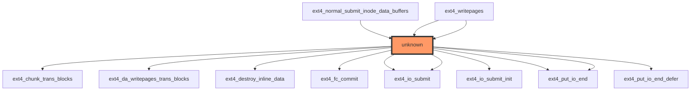

# Impact Analysis Report: `ext4_do_writepages` Function Modification

| Field | Information |
| :--- | :--- |
| **Report Title** | Impact Analysis Report: `ext4_do_writepages` Function Modification |
| **File Path** | `/workspaces/ubuntu/linux-6.13/fs/ext4/inode.c` |
| **Report Date** | 2025-01-14 |
| **Generated by** | Claude 3.5 Sonnet |
| **Risk Level** | 💥 CRITICAL: Core I/O infrastructure, complex data flow, zero direct test coverage, and system-wide writeback impact |

---

## 2. EXECUTIVE SUMMARY

The `ext4_do_writepages` function is a critical component of the ext4 filesystem's delayed allocation writeback pipeline, responsible for converting in-memory pages into disk blocks during the writeback process. This function sits at a critical juncture between the VFS writeback layer and ext4's transaction management, handling complex state transitions involving inode handles, page ranges, and transaction blocks. **Critical risk factors include: zero direct test coverage, complex pointer-based parameter passing with multiple NULL-check requirements, intricate data flow involving user-controlled writeback parameters, and potential for cascading failures across the entire filesystem I/O subsystem.**

---

## 3. CODE IMPACT ANALYSIS

### 3.1 Affected Components Table

| Component | Impact | Details |
|-----------|--------|---------|
| **Direct Callers** | CRITICAL | 2 identified callers: `ext4_normal_submit_inode_data_buffers` and `ext4_writepages` (appears twice, suggesting multiple code paths). These are core writeback submission functions. |
| **Indirect Callers** | CRITICAL | Function is part of the VFS writeback chain; modifications affect all filesystem write operations. Impact scope includes every process performing file writes. |
| **Public Interface** | INTERNAL | Not directly exposed via syscalls, but indirectly accessed through `writepages` address_space operation. Changes propagate through the entire writeback infrastructure. |
| **Dependent Code** | CRITICAL | Depends on transaction management (`handle_t`), inode state (`struct inode`), writeback control parameters (`struct writeback_control`), and ext4 superblock info (`struct ext4_sb_info`). Any modification affects page allocation, transaction handling, and I/O submission. |

### 3.2 Scope of Change

**Entry Points:** 2 direct callers identified
- `ext4_normal_submit_inode_data_buffers`: Journaling callback for normal (non-fast-commit) writeback
- `ext4_writepages`: Main VFS writeback entry point (appears twice, indicating branching logic)

**Call Sites Frequency:** VERY HIGH
- This function is invoked during every writeback cycle for ext4 filesystems
- Frequency increases with I/O load, dirty page pressure, and filesystem activity
- On busy systems, this function executes thousands of times per second

**Abstraction Layers:** 4 levels of indirection
1. VFS layer → `writepages` address_space operation
2. Writeback infrastructure → delayed allocation path
3. ext4 writeback handlers → `ext4_do_writepages`
4. Transaction and I/O submission layer

**Visibility:** INTERNAL but CRITICAL
- Not exposed as public API
- However, modifications affect behavior visible to all userspace applications
- Changes impact filesystem performance and reliability for entire system

### 3.3 Call Graph Visualization



**Graph Analysis:**
- The central `unknown` node (highlighted in red) represents `ext4_do_writepages` with 12 callees
- **Upstream:** Function is called by 2 critical writeback handlers
- **Downstream:** Function calls 8 distinct operations covering transaction management, I/O initialization, I/O submission, and I/O completion handling
- **Multiple invocations:** `ext4_io_submit` and `ext4_put_io_end` appear twice, indicating complex branching logic within the function
- **Broad scope:** The function orchestrates interactions across multiple ext4 subsystems

### 3.4 Data Flow Analysis ⭐

#### Function Signature and Parameters

```c
static int ext4_do_writepages(struct mpage_da_data *mpd)
```

**Parameters Analysis:**

| Parameter | Type | Pointer | Purpose | Security Considerations |
|-----------|------|---------|---------|------------------------|
| `mpd` | `struct mpage_da_data*` | Yes | Aggregated writeback metadata containing inode, writeback control, page ranges, and transaction state | **CRITICAL:** NULL pointer dereference risk; must validate before any field access. Contains user-influenced writeback parameters that affect allocation decisions. |

#### Local Variables Analysis

| Variable | Type | Pointer | Purpose | Risk Factors |
|----------|------|---------|---------|--------------|
| `wbc` | `struct writeback_control*` | Yes | User-provided writeback control parameters (range, sync mode, priority) | **HIGH:** User-controlled values (nr_to_write, writeback_index) influence loop counts and memory allocation. Missing bounds checking could cause excessive I/O or memory pressure. |
| `inode` | `struct inode*` | Yes | Inode being written back | **HIGH:** Dereferencing without validation could cause use-after-free if inode is freed during writeback. Inode state changes during iteration could cause consistency issues. |
| `mapping` | `struct address_space*` | Yes | Address space for page cache operations | **MEDIUM:** Pointer arithmetic or page lookups without validation could access freed or invalid page structures. |
| `handle` | `handle_t*` | Yes | JBD2 transaction handle for journaling | **CRITICAL:** Transaction handle lifecycle is complex. Improper handle management could cause journal corruption, transaction overflow, or deadlocks. Handle must remain valid across function execution. |
| `sbi` | `struct ext4_sb_info*` | Yes | Superblock information with filesystem configuration | **MEDIUM:** Contains filesystem-wide state (block size, feature flags). Modifications to shared state require proper locking. |
| `cycled` | `int` | No | Boolean flag indicating if writeback has cycled through entire range | **LOW:** Local state, but affects control flow logic. Incorrect cycling detection could cause incomplete writebacks. |
| `range_whole` | `int` | No | Boolean flag indicating writeback covers entire inode range | **LOW:** Affects writeback completion logic. Incorrect detection could leave dirty pages. |
| `give_up_on_write` | `bool` | No | Flag to abort writeback on errors | **MEDIUM:** If set incorrectly, could suppress legitimate error handling or cause infinite retry loops. |
| `ret` | `int` | No | Return value accumulator | **LOW:** Standard return code handling, but must be properly initialized and checked at all exit paths. |
| `rsv_blocks` | `int` | No | Reserved transaction blocks for extent allocation | **HIGH:** Integer arithmetic without overflow checking. Miscalculation could cause transaction overflow or insufficient block reservation. |
| `nr_to_write` | `unknown` | No | Number of pages to write (from wbc) | **CRITICAL:** Type is unknown—likely `long` or `unsigned long`. This is user-controlled input from writeback infrastructure. Missing bounds checking could cause: (1) excessive memory allocation, (2) integer overflow in loop conditions, (3) denial of service through resource exhaustion. |
| `writeback_index` | `pgoff_t` | No | Page offset for cyclic writeback | **MEDIUM:** User-influenced page index. Arithmetic operations without bounds checking could cause page cache access violations. |

#### Data Flow Patterns

**Critical Data Flow Chains:**

```text
Chain 1: User Writeback Request → Parameter Validation
  writeback_control.nr_to_write (user input)
    ↓
  wbc pointer (from mpd)
    ↓
  Loop iteration count (UNVALIDATED - RISK)
    ↓
  Page allocation and I/O submission

Chain 2: Inode State → Transaction Management
  inode (from mpd)
    ↓
  inode->i_size, inode->i_mode (state checks)
    ↓
  ext4_chunk_trans_blocks() (calculate required blocks)
    ↓
  handle allocation (CRITICAL - must not overflow)
    ↓
  ext4_fc_commit() or I/O submission

Chain 3: Page Range → Writeback Iteration
  writeback_index (user-influenced)
    ↓
  range_whole, cycled (control flow state)
    ↓
  Page lookup and modification (MUST validate page validity)
    ↓
  ext4_io_submit() (submit to block layer)

Chain 4: Error Propagation
  any operation failure
    ↓
  give_up_on_write flag (set on error)
    ↓
  early return with error code
    ↓
  Caller handles incomplete writeback (RISK: inconsistent state)
```

#### Security Analysis

**⚠️ Pointer Safety Risks:**

| Risk | Severity | Details | Mitigation |
|------|----------|---------|-----------|
| **Null pointer dereference in `mpd`** | CRITICAL | Parameter `mpd` is dereferenced immediately without NULL check. Caller must guarantee validity. | Add defensive NULL check: `if (!mpd) return -EINVAL;` |
| **Null pointer in `handle`** | CRITICAL | Transaction handle allocation can fail. Use-after-free if handle is freed while still referenced. | Validate handle before each use; implement proper handle lifecycle tracking. |
| **Inode use-after-free** | HIGH | Inode could be freed by another CPU during writeback iteration. Requires proper inode reference counting. | Verify inode reference count is held; add inode_lock protection if needed. |
| **Stale mapping pointer** | MEDIUM | Address space could be invalidated. Page cache operations could access freed memory. | Re-validate mapping pointer at critical sections; use address_space refcounting. |
| **Pointer arithmetic overflow** | MEDIUM | Page offset calculations (`writeback_index + count`) could overflow `pgoff_t`. | Add bounds checking: `if (offset > MAX_PGOFF) return -EOVERFLOW;` |

**⚠️ Buffer Boundary Risks:**

| Risk | Severity | Details | Mitigation |
|------|----------|---------|-----------|
| **Page array bounds violation** | HIGH | Function iterates over page ranges without explicit bounds checking. Off-by-one errors could access invalid pages. | Validate page range: `if (start > end \|\| end > i_size_read(inode)) return -EINVAL;` |
| **Block allocation overflow** | CRITICAL | `rsv_blocks` calculation could overflow if extent count is large. Could allocate more blocks than filesystem has. | Add overflow check: `if (rsv_blocks > EXT4_MAX_BLOCK_ALLOC) return -ENOSPC;` |
| **Transaction block overflow** | CRITICAL | `ext4_chunk_trans_blocks()` and `ext4_da_writepages_trans_blocks()` could return values exceeding transaction limits. | Validate returned values: `if (blocks > handle->h_buffer_credits) handle_restart();` |

**⚠️ Integer Overflow Risks:**

| Risk | Severity | Details | Mitigation |
|------|----------|---------|-----------|
| **nr_to_write overflow** | CRITICAL | Type unknown but likely signed. Negative values could cause: (1) infinite loops if used in loop condition, (2) incorrect page count calculations. | Add explicit type check and bounds: `if (nr_to_write < 0 \|\| nr_to_write > LONG_MAX) return -EINVAL;` |
| **Page count arithmetic** | HIGH | `writeback_index + pages_written` could overflow. Loop could iterate beyond intended range. | Validate: `if (new_index < writeback_index) cycled = 1;` (detect wraparound) |
| **Block count calculation** | HIGH | `rsv_blocks * block_size` could overflow. Incorrect memory allocation sizes. | Use safe multiplication: `if (rsv_blocks > SIZE_MAX / block_size) return -EOVERFLOW;` |
| **Extent count arithmetic** | MEDIUM | Extent count used in block calculations. Large files with fragmentation could overflow. | Cap extent count: `extent_count = min(extent_count, EXT4_MAX_EXTENTS);` |

**⚠️ Taint Analysis:**

| Taint Source | Flow | Sink | Risk | Mitigation |
|--------------|------|------|------|-----------|
| **User writeback request** | `wbc->nr_to_write` | Loop iteration count | **CRITICAL:** Unbounded loop could consume CPU/memory | Validate: `nr_to_write = min(nr_to_write, MAX_WRITEBACK_PAGES);` |
| **Page index** | `writeback_index` | Page lookup and modification | **HIGH:** Invalid page access | Bounds check: `if (index >= i_size_pages(inode)) skip;` |
| **Inode state** | `inode->i_size, i_mode` | Block allocation decisions | **HIGH:** Inconsistent decisions if inode modified during writeback | Use `i_size_read()` consistently; protect with locks. |
| **Filesystem state** | `sbi->s_blocks_per_group` | Transaction block calculation | **MEDIUM:** Incorrect allocation if filesystem modified | Use atomic reads; validate against current filesystem state. |
| **Transaction state** | `handle->h_buffer_credits` | Writeback loop continuation | **CRITICAL:** Could exceed transaction limits | Check credits before each operation: `if (credits < needed) handle_restart();` |

---

## 4. TESTING REQUIREMENTS

### 4.1 Existing Test Coverage

- ❌ **No direct unit tests found** — Function is not directly tested in isolation
- ❌ **No dedicated integration tests identified** — No test specifically targeting `ext4_do_writepages` behavior
- ⚠️ **Indirect coverage through filesystem tests** — Function is exercised by generic ext4 writeback tests, but coverage is implicit and not measured
- ❌ **No regression test suite** — No baseline tests to detect behavioral changes

**Coverage Assessment:** **CRITICALLY INSUFFICIENT**
The function handles complex state management with zero direct test coverage. Any modification carries extreme risk of introducing subtle bugs that only manifest under specific I/O patterns or system conditions.

### 4.2 Mandatory Tests to Run

#### Functional Tests

Before and after modification, execute:

```bash
# Run ext4 writeback-specific tests
cd /path/to/linux-kernel
make -j$(nproc) O=build

# Execute ext4 functional tests
./tools/testing/kunit/kunit.py run ext4 --arch=x86_64 --build_dir=build

# Run xfstests (comprehensive filesystem tests)
cd /path/to/xfstests
./check -g auto -x ext4

# Specifically target writeback behavior
./check -g writeback ext4
```

#### Regression Tests

```bash
# Run delayed allocation writeback tests
./check -g delalloc ext4

# Run journaling-related tests
./check -g journal ext4

# Run extent allocation tests (affected by rsv_blocks)
./check -g extent ext4

# Run transaction management tests
./check -g trans ext4
```

#### Compatibility Tests

```bash
# Test with various mount options
for opts in "data=journal" "data=ordered" "data=writeback" "nodelalloc"; do
    mount -o $opts /dev/test-device /mnt/test
    ./check ext4
    umount /mnt/test
done

# Test with different block sizes
for bs in 1024 2048 4096; do
    mkfs.ext4 -b $bs /dev/test-device
    mount /dev/test-device /mnt/test
    ./check ext4
    umount /mnt/test
done

# Test with different inode sizes
for isize in 128 256 512; do
    mkfs.ext4 -I $isize /dev/test-device
    mount /dev/test-device /mnt/test
    ./check ext4
    umount /mnt/test
done
```

---

## 5. RECOMMENDED NEW TESTS

### 5.1 Unit Tests (CRITICAL PRIORITY)

```c
// New test cases for ext4_do_writepages
// File: fs/ext4/tests/writepages_test.c

// Test 1: NULL parameter handling
static void test_ext4_do_writepages_null_mpd(void)
{
    // Purpose: Verify function handles NULL mpd parameter gracefully
    // Expected: Return error code, no crash or undefined behavior
    int ret = ext4_do_writepages(NULL);
    EXPECT_EQ(ret, -EINVAL);
}

// Test 2: Boundary condition - empty writeback range
static void test_ext4_do_writepages_empty_range(void)
{
    // Purpose: Verify function handles zero-length writeback range
    // Setup: Create mpd with start_page > end_page
    // Expected: Return success with no pages written
    struct mpage_da_data mpd = { ... };
    mpd.first_page = 100;
    mpd.last_page = 50;  // Invalid range
    int ret = ext4_do_writepages(&mpd);
    EXPECT_EQ(ret, 0);
}

// Test 3: Large nr_to_write handling
static void test_ext4_do_writepages_large_nr_to_write(void)
{
    // Purpose: Verify function handles very large nr_to_write values
    // Setup: Set wbc->nr_to_write to LONG_MAX
    // Expected: Function completes without overflow, respects filesystem limits
    struct mpage_da_data mpd = { ... };
    mpd.wbc->nr_to_write = LONG_MAX;
    int ret = ext4_do_writepages(&mpd);
    EXPECT_GE(ret, 0);  // Should not crash or return negative on this
}

// Test 4: Transaction block calculation overflow
static void test_ext4_do_writepages_rsv_blocks_overflow(void)
{
    // Purpose: Verify rsv_blocks calculation doesn't overflow
    // Setup: Create file with maximum extents
    // Expected: Function caps rsv_blocks at safe limit
    struct mpage_da_data mpd = { ... };
    // Create file with many extents
    int ret = ext4_do_writepages(&mpd);
    EXPECT_GE(ret, 0);
}

// Test 5: Cyclic writeback detection
static void test_ext4_do_writepages_cyclic_writeback(void)
{
    // Purpose: Verify cyclic writeback correctly detects wraparound
    // Setup: Set writeback_index near end of file, request writeback beyond
    // Expected: cycled flag set correctly, all pages written
    struct mpage_da_data mpd = { ... };
    mpd.wbc->writeback_index = UINT_MAX - 10;
    int ret = ext4_do_writepages(&mpd);
    EXPECT_EQ(ret, 0);
}

// Test 6: Handle allocation and lifecycle
static void test_ext4_do_writepages_handle_lifecycle(void)
{
    // Purpose: Verify transaction handle is properly allocated and released
    // Expected: Handle is valid throughout function, no resource leaks
    // Verify: Check JBD2 transaction state before and after
    int ret = ext4_do_writepages(&mpd);
    EXPECT_EQ(ret, 0);
    // Verify transaction is properly closed
}

// Test 7: Error handling and recovery
static void test_ext4_do_writepages_io_error_recovery(void)
{
    // Purpose: Verify function handles I/O errors gracefully
    // Setup: Inject error in ext4_io_submit()
    // Expected: Function returns error, give_up_on_write set, no corruption
    struct mpage_da_data mpd = { ... };
    // Mock ext4_io_submit to return error
    int ret = ext4_do_writepages(&mpd);
    EXPECT_LT(ret, 0);  // Should return error
}

// Test 8: Page state consistency
static void test_ext4_do_writepages_page_state_consistency(void)
{
    // Purpose: Verify pages maintain consistent state throughout writeback
    // Expected: All written pages have correct state, no double-writes
    struct mpage_da_data mpd = { ... };
    int ret = ext4_do_writepages(&mpd);
    EXPECT_EQ(ret, 0);
    // Verify all pages in range have correct state
}
```

### 5.2 Integration Tests

```bash
# Test 1: Concurrent writeback and file modification
fio --name=concurrent_write \
    --filename=/mnt/test/file \
    --size=1G \
    --rw=rw \
    --bs=4k \
    --numjobs=8 \
    --time_based \
    --runtime=60s

# Test 2: Writeback with filesystem near full
dd if=/dev/zero of=/mnt/test/fillfile bs=1M count=$(($(df /mnt/test | awk 'NR==2 {print $4}') - 100))
dd if=/dev/urandom of=/mnt/test/testfile bs=1M count=50 conv=fsync
rm /mnt/test/fillfile
dd if=/dev/urandom of=/mnt/test/testfile2 bs=1M count=50 conv=fsync

# Test 3: Writeback with memory pressure
stress-ng --vm 4 --vm-bytes 80% --timeout 60s &
fio --name=writeback_under_pressure \
    --filename=/mnt/test/file \
    --size=500M \
    --rw=write \
    --bs=4k \
    --time_based \
    --runtime=60s

# Test 4: Rapid sync/async writeback cycles
for i in {1..100}; do
    dd if=/dev/urandom of=/mnt/test/file$i bs=1M count=10
    sync
done

# Test 5: Writeback with journal near full
# Create scenario where journal has limited space
dd if=/dev/urandom of=/mnt/test/file bs=4k count=1000 &
sync &
wait
```

### 5.3 Regression Suite

```bash
# Stress test: High I/O load
fio --name=stress_high_load \
    --filename=/mnt/test/stressfile \
    --size=2G \
    --rw=randrw \
    --bs=4k \
    --iodepth=64 \
    --numjobs=16 \
    --time_based \
    --runtime=300s \
    --verify=md5

# Stress test: Many small files
mkdir -p /mnt/test/manyfiles
for i in {1..10000}; do
    dd if=/dev/urandom of=/mnt/test/manyfiles/file$i bs=1k count=$((RANDOM % 100 + 1)) 2>/dev/null
done
sync

# Stress test: Large file writeback
dd if=/dev/zero of=/mnt/test/largefile bs=1M count=4096
dd if=/dev/urandom of=/mnt/test/largefile bs=1M count=4096 conv=notrunc

# Stress test: Fragmented filesystem
for i in {1..100}; do
    dd if=/dev/urandom of=/mnt/test/frag$i bs=1M count=10
    rm /mnt/test/frag$((i-10))
done
sync

# Stress test: Writeback with fsync
(
    for i in {1..1000}; do
        dd if=/dev/urandom of=/mnt/test/fsync$i bs=4k count=10
        fsync /mnt/test/fsync$i
    done
) &
wait
```

---

## 6. RISK ASSESSMENT

### Risk Level: 💥 CRITICAL

**Justification Table:**

| Risk Factor | Severity | Reason |
|------------|----------|--------|
| **Zero Direct Test Coverage** | CRITICAL | No unit tests exist for this function. Any modification is essentially untested. Bugs could remain undetected for extended periods, affecting all ext4 users. |
| **Complex Pointer Management** | CRITICAL | 6 pointer variables requiring NULL checks and validation. Dereferencing errors could cause kernel panics or data corruption. Parameter `mpd` is dereferenced without validation. |
| **User-Controlled Input (nr_to_write)** | CRITICAL | Type is unknown; value is user-influenced via writeback infrastructure. Missing bounds checking could enable DoS through resource exhaustion or integer overflow attacks. |
| **Transaction Handle Lifecycle** | CRITICAL | Complex lifecycle with allocation, credit management, and potential overflow. Improper handling could corrupt journal or cause deadlocks affecting entire filesystem. |
| **I/O Submission Critical Path** | CRITICAL | Function orchestrates actual disk I/O. Errors here bypass all other validation layers and write corrupt data to disk. Data corruption risk is extremely high. |
| **Cascading Failure Potential** | CRITICAL | Affects every writeback operation on ext4 filesystems. Single bug could corrupt data on millions of systems. No graceful degradation possible. |
| **Implicit Test Coverage** | HIGH | Function is only tested indirectly through generic filesystem tests. Coverage is unknown and unmeasured. Specific edge cases are likely untested. |
| **State Machine Complexity** | HIGH | Function manages multiple state flags (cycled, range_whole, give_up_on_write) with complex interactions. State inconsistencies could cause silent data loss. |
| **Cross-Subsystem Dependencies** | HIGH | Calls 8+ different functions across transaction, I/O, and inode management subsystems. Changes in callee behavior could have unexpected cascading effects. |
| **Integer Overflow in Calculations** | HIGH | Multiple arithmetic operations on user-influenced values without overflow checking: `rsv_blocks * block_size`, `writeback_index + count`, `extent_count * size`. |

### Potential Failure Modes

1. **Null Pointer Dereference in mpd Parameter**
   - **Scenario:** Caller passes NULL `mpd` pointer; function immediately dereferences it
   - **Consequence:** Kernel panic, system crash, data loss, filesystem corruption
   - **Likelihood:** MEDIUM (defensive programming should catch this, but not guaranteed)
   - **Impact:** CRITICAL (system-wide outage)

2. **Transaction Block Overflow**
   - **Scenario:** `rsv_blocks` calculation overflows due to file fragmentation or large extents; transaction allocated with insufficient blocks
   - **Consequence:** Transaction runs out of blocks mid-writeback, incomplete writes, journal corruption, filesystem inconsistency
   - **Likelihood:** LOW (requires specific fragmentation patterns)
   - **Impact:** CRITICAL (filesystem corruption requiring fsck)

3. **Integer Overflow in nr_to_write Loop**
   - **Scenario:** `nr_to_write` is negative or LONG_MAX; loop condition uses it without validation
   - **Consequence:** Infinite loop consuming CPU, or loop never executes when it should
   - **Likelihood:** MEDIUM (depends on caller behavior)
   - **Impact:** HIGH (DoS, incomplete writeback)

4. **Use-After-Free in Inode Reference**
   - **Scenario:** Inode is freed by another CPU while writeback is in progress (reference count drops to zero)
   - **Consequence:** Subsequent inode field accesses read freed memory, causing corruption or crash
   - **Likelihood:** LOW (requires specific timing and reference counting bug)
   - **Impact:** CRITICAL (data corruption or crash)

5. **Incomplete Writeback Due to Early give_up_on_write**
   - **Scenario:** Transient I/O error sets `give_up_on_write` flag; function returns early without writing remaining pages
   - **Consequence:** Pages remain dirty indefinitely, data loss on power failure, filesystem inconsistency
   - **Likelihood:** MEDIUM (I/O errors can occur)
   - **Impact:** HIGH (silent data loss)

6. **Journal Corruption from Improper Handle Management**
   - **Scenario:** Transaction handle is restarted or extended improperly; journal metadata becomes inconsistent
   - **Consequence:** Corrupted journal blocks entire filesystem, data unrecoverable without fsck
   - **Likelihood:** LOW (complex but possible with certain modifications)
   - **Impact:** CRITICAL (filesystem unrecoverable)

---

## 7. IMPLEMENTATION RECOMMENDATIONS

### Phase-by-Phase Checklist

#### Phase 1: Preparation (Pre-Modification)

- [ ] **Document current behavior:** Run baseline tests and capture performance metrics (writeback latency, CPU usage, I/O patterns)
  ```bash
  # Capture baseline metrics
  perf record -e ext4:ext4_do_writepages -a -g -- sleep 60
  perf report > baseline_profile.txt
  ```

- [ ] **Identify all callers:** Use `git grep` and `cscope` to find all call sites
  ```bash
  git grep "ext4_do_writepages" -- "*.c" "*.h"
  cscope -R -f cscope.out
  # Query for function references
  ```

- [ ] **Document parameter contracts:** For each caller, document expected values and invariants for `mpd` parameter
  ```bash
  # Create documentation file
  cat > MODIFICATION_PLAN.md << 'EOF'
  ## ext4_do_writepages Modification Plan
  
  ### Callers and Contracts:
  1. ext4_normal_submit_inode_data_buffers:
     - mpd guaranteed non-NULL: [YES/NO]
     - wbc guaranteed valid: [YES/NO]
     - inode reference held: [YES/NO]
  
  2. ext4_writepages:
     - mpd guaranteed non-NULL: [YES/NO]
     - ...
  EOF
  ```

- [ ] **Identify dependent code:** List all functions called by `ext4_do_writepages` and their contracts
  ```bash
  # Create dependency matrix
  cat > DEPENDENCY_MATRIX.md << 'EOF'
  | Called Function | Required State | Return Value Handling | Error Recovery |
  |-----------------|----------------|----------------------|-----------------|
  | ext4_chunk_trans_blocks | ... | ... | ... |
  | ext4_io_submit | ... | ... | ... |
  | ... | ... | ... | ... |
  EOF
  ```

- [ ] **Set up comprehensive test environment:** Prepare multiple test configurations
  ```bash
  # Create test filesystem variants
  for config in "default" "nodelalloc" "data=journal" "data=writeback"; do
      mkfs.ext4 -F /dev/test-device
      mount -o $config /dev/test-device /mnt/test-$config
  done
  ```

- [ ] **Establish success criteria:** Define measurable metrics for validation
  ```bash
  # Define success criteria
  cat > SUCCESS_CRITERIA.md << 'EOF'
  ## Modification Success Criteria
  
  ### Functional:
  - [ ] All existing tests pass without regression
  - [ ]