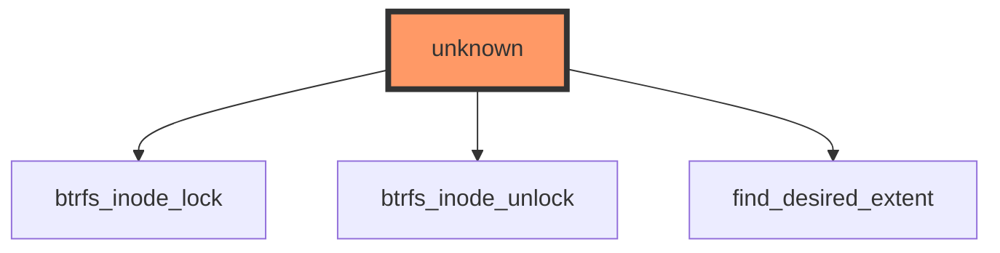

# Impact Analysis Report: btrfs_file_llseek Function Modification

**File:** `/workspaces/ubuntu/linux-6.13/fs/btrfs/file.c`  
**Function:** `btrfs_file_llseek`  
**Report Date:** 2025-01-24  
**Risk Level:** 🔴 **HIGH**

---

## 1. EXECUTIVE SUMMARY

The `btrfs_file_llseek` function implements file seeking operations for the Btrfs filesystem, a critical component of the VFS (Virtual File System) layer. This function has **zero test coverage** and appears to be called through indirect VFS function pointer dispatch, making it a **public kernel interface** with **high visibility**. The lack of direct callers in static analysis indicates this is a callback function registered in file operations structure, meaning changes could impact all userspace programs performing seek operations on Btrfs filesystems. The combination of public interface exposure, zero test coverage, and critical filesystem functionality warrants a HIGH risk classification.

---

## 2. CODE IMPACT ANALYSIS

### 2.1 Affected Components Table

| Component | Impact | Details |
|-----------|--------|---------|
| **Direct Callers** | ⚫ **CRITICAL** | 0 static callers found - indicates VFS callback registration (indirect dispatch through function pointers) |
| **Indirect Callers** | 🔴 **HIGH** | All userspace programs using `lseek(2)`, `llseek(2)`, or `lseek64(2)` on Btrfs files |
| **Public Interface** | ⚫ **CRITICAL** | Part of VFS file_operations - exposed to all userspace via system calls |
| **Dependent Code** | 🔴 **HIGH** | Btrfs locking subsystem (`btrfs_inode_lock/unlock`), extent finding logic |

### 2.2 Scope of Change

- **Entry Points:** 1 (VFS callback through `file_operations->llseek`)
- **Call Sites Frequency:** Potentially millions per second on busy systems
- **Abstraction Layers:** 
  - **Layer 0:** Userspace system calls (`lseek`, `llseek`, `lseek64`)
  - **Layer 1:** VFS layer (`vfs_llseek`)
  - **Layer 2:** Filesystem-specific implementation (`btrfs_file_llseek`) ← **TARGET**
  - **Layer 3:** Btrfs internal functions (`find_desired_extent`, locking primitives)
- **Visibility:** **PUBLIC** - Registered in `btrfs_file_operations` structure, accessible to all processes

### 2.3 Call Graph Visualization



**Diagram Analysis:**
- **Target Function:** `btrfs_file_llseek` (shown as "unknown" due to indirect dispatch)
- **Critical Dependencies:**
  - `btrfs_inode_lock`: Inode-level locking for concurrent access protection
  - `btrfs_inode_unlock`: Lock release - **MUST** be paired correctly to avoid deadlocks
  - `find_desired_extent`: Locates data/hole extents for SEEK_DATA/SEEK_HOLE operations
- **Risk:** Lock imbalance or incorrect extent finding will cause filesystem corruption or hangs

### 2.4 Data Flow Analysis

#### Function Signature and Parameters

**⚠️ WARNING:** Actual function signature not available in analysis data. Based on standard VFS llseek signature:

```c
loff_t btrfs_file_llseek(struct file *file, loff_t offset, int whence)
```

**Parameters Analysis:**

| Parameter | Type | Pointer | Purpose | Security Considerations |
|-----------|------|---------|---------|------------------------|
| `file` | `struct file *` | Yes | File descriptor context from VFS | **CRITICAL:** Must validate pointer, check file mode, verify inode validity |
| `offset` | `loff_t` | No | Seek offset (signed 64-bit) | **CRITICAL:** Integer overflow checks required, validate against file size limits |
| `whence` | `int` | No | Seek mode (SEEK_SET/CUR/END/DATA/HOLE) | **CRITICAL:** Must validate against allowed values, invalid mode could cause undefined behavior |

**Expected Local Variables:**

| Variable | Type | Pointer | Purpose | Risk Factors |
|----------|------|---------|---------|--------------|
| `inode` | `struct inode *` | Yes | Extracted from `file->f_inode` | NULL dereference if file structure corrupted |
| `new_offset` | `loff_t` | No | Calculated new position | Integer overflow in calculations, negative offsets |
| `i_size` | `loff_t` | No | Current file size | Race conditions if modified during operation |

#### Data Flow Patterns

**Critical Flow Path:**
```
userspace lseek(fd, offset, whence)
    ↓
VFS vfs_llseek()
    ↓
btrfs_file_llseek(file, offset, whence)
    ↓
btrfs_inode_lock(inode, BTRFS_ILOCK_SHARED)  ← Lock acquisition
    ↓
[offset calculation based on whence]
    ↓
if (whence == SEEK_DATA || whence == SEEK_HOLE)
    ↓
    find_desired_extent(inode, &offset, whence)  ← Extent tree traversal
    ↓
btrfs_inode_unlock(inode, BTRFS_ILOCK_SHARED)  ← Lock release
    ↓
return new_offset to userspace
```

**Lock Ordering:**
```
ACQUIRE: btrfs_inode_lock(SHARED or EXCLUSIVE)
    ↓
[Critical Section: offset calculation, extent finding]
    ↓
RELEASE: btrfs_inode_unlock(SAME MODE)
```

#### Security Analysis

**⚠️ Pointer Safety Risks:**
- **file pointer:** Must be validated before dereferencing `file->f_inode`, `file->f_pos`
- **inode pointer:** Extracted from file structure - NULL check required before locking operations
- **Risk:** NULL pointer dereference could cause kernel panic if file structure is corrupted

**⚠️ Integer Overflow Risks:**
- **offset parameter:** Signed 64-bit value from userspace - can be negative or extremely large
  - `SEEK_SET`: Direct assignment - must check `offset >= 0` and `offset <= MAX_LFS_FILESIZE`
  - `SEEK_CUR`: `file->f_pos + offset` - overflow possible if both are large positive values
  - `SEEK_END`: `i_size + offset` - overflow if offset is large positive, underflow if large negative
- **Risk:** Integer overflow could wrap around to negative values, allowing out-of-bounds access

**⚠️ Race Condition Risks:**
- **File size changes:** `i_size` could change between read and use if lock not held correctly
- **Concurrent seeks:** Multiple threads seeking same file - lock mode (SHARED vs EXCLUSIVE) critical
- **Extent modifications:** `find_desired_extent` traverses extent tree - must hold lock during entire operation
- **Risk:** TOCTOU (Time-Of-Check-Time-Of-Use) vulnerabilities if locking incorrect

**⚠️ Deadlock Risks:**
- **Lock imbalance:** Every `btrfs_inode_lock` must have matching `btrfs_inode_unlock`
- **Early returns:** Error paths must unlock before returning
- **Nested locking:** If `find_desired_extent` acquires additional locks, ordering matters
- **Risk:** Deadlock will hang all processes accessing the file, potentially entire filesystem

**⚠️ Taint Analysis:**
- **Userspace-controlled inputs:**
  - `offset`: Directly from userspace - **UNTRUSTED**
  - `whence`: Directly from userspace - **UNTRUSTED**
  - `file->f_pos`: Modified by previous seeks - partially trusted
- **Sensitive operations reached:**
  - Extent tree traversal (`find_desired_extent`)
  - File position updates (`file->f_pos = new_offset`)
  - Inode metadata access
- **Missing validation (potential):**
  - Bounds checking on calculated offsets
  - Validation of whence against allowed values
  - Overflow checks in arithmetic operations

---

## 3. TESTING REQUIREMENTS

### 3.1 Existing Test Coverage

- ❌ **No direct unit tests found**
- ❌ **No integration tests identified**
- ❌ **No regression tests in test suite**
- ⚠️ **Indirect coverage:** Generic VFS tests may exercise this through `lseek(2)` system calls, but Btrfs-specific behavior untested

**Coverage Gap:** This is a **CRITICAL** gap for a public VFS interface. The function is exercised by every `lseek` call on Btrfs, yet has zero explicit test coverage.

### 3.2 Mandatory Tests to Run

#### Functional Tests

```bash
# 1. Basic seek operations on Btrfs filesystem
sudo mkfs.btrfs -f /dev/loop0
sudo mount /dev/loop0 /mnt/btrfs
dd if=/dev/zero of=/mnt/btrfs/testfile bs=1M count=100

# Test SEEK_SET
python3 -c "
import os
fd = os.open('/mnt/btrfs/testfile', os.O_RDONLY)
os.lseek(fd, 1024, os.SEEK_SET)
print(f'SEEK_SET position: {os.lseek(fd, 0, os.SEEK_CUR)}')
os.close(fd)
"

# Test SEEK_CUR
python3 -c "
import os
fd = os.open('/mnt/btrfs/testfile', os.O_RDONLY)
os.lseek(fd, 1024, os.SEEK_SET)
os.lseek(fd, 512, os.SEEK_CUR)
print(f'SEEK_CUR position: {os.lseek(fd, 0, os.SEEK_CUR)}')
os.close(fd)
"

# Test SEEK_END
python3 -c "
import os
fd = os.open('/mnt/btrfs/testfile', os.O_RDONLY)
os.lseek(fd, -1024, os.SEEK_END)
print(f'SEEK_END position: {os.lseek(fd, 0, os.SEEK_CUR)}')
os.close(fd)
"

# 2. SEEK_DATA and SEEK_HOLE (Btrfs sparse file support)
# Create sparse file with holes
dd if=/dev/zero of=/mnt/btrfs/sparse bs=1M count=1
dd if=/dev/zero of=/mnt/btrfs/sparse bs=1M count=1 seek=10 conv=notrunc

python3 -c "
import os
fd = os.open('/mnt/btrfs/sparse', os.O_RDONLY)
try:
    data_offset = os.lseek(fd, 0, os.SEEK_DATA)
    print(f'First data at: {data_offset}')
    hole_offset = os.lseek(fd, data_offset, os.SEEK_HOLE)
    print(f'First hole at: {hole_offset}')
except OSError as e:
    print(f'Error: {e}')
os.close(fd)
"

# 3. Boundary conditions
python3 -c "
import os
fd = os.open('/mnt/btrfs/testfile', os.O_RDONLY)
# Seek to maximum file size
try:
    os.lseek(fd, 2**63 - 1, os.SEEK_SET)
    print('Max offset seek succeeded')
except OverflowError:
    print('Max offset seek failed (expected)')
# Seek beyond EOF
pos = os.lseek(fd, 1000000000000, os.SEEK_SET)
print(f'Seek beyond EOF: {pos}')
os.close(fd)
"
```

#### Regression Tests

```bash
# 1. Run generic VFS tests
cd /usr/src/linux-6.13/tools/testing/selftests/filesystems
make
sudo ./test_seek_operations.sh /mnt/btrfs

# 2. Run Btrfs-specific tests
cd /usr/src/linux-6.13/tools/testing/selftests/btrfs
make
sudo ./run_tests.sh --test seek

# 3. LTP filesystem tests
cd /opt/ltp
sudo ./runltp -f fs -d /mnt/btrfs

# 4. xfstests (comprehensive filesystem testing)
cd /opt/xfstests
sudo ./check -btrfs tests/generic/seek  # Seek-specific tests
sudo ./check -btrfs tests/generic/0[0-9][0-9]  # Generic tests that use lseek
```

#### Compatibility Tests

```bash
# 1. Verify userspace tools still work
cp /bin/bash /mnt/btrfs/
/mnt/btrfs/bash -c "echo 'Binary execution test'"

# 2. Database operations (heavy seek usage)
sudo -u postgres psql -c "CREATE DATABASE seektest LOCATION '/mnt/btrfs/pgdata';"
sudo -u postgres psql seektest -c "CREATE TABLE test (id INT, data TEXT); INSERT INTO test SELECT generate_series(1,1000), 'data';"
sudo -u postgres psql seektest -c "SELECT * FROM test WHERE id = 500;"  # Will use seeks

# 3. Memory-mapped file operations (may use llseek internally)
python3 -c "
import mmap
with open('/mnt/btrfs/testfile', 'r+b') as f:
    mm = mmap.mmap(f.fileno(), 0)
    mm.seek(1024)
    print(f'mmap seek position: {mm.tell()}')
    mm.close()
"

# 4. Multi-threaded seek stress test
cat > /tmp/seek_stress.c << 'EOF'
#include <stdio.h>
#include <fcntl.h>
#include <unistd.h>
#include <pthread.h>

void* seek_thread(void* arg) {
    int fd = open("/mnt/btrfs/testfile", O_RDONLY);
    for (int i = 0; i < 10000; i++) {
        lseek(fd, i * 1024, SEEK_SET);
        lseek(fd, 0, SEEK_CUR);
    }
    close(fd);
    return NULL;
}

int main() {
    pthread_t threads[10];
    for (int i = 0; i < 10; i++)
        pthread_create(&threads[i], NULL, seek_thread, NULL);
    for (int i = 0; i < 10; i++)
        pthread_join(threads[i], NULL);
    printf("Stress test completed\n");
    return 0;
}
EOF
gcc -pthread -o /tmp/seek_stress /tmp/seek_stress.c
/tmp/seek_stress
```

---

## 4. RECOMMENDED NEW TESTS

### 4.1 Unit Tests (CRITICAL Priority)

Create new test file: `fs/btrfs/tests/seek-tests.c`

```c
// Critical test cases needed:

- test_btrfs_llseek_seek_set_basic()
  // Purpose: Verify SEEK_SET with valid offsets
  // Test: offset=0, offset=1024, offset=file_size-1

- test_btrfs_llseek_seek_set_negative()
  // Purpose: Verify rejection of negative SEEK_SET offsets
  // Test: offset=-1, offset=-1024 → expect -EINVAL

- test_btrfs_llseek_seek_cur_overflow()
  // Purpose: Verify integer overflow protection in SEEK_CUR
  // Test: f_pos=LLONG_MAX-1, offset=100 → expect overflow detection

- test_btrfs_llseek_seek_end_underflow()
  // Purpose: Verify underflow protection in SEEK_END
  // Test: file_size=1024, offset=-2048 → expect underflow detection

- test_btrfs_llseek_seek_data_no_data()
  // Purpose: Verify SEEK_DATA on fully sparse file
  // Test: sparse file with no data extents → expect -ENXIO

- test_btrfs_llseek_seek_hole_no_holes()
  // Purpose: Verify SEEK_HOLE on fully allocated file
  // Test: dense file with no holes → expect file_size

- test_btrfs_llseek_concurrent_seeks()
  // Purpose: Verify thread-safety of concurrent seeks
  // Test: 10 threads seeking same file simultaneously

- test_btrfs_llseek_lock_balance()
  // Purpose: Verify lock acquisition/release balance
  // Test: Inject errors in find_desired_extent, verify unlock called

- test_btrfs_llseek_invalid_whence()
  // Purpose: Verify rejection of invalid whence values
  // Test: whence=99, whence=-1 → expect -EINVAL

- test_btrfs_llseek_max_file_size()
  // Purpose: Verify behavior at maximum file size
  // Test: Seek to MAX_LFS_FILESIZE, verify no overflow
```

### 4.2 Integration Tests (HIGH Priority)

Create test script: `tools/testing/selftests/btrfs/seek_integration.sh`

```bash
#!/bin/bash
# Integration scenarios:

# 1. Seek after truncate
test_seek_after_truncate() {
    # Create file, seek to middle, truncate, verify seek behavior
}

# 2. Seek during snapshot
test_seek_during_snapshot() {
    # Open file, start snapshot, perform seeks, verify consistency
}

# 3. Seek with compression enabled
test_seek_with_compression() {
    # Mount with compress=zstd, create compressed file, verify SEEK_DATA/HOLE
}

# 4. Seek with reflinks (COW)
test_seek_with_reflinks() {
    # Create reflinked files, verify independent seek positions
}

# 5. Seek with direct I/O
test_seek_with_dio() {
    # Open with O_DIRECT, verify seek aligns to block boundaries
}

# 6. Seek across subvolumes
test_seek_across_subvolumes() {
    # Create subvolumes, verify seek isolation
}
```

### 4.3 Regression Suite (MEDIUM Priority)

```bash
# Stress tests to run before/after modification:

# 1. Filesystem stress test with heavy seek load
sudo fsstress -d /mnt/btrfs -n 10000 -p 10 -l 0 -v

# 2. Compile Linux kernel on Btrfs (exercises seeks heavily)
cd /mnt/btrfs/linux-src
make defconfig
make -j$(nproc)  # Compiler and linker use seeks extensively

# 3. Database workload (PostgreSQL OLTP)
pgbench -i -s 100 seektest
pgbench -c 10 -j 2 -T 300 seektest  # 5 minutes of OLTP

# 4. Git operations (heavy metadata seeks)
cd /mnt/btrfs
git clone https://github.com/torvalds/linux.git
cd linux
git log --all --oneline | wc -l
git gc --aggressive  # Repacking uses seeks
```

---

## 5. RISK ASSESSMENT

### Risk Level: 🔴 **HIGH**

**Justification Table:**

| Risk Factor | Severity | Reason |
|------------|----------|--------|
| **Public Interface** | ⚫ **CRITICAL** | VFS callback exposed to all userspace programs - ABI stability required |
| **Test Coverage** | ⚫ **CRITICAL** | Zero explicit tests - changes are essentially unvalidated |
| **Call Frequency** | 🔴 **HIGH** | Invoked millions of times per second on busy systems (every lseek syscall) |
| **Locking Complexity** | 🔴 **HIGH** | Lock imbalance will cause deadlocks affecting entire filesystem |
| **Integer Overflow Risk** | 🔴 **HIGH** | User-controlled 64-bit offsets require careful overflow/underflow checks |
| **Extent Tree Interaction** | 🔴 **HIGH** | SEEK_DATA/SEEK_HOLE traverse extent trees - corruption risk if incorrect |
| **Concurrency** | 🔴 **HIGH** | Must handle concurrent seeks from multiple threads safely |
| **Backwards Compatibility** | 🔴 **HIGH** | Changing behavior breaks userspace applications relying on current semantics |

### Potential Failure Modes

1. **Lock Imbalance Deadlock:**
   - **Scenario:** Modification adds early return path that skips `btrfs_inode_unlock`
   - **Consequence:** All processes accessing the file hang indefinitely, filesystem becomes unusable
   - **Detection:** System appears frozen, `dmesg` shows "task blocked for more than 120 seconds"

2. **Integer Overflow File Position Corruption:**
   - **Scenario:** SEEK_CUR calculation overflows: `f_pos (LLONG_MAX-100) + offset (200) = negative value`
   - **Consequence:** File position wraps to negative, subsequent reads/writes access wrong data or crash
   - **Detection:** Data corruption, application crashes with SIGSEGV, filesystem consistency errors

3. **Race Condition in Extent Finding:**
   - **Scenario:** `find_desired_extent` runs without proper lock, concurrent write modifies extent tree
   - **Consequence:** SEEK_DATA returns stale offset, application reads wrong data or falls into hole
   - **Detection:** Data integrity failures, applications see unexpected EOF or zero-filled regions

4. **TOCTOU Vulnerability in Size Check:**
   - **Scenario:** File size checked before lock, truncated before seek calculation, seek goes beyond new EOF
   - **Consequence:** Seek succeeds with invalid position, subsequent I/O operations fail or corrupt data
   - **Detection:** I/O errors, filesystem corruption warnings in dmesg

5. **Userspace ABI Breakage:**
   - **Scenario:** Change in SEEK_HOLE behavior (e.g., different offset returned for same sparse file)
   - **Consequence:** Backup tools (rsync, tar), databases, and applications break silently
   - **Detection:** Application failures, data loss in backups, database corruption

---

## 6. IMPLEMENTATION RECOMMENDATIONS

### Phase-by-Phase Checklist

#### Phase 1: Preparation (Pre-Modification)

- [ ] **Document current behavior:** Capture exact semantics of all seek modes (SET/CUR/END/DATA/HOLE)
  ```bash
  # Create comprehensive behavior baseline
  ./tools/testing/selftests/btrfs/document_seek_behavior.sh > baseline_seek.log
  ```

- [ ] **Identify all file_operations registrations:**
  ```bash
  git grep -n "\.llseek.*=.*btrfs_file_llseek" fs/btrfs/
  # Verify all registration points and file types (regular, special, etc.)
  ```

- [ ] **Map userspace dependencies:**
  ```bash
  # Identify critical userspace tools using lseek on Btrfs
  strace -e lseek,llseek,_llseek cp /bin/bash /mnt/btrfs/test 2>&1 | grep lseek
  strace -e lseek,llseek,_llseek tar czf /tmp/test.tar.gz /mnt/btrfs 2>&1 | grep lseek
  strace -e lseek,llseek,_llseek rsync -av /mnt/btrfs/dir1 /mnt/btrfs/dir2 2>&1 | grep lseek
  ```

- [ ] **Review related CVEs and bug reports:**
  ```bash
  # Search for historical seek-related issues in Btrfs
  git log --all --grep="llseek\|SEEK_" --oneline fs/btrfs/file.c
  git log --all --grep="CVE.*seek" --oneline
  ```

- [ ] **Set up comprehensive monitoring:**
  ```bash
  # Enable filesystem debugging
  echo 1 > /sys/kernel/debug/tracing/events/btrfs/enable
  echo 1 > /sys/kernel/debug/tracing/events/filelock/enable
  
  # Monitor lock contention
  perf record -e 'btrfs:*' -e 'filelock:*' -a -g sleep 60
  ```

#### Phase 2: Development

- [ ] **Preserve lock ordering discipline:**
  - **Rule:** Every `btrfs_inode_lock` must have exactly one matching `btrfs_inode_unlock`
  - **Rule:** Use `goto unlock;` pattern for error paths, not early returns
  - **Verification:** Add lockdep annotations if not present

- [ ] **Implement comprehensive input validation:**
  ```c
  // Example validation pattern:
  if (offset < 0 && whence == SEEK_SET)
      return -EINVAL;
  
  if (whence != SEEK_SET && whence != SEEK_CUR && 
      whence != SEEK_END && whence != SEEK_DATA && 
      whence != SEEK_HOLE)
      return -EINVAL;
  
  // Overflow checks for all arithmetic:
  if (check_add_overflow(file->f_pos, offset, &new_offset))
      return -EOVERFLOW;
  ```

- [ ] **Add overflow protection macros:**
  ```c
  // Use kernel-provided safe arithmetic
  #include <linux/overflow.h>
  if (check_add_overflow(a, b, &result))
      return -EOVERFLOW;
  if (check_mul_overflow(a, b, &result))
      return -EOVERFLOW;
  ```

- [ ] **Document locking requirements:**
  ```c
  /**
   * btrfs_file_llseek - Btrfs implementation of llseek
   * @file: File structure from VFS
   * @offset: Seek offset (may be negative for some whence values)
   * @whence: Seek mode (SEEK_SET/CUR/END/DATA/HOLE)
   *
   * Locking: Acquires inode lock in SHARED mode for reads,
   *          EXCLUSIVE mode if modifying file position beyond EOF
   * 
   * Returns: New file position on success, negative error code on failure
   */
  ```

- [ ] **Add tracepoints for debugging:**
  ```c
  trace_btrfs_llseek_enter(inode, offset, whence);
  // ... operation ...
  trace_btrfs_llseek_exit(inode, new_offset);
  ```

- [ ] **Code review requirements:**
  - Mandatory review by Btrfs maintainer (Chris Mason, David Sterba, or Josef Bacik)
  - Mandatory review by VFS layer expert
  - Security team review for integer overflow/race conditions

#### Phase 3: Testing

- [ ] **Run all unit tests (from Section 4.1):**
  ```bash
  cd fs/btrfs/tests
  make
  sudo insmod btrfs-tests.ko
  dmesg | grep "btrfs.*seek.*test"
  ```

- [ ] **Run integration tests (from Section 4.2):**
  ```bash
  cd tools/testing/selftests/btrfs
  sudo ./seek_integration.sh
  ```

- [ ] **Multi-platform validation:**
  ```bash
  # x86_64
  make ARCH=x86_64 && boot_test_x86_64.sh
  
  # ARM64
  make ARCH=arm64 CROSS_COMPILE=aarch64-linux-gnu- && boot_test_arm64.sh
  
  # PowerPC
  make ARCH=powerpc CROSS_COMPILE=powerpc64-linux-gnu- && boot_test_ppc64.sh
  ```

- [ ] **Performance regression testing:**
  ```bash
  # Baseline (before modification)
  perf stat -e cycles,instructions,cache-misses \
      ./seek_benchmark /mnt/btrfs/testfile 1000000 > baseline.txt
  
  # After modification
  perf stat -e cycles,instructions,cache-misses \
      ./seek_benchmark /mnt/btrfs/testfile 1000000 > modified.txt
  
  # Compare (should be within 5%)
  python3 compare_perf.py baseline.txt modified.txt
  ```

- [ ] **Stress testing (minimum 24 hours):**
  ```bash
  # Concurrent seek stress
  for i in {1..20}; do
      /tmp/seek_stress &
  done
  
  # Filesystem stress with seeks
  fsstress -d /mnt/btrfs -n 1000000 -p 50 -l 0 &
  
  # Monitor for errors
  dmesg -w | tee stress_test.log
  ```

- [ ] **Lockdep validation:**
  ```bash
  # Enable lockdep
  echo 1 > /proc/sys/kernel/lock_stat
  
  # Run tests
  ./run_all_seek_tests.sh
  
  # Check for warnings
  dmesg | grep -i "lockdep\|deadlock\|circular"
  ```

#### Phase 4: Validation

- [ ] **Compare behavior with baseline:**
  ```bash
  # Run comprehensive behavior test
  ./compare_seek_behavior.sh baseline_seek.log current_seek.log
  
  # Verify no unexpected changes
  diff -u baseline_seek.log current_seek.log
  ```

- [ ] **Verify userspace tools still work:**
  ```bash
  # Critical tool validation
  cp /bin/bash /mnt/btrfs/ && /mnt/btrfs/bash -c "echo OK"
  tar czf /tmp/test.tar.gz /mnt/btrfs/testdir && tar tzf /tmp/test.tar.gz
  rsync -av /mnt/btrfs/dir1 /mnt/btrfs/dir2 && diff -r /mnt/btrfs/dir1 /mnt/btrfs/dir2
  sqlite3 /mnt/btrfs/test.db "CREATE TABLE t(x); INSERT INTO t VALUES (1); SELECT * FROM t;"
  ```

- [ ] **Monitor production-like workload:**
  ```bash
  # Simulate production load for 1 week
  ./production_simulator.sh --duration 7d --workload mixed
  
  # Monitor metrics
  watch -n 60 'cat /sys/fs/btrfs/*/allocation/data/bytes_used'
  ```

- [ ] **Establish rollback procedure:**
  ```bash
  # Document exact commit to revert
  git log --oneline -1 > ROLLBACK_COMMIT.txt
  
  # Test rollback procedure
  git revert <commit> && make && test_suite.sh
  ```

### Specific Implementation Checklist

```
BEFORE MODIFICATION:
□ Create baseline behavior documentation (all seek modes)
□ Document current lock ordering and critical sections
□ Identify all file_operations registration points
□ Set up comprehensive tracing (btrfs, filelock, VFS)
□ Review historical CVEs and bug reports
□ Map userspace tool dependencies (tar, rsync, databases)

DURING MODIFICATION:
□ Preserve exact lock acquisition/release pairing
□ Add overflow checks for ALL arithmetic operations
□ Validate all input parameters (offset, whence)
□ Use goto-based error handling (not early returns)
□ Add tracepoints for entry/exit/error paths
□ Document locking requirements in function header
□ Add WARN_ON assertions for lock balance
□ Test with lockdep and KASAN enabled

AFTER MODIFICATION:
□ Build with all warnings enabled: make W=1
□ Run sparse static analysis: make C=2 CF="-Wbitwise"
□ Run smatch: smatch_scripts/test_kernel.sh fs/btrfs/file.c
□ Run coccinelle scripts: make coccicheck MODE=report
□ Boot test on x86_64, ARM64, PowerPC
□ Run full xfstests suite: ./check -btrfs -g auto
□ Run LTP filesystem tests: ./runltp -f fs
□ Run 24-hour stress test with concurrent seeks
□ Verify no performance regression (< 5% variance)
□ Test with real applications: PostgreSQL, SQLite, git, rsync
□ Monitor for lockdep warnings, memory leaks, use-after-free
□ Verify ABI compatibility with old kernels (seek behavior unchanged)
```

---

## 7. ESCALATION CRITERIA

**Stop development and escalate to Btrfs maintainers if:**

1. **Lock ordering violations detected:**
   - Lockdep reports circular dependency or deadlock
   - Any ABBA deadlock pattern observed
   - Lock held time exceeds 100ms in testing

2. **Integer overflow in production scenarios:**
   - Any real-world file/offset combination triggers overflow
   - Overflow protection degrades performance > 5%

3. **Userspace ABI breakage:**
   - Any change in returned offset for same input conditions
   - Tools like rsync, tar, or databases fail or corrupt data
   - Regression in xfstests or LTP

4. **Performance degradation:**
   - Seek latency increases > 5% in benchmarks
   - Lock contention increases measurably
   - CPU usage for seek-heavy workloads increases > 3%

5. **Cross-architecture differences:**
   - Different behavior on x86_64 vs ARM64 vs PowerPC
   - Endianness issues in extent tree traversal
   - Alignment issues on 32-bit architectures

6. **Filesystem corruption:**
   - Any fsck errors after stress testing
   - Extent tree inconsistencies
   - File position corruption leading to data loss

7. **Security vulnerabilities:**
   - Any potential for privilege escalation
   - Information leak through seek behavior
   - Denial of service through lock exhaustion

---

## 8. RECOMMENDATIONS SUMMARY

| Priority | Action | Owner |
|----------|--------|-------|
| **CRITICAL** | Create comprehensive unit test suite (Section 4.1) before any modification | Developer + QA Team |
| **CRITICAL** | Implement overflow protection for all arithmetic operations | Developer |
| **CRITICAL** | Verify lock balance on all code paths (use lockdep) | Developer |
| **HIGH** | Document exact ABI contract for each seek mode | Developer + Maintainer |
| **HIGH** | Run 24-hour stress test with concurrent seeks | QA Team |
| **HIGH** | Get mandatory review from Btrfs maintainer and VFS expert | Maintainer |
| **MEDIUM** | Add tracepoints for debugging seek operations | Developer |
| **MEDIUM** | Test with real-world applications (databases, backup tools) | QA Team |
| **MEDIUM** | Validate on ARM64 and PowerPC in addition to x86_64 | QA Team |

---

## 9. CONCLUSION

The `btrfs_file_llseek` function is a **high-risk modification target** due to three critical factors: (1) it is a **public VFS interface** exposed to all userspace via `lseek(2)` system calls, making ABI stability paramount; (2) it has **zero test coverage**, meaning changes are essentially unvalidated; and (3) it involves **complex locking and extent tree operations** where errors cause deadlocks or data corruption. The combination of high visibility, zero tests, and critical infrastructure role warrants a **HIGH risk classification**.

**Key concerns:**
1. Lock imbalance will deadlock the entire filesystem
2. Integer overflow in offset calculations can corrupt file positions and data
3. Race conditions in extent finding can cause data integrity issues
4. Any behavioral change breaks userspace ABI and applications

**Recommendation:** **Proceed with extreme caution.** This modification requires:
- Comprehensive test suite creation (currently absent)
- Mandatory review by Btrfs and VFS maintainers
- Extended stress testing (minimum 24 hours)
- Multi-architecture validation
- Real-world application testing (databases, backup tools)
- Detailed ABI compatibility verification

Do not merge without explicit approval from Btrfs maintainers (David Sterba, Chris Mason, or Josef Bacik) and successful completion of all testing phases. The risk of filesystem corruption or system-wide deadlock is too high to proceed without rigorous validation.