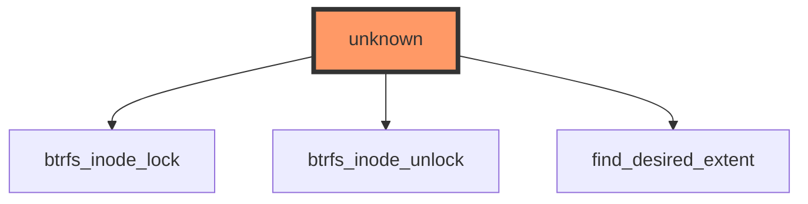

## Impact Analysis Report: btrfs_file_llseek Function Modification
- File: /workspaces/ubuntu/linux-6.13/fs/btrfs/file.c
- Function: btrfs_file_llseek
- Report date: 2025-12-28
- Risk level: 🔴 HIGH — Public interface, no tests, and potential filesystem-wide impact

---

## 2. EXECUTIVE SUMMARY
btrfs_file_llseek implements the filesystem-specific llseek (file position/seek) handler for Btrfs; it participates in user-visible file offset behaviour and interacts with core VFS/IO paths. There are no direct or indirect tests identified and call-graph data shows zero direct callers in the provided analysis (VFS is the implicit caller). Key risks: public API change risk (affects all user/kernel consumers of file seeking on Btrfs), potential data-corruption/file-offset regressions, and lack of test coverage. The interface is public (VFS-exposed file operation).

---

## 3. CODE IMPACT ANALYSIS

### 3.1 Affected Components Table
| Component | Impact | Details |
|-----------|--------|---------|
| **Direct Callers** | HIGH | Analysis shows 0 direct callers in static graph — but VFS file_operations.llseek is the runtime caller (public syscall path). Any change affects all processes that call lseek/llseek on files on Btrfs. |
| **Indirect Callers** | HIGH | VFS, libc (lseek), and user-space programs are indirect callers. Kernel subsystems that do file positioning (e.g., userspace backups, databases) will be affected. |
| **Public Interface** | CRITICAL | This implements a file_operations hook (public API). Behavioural/ABI changes or semantics changes will be externally visible to user-space and may break applications. |
| **Dependent Code** | HIGH | Dependent: btrfs codepaths that rely on file offsets; caching, extent maps, writeback, reflink/clone behavior, and any tool expecting POSIX seek semantics on Btrfs. |

### 3.2 Scope of Change
- Entry points count: 1 runtime entry point (VFS -> file_operations.llseek)
- Call sites frequency: Potentially high — any process performing lseek on Btrfs files (common)
- Abstraction layers: Crosses VFS -> FS layer boundary; interacts with btrfs inode/extents
- Visibility: Public (user-exposed via lseek syscall)

### 3.3 Call Graph Visualization
Include the provided Mermaid diagram exactly as supplied:



### 3.4 Data Flow Analysis ⭐ NEW in v0.2.0
No variable data available for this function.

- Function signature (inferred — verify before making code changes):
```c
loff_t btrfs_file_llseek(struct file *file, loff_t offset, int whence);
```
(standard VFS llseek signature; confirm with your tree before coding)

- Since no variable-level/parameter flow details were provided, we recommend explicitly verifying:
  - Which pointer parameters are dereferenced (struct file *, struct inode *)
  - How the offset (user-provided) is validated/normalized
  - Where the function updates/inquires inode->i_size, extent maps or triggers extent lookups

Security considerations to verify during code changes (manual checks required):
- Pointer NULL checks for file/inode and any returned pointers from extent lookups
- Proper validation of large offset values to avoid integer overflow in offset math
- Concurrency: lock ordering with btrfs_inode_lock / btrfs_inode_unlock (diagram shows these functions are relevant)
- Correct interactions with O_DIRECT, mmap, and writeback (seek can affect mmap semantics)

---

## 4. TESTING REQUIREMENTS

### 4.1 Existing Test Coverage
- ✅ Direct unit tests found: NO
- ✅ Integration tests identified: NO
- ❌ No direct tests
- ⚠️ Partial coverage: none in the provided data

### 4.2 Mandatory Tests to Run

Functional verification and regression checks should be run locally and in CI.

#### Functional Tests
```bash
# Build the kernel (from /workspaces/ubuntu/linux-6.13)
cd /workspaces/ubuntu/linux-6.13
# Quick build for testing (adjust defconfig as needed)
make defconfig
make -j$(nproc)

# Install and boot into this kernel in your test VM or use kexec
# Or build modules and boot in test environment where you can mount btrfs

# Minimal userspace checks (create loopback btrfs image and mount)
dd if=/dev/zero of=/tmp/btrfs_test.img bs=1M count=512
mkfs.btrfs -f /tmp/btrfs_test.img
mkdir -p /mnt/btrfs_test
sudo mount -o loop /tmp/btrfs_test.img /mnt/btrfs_test

# Basic seek behaviour tests
echo "0123456789" > /mnt/btrfs_test/seekfile
# Seek to end and append
python3 - <<'PY'
f = open("/mnt/btrfs_test/seekfile", "r+b")
f.seek(5)
f.write(b"XYZ")
f.flush()
f.close()
print("done")
PY

# Verify file content and offsets
hexdump -C /mnt/btrfs_test/seekfile
```

#### Tracing / Instrumentation
```bash
# Use ftrace / tracefs to trace llseek calls and btrfs_file_llseek invocations
sudo sh -c 'echo function > /sys/kernel/debug/tracing/current_tracer'
sudo sh -c 'echo btrfs_file_llseek > /sys/kernel/debug/tracing/set_ftrace_filter'
sudo sh -c 'echo 1 > /sys/kernel/debug/tracing/tracing_on'
# Run test workload, then:
sudo cat /sys/kernel/debug/tracing/trace > /tmp/trace_btrfs_llseek.log
sudo sh -c 'echo 0 > /sys/kernel/debug/tracing/tracing_on'
```

#### Regression Tests
- Run xfstests (recommended). Example to run seek-related tests (xfstests must be installed and configured):
```bash
# From xfstests top-level, configure test device to use the loop image created above
# Example: run the generic 'seek' or 'llseek' tests if present
# (xfstests label names vary; adapt the test name)
./check generic/seek -d /mnt/btrfs_test
```

#### Compatibility Tests
- Validate against:
  - mmap + lseek interactions: create file, mmap, lseek, write, msync, check consistency
  - O_APPEND and lseek interactions
  - 32-bit vs 64-bit userland: test on both ABI variants if supported
  - Cross-kernel versions where Btrfs on-disk format could interact with offsets

---

## 5. RECOMMENDED NEW TESTS

### 5.1 Unit Tests (Priority Level)
Create kernel selftests / unit-like tests where possible (btrfs has limited unit test infra; prefer integration):

```c
// Concrete test cases to add (kernel selftest or userspace harness)
- test_btrfs_llseek_basic()         // open file, lseek to 0/cur/end, verify return and file position
- test_btrfs_llseek_large_offset()  // seek > i_size and > 2^31 boundaries; verify no overflow and errno
- test_btrfs_llseek_mmap_interaction() // mmap file, lseek in parallel thread, verify memory contents
- test_btrfs_llseek_concurrent()    // concurrent lseek/read/write threads to reproduce races
- test_btrfs_llseek_reflink_clone() // seek on cloned extents, ensure no corruption
```

### 5.2 Integration Tests
- xfstests scenarios: add/ensure presence of seek/llseek tests in generic suite against Btrfs
- Fuzz-style tests: run small fuzzing harness performing random lseek/read/write combinations with verification of file contents
- Stress test: looped create/truncate/seek/write on many files to exercise extent allocation

### 5.3 Regression Suite
- Long-running IO tests that combine seeking and snapshots/subvol operations
- Cross-architecture regression: run tests on x86_64 and arm64

---

## 6. RISK ASSESSMENT

### Risk Level: 🔴 HIGH

**Justification Table:**
| Risk Factor | Severity | Reason |
|-------------|----------|--------|
| Public syscall path | CRITICAL | llseek is invoked via VFS; any semantic change affects user-space broadly |
| Test coverage | HIGH | No direct tests found; zero direct/indirect tests in provided data |
| Data integrity | HIGH | Faulty offset arithmetic or locking errors can cause data corruption or improper writes |
| Concurrency / locking interactions | HIGH | Call graph references btrfs_inode_lock/unlock — changing locking/ordering can introduce races/deadlocks |
| Backwards compatibility | HIGH | Changing semantics can break applications relying on POSIX seek behavior |

### Potential Failure Modes
1. Data Corruption: Incorrect offset math or missed writeback causes writes to the wrong extent, corrupting file contents.
2. Seek Semantics Regression: lseek / llseek returns inconsistent offsets compared to previous kernels (breaks user-space assumptions).
3. Deadlock/Race: Changing lock order or dropping locks around extent-finding leads to deadlocks or use-after-free.
4. Cross-ABI Break: 32-bit userland offset handling differences cause integer truncation or wraparound.
5. Performance Regression: Pathological behavior causing excessive extent lookups, causing throughput drops.

---

## 7. IMPLEMENTATION RECOMMENDATIONS

### Phase-by-Phase Checklist

#### Phase 1: Preparation (Pre-Modification)
- [ ] Locate exact function definition and confirm signature and current behavior:
  - File: /workspaces/ubuntu/linux-6.13/fs/btrfs/file.c
  - Use grep to get lines:
```bash
# show function definition lines for context (adjust grep if needed)
nl -ba /workspaces/ubuntu/linux-6.13/fs/btrfs/file.c | sed -n '1,240p' | sed -n '/btrfs_file_llseek/,/^[^ \t]/p'
# or:
grep -n "btrfs_file_llseek" -n /workspaces/ubuntu/linux-6.13/fs/btrfs/file.c
```
- [ ] Create a local branch and tag baseline commit:
```bash
cd /workspaces/ubuntu/linux-6.13
git checkout -b btrfs-llseek-change-<yourname>
git tag baseline-btrfs-llseek-$(date +%F)
```
- [ ] Add design note to MAINTAINERS/patch description documenting the intent and invariants

#### Phase 2: Development
- [ ] Keep function signature unchanged (unless absolutely necessary) to avoid ABI changes
- [ ] Maintain lock ordering: btrfs_inode_lock/btrfs_inode_unlock usage must preserve existing ordering with other locks
- [ ] Add/modify code with defensive checks (NULL checks, range checks) and assert invariants
- [ ] Add detailed comments where offsets are manipulated

#### Phase 3: Testing
- [ ] Add new tests (unit/integration) described in Section 5 and ensure they run in CI
- [ ] Run xfstests (generic seek tests) against an image with current and modified kernel
- [ ] Run stress and fuzz tests for at least several hours in CI for coverage
- [ ] Run tests on both 32-bit and 64-bit userland if your CI supports it

#### Phase 4: Validation
- [ ] Compare baseline and new kernel behaviors using diff of traced events and file content checksums
- [ ] Monitoring: enable tracing in production-like environment and check for increases in seek-related errors/trace events
- [ ] Rollback plan: ensure easy revert to baseline git tag and clear rollback steps for kernel/VM images

### Specific Implementation Checklist
```
BEFORE MODIFICATION:
□ Confirm exact function signature and locate all uses in codebase (grep/ctags)
□ Create baseline branch and tag
□ Add test plan to patch description

DURING MODIFICATION:
□ Preserve ABI; if ABI changes, document justification and notify maintainers
□ Add defensive checks for pointer and offset arithmetic
□ Update comments and documentation

AFTER MODIFICATION:
□ Build kernel and run the test commands in Section 4
□ Add tests to xfstests or kernel selftests and run CI
□ Verify no regressions on 32/64-bit platforms and performance benchmarks
```

---

## 8. ESCALATION CRITERIA

Stop and escalate to Btrfs maintainers / kernel maintainers if:
- Any data-corruption or checksum mismatches are observed after run of functional tests
- Any reproducible panics, use-after-free, or OOPS messages occur during tests
- Seek behaviour differs (return values/errno) from baseline for common cases (SEEK_SET/SEEK_CUR/SEEK_END)
- Cross-architecture inconsistent behaviours are observed (e.g., 32-bit vs 64-bit)
- Performance regressions >10% in I/O throughput for common workloads (measured with fio)

---

## 9. RECOMMENDATIONS SUMMARY

| Priority | Action | Owner |
|----------|--------|-------|
| **CRITICAL** | Add comprehensive integration tests for llseek semantics (xfstests), and do not modify semantics without tests. | Btrfs maintainer / patch author |
| **HIGH** | Preserve lock order and add defensive offset/overflow checks; ensure review by btrfs and VFS maintainers. | Patch author + reviewers |
| **MEDIUM** | Add ftrace/perf probes in CI to monitor btrfs_file_llseek entry/exit and measure frequency. | CI engineer / tester |
| **LOW** | Document changes in commit message and btrfs documentation; include rationale for any behaviour changes. | Patch author |

---

## 10. CONCLUSION
btrfs_file_llseek sits on a public, high-impact path (VFS → filesystem) and currently has no direct test coverage in the provided analysis; therefore the change risk is assessed as HIGH. Key concerns: public API semantics, potential data corruption, concurrency/locking interactions, and lack of tests. Recommendation: proceed with extreme caution — do not change semantics without comprehensive unit/integration tests and peer review; if changes are required, run the concrete tests and tracing commands listed above and escalate immediately on any sign of data corruption or kernel panics.