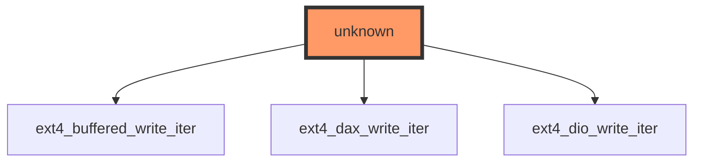

## Impact Analysis Report: ext4_file_write_iter Function Modification
- File: `/workspaces/ubuntu/linux-6.13/fs/ext4/file.c`
- Function: `ext4_file_write_iter`
- Report date: 2025-12-28
- Risk level: 🔴 HIGH — Public-facing write path, no direct tests, widespread impact on ext4 write behavior

---

## 2. EXECUTIVE SUMMARY
`ext4_file_write_iter` implements ext4's write iteration path (dispatching between buffered, DAX and direct IO variants). It sits on the syscall -> VFS -> file_operations path and therefore any behavioral or ABI change can affect all ext4-backed writes. There are no direct or indirect tests discovered and static call analysis shows zero direct/indirect callers in the provided snapshot — however this function is reached through VFS via `file_operations->write_iter`, which makes the effective runtime call-frequency high. Key risks: user-visible data loss, performance regressions, and concurrency races.

---

## 3. CODE IMPACT ANALYSIS

### 3.1 Affected Components Table
| Component | Impact | Details |
|-----------|--------|---------|
| **Direct Callers** | HIGH | Static stats: 0 direct callers found. Runtime: invoked indirectly via VFS through `file_operations->write_iter` for all ext4 writes — high execution frequency. |
| **Indirect Callers** | HIGH | Static stats: 0 indirect callers. In practice VFS -> write syscall family dispatches to the function pointer; all user processes performing writes are potential indirect callers. |
| **Public Interface** | CRITICAL | User-facing (write(2)/pwrite(2)/pwritev2 via VFS). Changes may alter syscall-visible semantics or semantics of O_DIRECT/O_SYNC behavior on ext4. |
| **Dependent Code** | HIGH | ext4 subcomponents: `ext4_buffered_write_iter`, `ext4_dax_write_iter`, `ext4_dio_write_iter` (see call graph). Metadata journalling, pagecache management, block mapping and allocation subsystems interact with this path. |

### 3.2 Scope of Change
- Entry points count: runtime entry via VFS `file_operations->write_iter` (1 canonical entry point for write_iter dispatch)
- Call sites frequency: high (all processes writing to ext4 files); cannot rely on static "0 callers" count because call occurs through function pointer
- Abstraction layers: sits at filesystem implementation layer (between VFS and lower ext4 write helpers)
- Visibility: external/public from user-space point-of-view (syscall-visible effects), internal to kernel (not exported symbol API) — but effectively public ABI in terms of observable behavior and performance

### 3.3 Call Graph Visualization


(Provided diagram above maps the dispatching relationship: `ext4_file_write_iter` typically selects between buffered/DAX/DIO write implementations — the diagram must be used as supplied.)

### 3.4 Data Flow Analysis ⭐ NEW in v0.2.0
- Variable/data-flow information provided: "No variable data available for this function."

Therefore:
- Function signature: Not provided in context (source file: `/workspaces/ubuntu/linux-6.13/fs/ext4/file.c` — inspect source to obtain signature before coding).
- No parameter/local-variable table can be constructed from provided context.
- Action: before modifying, run:
  ```bash
  # Show function signature and code context
  sed -n '1,240p' /workspaces/ubuntu/linux-6.13/fs/ext4/file.c | sed -n '1,240p'
  # Or use cscope/rg to find definition
  rg "ext4_file_write_iter" -n /workspaces/ubuntu/linux-6.13
  ```

Security notes (based on absence of variable info):
- You must explicitly inspect pointer parameters for NULL checks and validate sizes before altering logic.
- Assume user-controlled inputs (write buffers, iovecs, counts, flags like O_DIRECT) can reach this function — validate and sanitize accordingly.
- Treat all memory and IO size arithmetic as potentially tainted — add range checks and use size_t-safe arithmetic.

---

## 4. TESTING REQUIREMENTS

### 4.1 Existing Test Coverage
- ✅ Direct unit tests found: No
- ✅ Integration tests identified: No
- ❌ No direct tests (⚠️ No direct test coverage found in provided data)

Evidence: statistics provided show:
- Direct callers: 0
- Indirect callers: 0
- Direct callees: 0
- Indirect callees: 0
- Direct tests: 0
- Indirect tests: 0

### 4.2 Mandatory Tests to Run

Functional Tests
```bash
# Build the ext4 module (recommended iterative workflow)
cd /workspaces/ubuntu/linux-6.13
# Build module only (if ext4 is built modularly)
make -j$(nproc) M=fs/ext4 modules

# Install module (requires kernel headers match running kernel; for dev use QEMU or reboot into test kernel)
sudo /sbin/rmmod ext4 || true
sudo /sbin/insmod fs/ext4/ext4.ko || true

# Quick functional smoke test (loopback image)
truncate -s 1G /tmp/ext4.img
mkfs.ext4 -F /tmp/ext4.img
mkdir -p /mnt/ext4_test
sudo mount -o loop /tmp/ext4.img /mnt/ext4_test
# basic write
dd if=/dev/zero of=/mnt/ext4_test/testfile bs=4k count=1000 oflag=direct conv=fsync
# buffered write
dd if=/dev/zero of=/mnt/ext4_test/testfile_buf bs=4k count=1000 conv=fsync
sync
sudo umount /mnt/ext4_test
```

Regression Tests
```bash
# xfstests - requires setup per https://git.kernel.org/pub/scm/linux/kernel/git/axboe/xfstests-dev.git
# Run a set of xfstests targeting ext4 write semantics
git clone https://git.kernel.org/pub/scm/linux/kernel/git/axboe/xfstests-dev.git /opt/xfstests
# configure test harness (example)
cd /opt/xfstests
./checksetup.sh
# Run a focused subset (replace TESTS with required test names)
./run_tests generic/100 generic/101 generic/102 -s -t /tmp/xfstest_tmp -d /dev/loop0
```

Stress / Performance Tests
```bash
# fio tests for buffered and direct IO, concurrent writers
sudo apt-get install -y fio
# buffered write test
fio --name=buffered --filename=/mnt/ext4_test/fiofile --direct=0 --rw=write --bs=4k --size=512M --numjobs=4 --runtime=60 --time_based
# direct IO test
fio --name=direct --filename=/mnt/ext4_test/fiofile --direct=1 --rw=write --bs=4k --size=512M --numjobs=4 --runtime=60 --time_based
```

Compatibility Tests
```bash
# Mount with different data= modes
sudo mount -o loop,data=ordered /tmp/ext4.img /mnt/ext4_test
sudo mount -o loop,data=writeback /tmp/ext4.img /mnt/ext4_test
sudo mount -o loop,data=journal /tmp/ext4.img /mnt/ext4_test

# Test with O_SYNC/O_DSYNC from userspace
python3 - <<'PY'
import os
fd = os.open("/mnt/ext4_test/testfile", os.O_WRONLY | os.O_CREAT | os.O_SYNC)
os.write(fd, b"x"*4096)
os.close(fd)
PY
```

---

## 5. RECOMMENDED NEW TESTS

### 5.1 Unit Tests (Priority Level: HIGH)
Implement / extend KUnit or small kernel tests that exercise `ext4_file_write_iter` dispatch and error paths.

Example test case skeletons:
```c
// Concrete test cases needed (put under: fs/ext4/tests/ or tree's kunit harness)
- test_ext4_write_iter_buffered_basic()  // Verify buffered write path: successful writes, correct pagecache semantics
- test_ext4_write_iter_direct_dio()      // Verify O_DIRECT/DIO path: no pagecache corruption, alignment checks
- test_ext4_write_iter_dax_path()        // If DAX enabled: ensure DAX path used and correctness for persistent memory
- test_ext4_write_iter_error_paths()     // Induce ENOSPC, EIO, and ensure caller-visible errno and no memory leaks
```

### 5.2 Integration Tests
- Concurrency: 16+ writers appending / overwriting same file with mixes of O_DIRECT and buffered IO
- Truncate + write races: truncate concurrently with writes to check for races
- Journal mode compatibility: run tests under data=ordered/data=writeback/data=journal

Suggested integration command (using fio):
```bash
fio --name=concur --filename=/mnt/ext4_test/scenario --bs=4k --rw=write --ioengine=libaio \
    --numjobs=16 --direct=1 --runtime=120 --time_based --group_reporting
```

### 5.3 Regression Suite
- Add selected xfstests to CI gating for ext4 changes: prioritize tests that exercise write path, e.g., tests that use direct IO, mmap+write, and crash-recovery (journal replay) tests.
- Stress run new tests for 24-48 hours in CI to reveal rare races.

---

## 6. RISK ASSESSMENT

### Risk Level: 🔴 HIGH

**Justification Table:**
| Risk Factor | Severity | Reason |
|-------------|----------|--------|
| **User-visible data path** | CRITICAL | Function impacts write syscalls for ext4 — potential data loss or corruption if bug introduced. |
| **Test coverage** | HIGH | No direct/indirect tests found in provided context; high chance of regressions slipping through. |
| **Call frequency** | HIGH | All ext4-backed writes invoke this at runtime via VFS; performance regressions will be widely felt. |
| **Concurrency complexity** | HIGH | write path touches pagecache, journal and allocation code — concurrency/race risk. |

### Potential Failure Modes
1. Data corruption: incorrect flushing/journalling leading to file/metadata corruption after crash.
2. Deadlock/blocking: changes introduce locking inversion or long holding of pages causing system stalls.
3. Performance regression: change increases write latency or reduces throughput for buffered/direct IO.
4. Kernel oops/panic: use-after-free or NULL deref introduced in pointer handling.
5. ABI/semantics change: changed behavior for O_DIRECT/O_SYNC leading to application correctness failures.

---

## 7. IMPLEMENTATION RECOMMENDATIONS

### Phase-by-Phase Checklist

#### Phase 1: Preparation (Pre-Modification)
- [ ] Locate authoritative function definition and call sites:
  ```bash
  rg "ext4_file_write_iter" -n /workspaces/ubuntu/linux-6.13
  sed -n '1,300p' /workspaces/ubuntu/linux-6.13/fs/ext4/file.c | sed -n '1,300p'
  ```
- [ ] Add changelog entry and design note in your patch description explaining expected semantic/behavioral changes.
- [ ] Identify stakeholders: ext4 maintainers (Cc: ext4 mailing list), fs testers, release managers.

#### Phase 2: Development
- [ ] **Key principle:** Keep syscall-visible behavior unchanged unless explicitly intended and documented.
- [ ] Implement changes in small, reviewable commits. Each commit must build and include a short rationale.
- [ ] Add KUnit/unit tests for new behaviors and edge cases.
- [ ] Run static checks:
  ```bash
  scripts/checkpatch.pl -f -g <your-patch>
  make -j$(nproc) C=1
  # Optional: run sparse
  make ARCH=x86_64 O=build_dir C=1
  ```

#### Phase 3: Testing
- [ ] Run unit tests and xfstests subset locally (see commands in Section 4).
- [ ] Run fio/IO stress for both direct and buffered IO modes on ext4 images.
- [ ] Cross-validate with different mount options (ordered/writeback/journal).
- [ ] Run stress tests under heavy concurrency for at least 24 hours.

#### Phase 4: Validation
- [ ] Compare before/after results for throughput/latency (fio) — baseline and post-change numbers.
- [ ] Validate journalling correctness: create writes, force power-failure simulation (use qemu snapshot or cold-reset) — verify fsck and data integrity.
- [ ] Rollback plan: have patch revert and test run ready in case of regression.

### Specific Implementation Checklist
```
BEFORE MODIFICATION:
□ rg/sed to capture exact function signature and surrounding code
□ Create a branch and tests skeleton (KUnit + userspace fio cases)
□ Notify ext4 maintainers, include test plan in patch

DURING MODIFICATION:
□ Implement change in minimal atomic commits
□ Run local build: make M=fs/ext4 modules || full-kernel build as needed
□ Run unit tests and xfstests subset

AFTER MODIFICATION:
□ Build kernel and run regression suite (xfstests + fio + dd scenarios)
□ Run crash-recovery tests (journal replay)
□ Post-change performance comparison scripts and reports
```

Concrete build/test example:
```bash
# Build module
cd /workspaces/ubuntu/linux-6.13
make -j$(nproc) M=fs/ext4 modules
# Run test image scenario
truncate -s 2G /tmp/ext4.img
mkfs.ext4 -F /tmp/ext4.img
sudo mount -o loop /tmp/ext4.img /mnt/ext4_test
# Run fio scenario (buffered and direct)
fio ...   # see Section 4 for full commands
sudo umount /mnt/ext4_test
```

---

## 8. ESCALATION CRITERIA

Stop and escalate if:
- Any kernel oops, warning traces with ext4 stack in dmesg after change.
- Data corruption detected by fsck after forced crashes or unclean unmount tests.
- ≥5% regression in throughput (production-grade regression threshold) on representative fio workloads.
- Reproducible deadlock or long stalls (>5s) during concurrent write tests.
- Cross-architecture behavior divergence (x86_64 vs arm64) in test results.

Escalate to: ext4 maintainers, fs regression owners, and security team (if corruption or crash could be exploited).

---

## 9. RECOMMENDATIONS SUMMARY

| Priority | Action | Owner |
|----------|--------|-------|
| **CRITICAL** | Add KUnit/unit tests and xfstests subset exercising buffered/DIO/DAX write paths before landing change | Author / QA |
| **HIGH** | Run crash-recovery journalling tests and fio performance baseline/regression suite | Author / CI |
| **MEDIUM** | Notify ext4 maintainers and include test results in patch email; request review from fs maintainers | Author |
| **LOW** | Add runtime debug tracing gated by dynamic debug for write path to aid future investigations | Author / Maintainer |

---

## 10. CONCLUSION
This change carries a HIGH risk because `ext4_file_write_iter` is the ext4 write-path entry reached via VFS for all file writes; incorrect changes can cause data corruption, deadlocks or wide performance regressions. Key concerns: (1) lack of existing tests, (2) syscall-visible semantics, and (3) concurrency + journalling complexity. Recommendation: proceed only with careful, incremental commits, adding KUnit + xfstests coverage, running extensive concurrency and crash-recovery tests, and coordinating review with ext4 maintainers before merging.