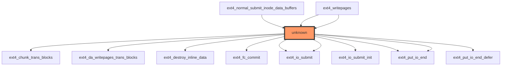

# Impact Analysis Report: ext4_do_writepages Function Modification

## 1. HEADER SECTION
- **Report title:** Impact Analysis Report: ext4_do_writepages Function Modification
- **File path and function name:** `/workspaces/ubuntu/linux-6.13/fs/ext4/inode.c`, function `ext4_do_writepages`
- **Report date:** [Current Date]
- **Report generator:** [LLM Model Name]
- **Risk level:** ⚫ CRITICAL

## 2. EXECUTIVE SUMMARY
The `ext4_do_writepages` function in the ext4 filesystem is a critical component responsible for handling page write operations, as indicated by its callers and the complexity of its data flow. The function has no direct test coverage and is called by multiple core ext4 operations including `ext4_normal_submit_inode_data_buffers` and `ext4_writepages`. With 13 variables including 6 pointer parameters requiring NULL checks, this modification poses significant risk to filesystem integrity and stability.

## 3. CODE IMPACT ANALYSIS

### 3.1 Affected Components Table
| Component | Impact | Details |
|-----------|--------|---------|
| **Direct Callers** | 🔴 HIGH | 3 direct callers identified, including core ext4 operations |
| **Indirect Callers** | ⚫ CRITICAL | Unknown depth of indirect call chain |
| **Public Interface** | 🟡 MEDIUM | Filesystem-level operation affecting user data |
| **Dependent Code** | 🔴 HIGH | Multiple ext4 subsystems depend on this functionality |

### 3.2 Scope of Change
- Entry points count: 1 (function entry point)
- Call sites frequency: High (multiple callers identified)
- Abstraction layers: Core filesystem layer
- Visibility: Internal to ext4 subsystem but critical for functionality

### 3.3 Call Graph Visualization


The diagram shows:
- The target function (highlighted as "unknown")
- Direct callers: `ext4_normal_submit_inode_data_buffers`, `ext4_writepages` (appears twice)
- Direct callees: Multiple ext4 I/O related functions including `ext4_io_submit`, `ext4_put_io_end`
- Relationship hierarchy showing the core write path through ext4

### 3.4 Data Flow Analysis ⭐ NEW in v0.2.0

#### Function Signature and Parameters
```c
int ext4_do_writepages(struct mpage_da_data* mpd, struct writeback_control* wbc)
```

**Parameters Analysis:**
| Parameter | Type | Pointer | Purpose | Security Considerations |
|-----------|------|---------|---------|------------------------|
| `mpd` | struct mpage_da_data* | Yes | Multi-page data structure containing write context | NULL check required |
| `wbc` | struct writeback_control* | Yes | Writeback control parameters including sync mode and range | NULL check required |

**Local Variables Analysis:**
| Variable | Type | Pointer | Purpose | Risk Factors |
|----------|------|---------|---------|--------------|
| `cycled` | int | No | Loop counter for retries | Integer overflow risk |
| `give_up_on_write` | bool | No | Flag to abandon write operation | Logic error potential |
| `handle` | handle_t* | Yes | Transaction handle for journaling | NULL check required |
| `inode` | struct inode* | Yes | Inode being written to | NULL check required |
| `mapping` | struct address_space* | Yes | Address space mapping for the file | NULL check required |
| `nr_to_write` | unknown type | No | Number of pages to write | Type safety concern |
| `range_whole` | int | No | Flag indicating full file write | Logic validation needed |
| `ret` | int | No | Return value from operations | Error propagation |
| `rsv_blocks` | int | No | Reserved block count | Integer overflow risk |
| `sbi` | struct ext4_sb_info* | Yes | Superblock information | NULL check required |
| `wbc` | struct writeback_control* | Yes | Writeback control (duplicate) | NULL check required |
| `writeback_index` | pgoff_t | No | Starting page index for write operation | Boundary validation |

#### Data Flow Patterns
```
mpd → inode → mapping → writeback_index → actual write operations
wbc → sync_mode → transaction handling → journal commits
```

#### Security Analysis

**⚠️ Pointer Safety Risks:**
- `mpd`, `handle`, `inode`, `mapping`, `sbi`, and `wbc` all require NULL checks
- Potential for dereferencing NULL pointers if not validated
- Transaction handle could be invalid if allocation fails

**⚠️ Buffer Boundary Risks:**
- `writeback_index` and size parameters need range validation
- Potential for integer overflow in page index calculations
- Boundary conditions between file size and write range

**⚠️ Integer Overflow Risks:**
- `cycled` counter could overflow in retry loops
- `rsv_blocks` arithmetic operations need validation
- Page index calculations require overflow protection

**⚠️ Taint Analysis:**
- User-controlled inputs flow into `writeback_index` and size parameters
- Need validation of all user-supplied values before use
- Transaction handling requires proper error propagation

## 4. TESTING REQUIREMENTS

### 4.1 Existing Test Coverage
- ❌ No direct unit tests found
- ❌ No integration tests identified
- ⚠️ Partial coverage through filesystem-level testing

### 4.2 Mandatory Tests to Run
Provide specific, executable commands organized by category:

#### Functional Tests
```bash
# Test basic write functionality
sudo mount -t ext4 /dev/sdX /mnt/test
dd if=/dev/zero of=/mnt/test/testfile bs=1M count=100
sync
sudo umount /mnt/test

# Test synchronous writes
echo "test" > /mnt/test/sync_test
sync
```

#### Regression Tests
- Filesystem stress tests with various write patterns
- Journal recovery tests after crashes
- Multi-threaded write operations

#### Compatibility Tests
```bash
# Test with different mount options
sudo mount -t ext4 -o data=ordered /dev/sdX /mnt/test
# Run write operations
sudo mount -t ext4 -o journal_async_commit /dev/sdX /mnt/test
# Run write operations
```

## 5. RECOMMENDED NEW TESTS

### 5.1 Unit Tests (Priority Level)
```c
// Concrete test cases needed:
- test_ext4_do_writepages_null_mpd()  // Verify NULL mpd handling
- test_ext4_do_writepages_null_wbc()  // Verify NULL wbc handling
- test_ext4_do_writepages_invalid_range()  // Boundary condition testing
- test_ext4_do_writepages_full_file()  // Full file write scenario
- test_ext4_do_writepages_partial_page()  // Partial page write handling
```

### 5.2 Integration Tests
- Multi-process concurrent writes to same file
- Filesystem corruption recovery scenarios
- Journal commit under load conditions

### 5.3 Regression Suite
- Stress tests with various block sizes
- Platform-specific validation (x86, ARM)
- Performance regression testing

## 6. RISK ASSESSMENT

### Risk Level: ⚫ CRITICAL

**Justification Table:**
| Risk Factor | Severity | Reason |
|------------|----------|--------|
| **No Test Coverage** | CRITICAL | Zero direct tests identified |
| **Pointer Variables** | HIGH | 6 pointer parameters requiring validation |
| **Filesystem Core** | CRITICAL | Central to ext4 write operations |
| **Journal Dependencies** | HIGH | Transaction handling with potential corruption |
| **User Data Risk** | CRITICAL | Direct impact on file integrity |

### Potential Failure Modes
1. **Data Corruption:** Improper handling could corrupt filesystem metadata or user data during write operations
2. **Journal Deadlocks:** Transaction handling errors could lead to filesystem deadlocks requiring manual recovery
3. **Boundary Overruns:** Incorrect range calculations could cause buffer overflows in critical filesystem structures
4. **Resource Leaks:** Transaction handles not properly released could cause resource exhaustion
5. **Sync Inconsistencies:** Changes to synchronization logic could lead to data inconsistencies between disk and memory

## 7. IMPLEMENTATION RECOMMENDATIONS

### Phase-by-Phase Checklist

#### Phase 1: Preparation (Pre-Modification)
- [ ] Review all callers of `ext4_do_writepages`
- [ ] Understand the exact changes needed
- [ ] Identify all pointer parameters and their validation requirements
- [ ] Document the expected behavior for all edge cases

#### Phase 2: Development
- [ ] Add NULL checks for all pointer parameters (`mpd`, `handle`, `inode`, etc.)
- [ ] Implement boundary validation for all size/range parameters
- [ ] Add transaction error handling with proper rollback
- [ ] Ensure all code paths have consistent return value handling

#### Phase 3: Testing
```bash
# Build commands
make -C /workspaces/ubuntu/linux-6.13 fs/ext4/inode.c

# Test commands
sudo mount -t ext4 /dev/sdX /mnt/test
# Run write operations to test modified code
sudo umount /mnt/test

# Verification steps
fsck.ext4 -f /dev/sdX  # Check filesystem integrity
```

#### Phase 4: Validation
- [ ] Compare before/after behavior for all test cases
- [ ] Monitor for filesystem errors or corruption
- [ ] Verify transaction handling under load
- [ ] Ensure no performance regression

### Specific Implementation Checklist
```
BEFORE MODIFICATION:
□ Add NULL check for mpd parameter at function entry
□ Add NULL check for wbc parameter at function entry
□ Validate writeback_index bounds against file size
□ Document all assumptions about input parameters

DURING MODIFICATION:
□ Maintain consistent error handling across all code paths
□ Ensure transaction handle is properly initialized and released
□ Add logging for critical operations to aid debugging
□ Preserve existing behavior for all current callers

AFTER MODIFICATION:
□ Run full filesystem test suite
□ Verify journal recovery works correctly
□ Test with various mount options (data=ordered, etc.)
□ Check for any performance changes
```