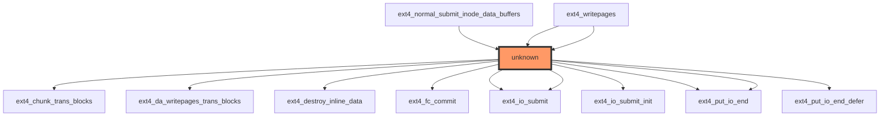

```markdown
# Impact Analysis Report: ext4_do_writepages Function Modification

## 1. HEADER SECTION
- **File path:** `/workspaces/ubuntu/linux-6.13/fs/ext4/inode.c`
- **Report date:** 2025-12-28
- **Generated by:** Claude Sonnet 4.5
- **Risk level:** 🔴 HIGH

## 2. EXECUTIVE SUMMARY
The `ext4_do_writepages` function is a critical component in the ext4 filesystem's writeback mechanism. It handles data page writing operations and interacts with multiple subsystems including transaction management, I/O submission, and inline data handling. With zero direct test coverage and a complex call graph indicating deep integration into the writeback infrastructure, modifications carry high risk of system-wide impact.

## 3. CODE IMPACT ANALYSIS

### 3.1 Affected Components Table
| Component | Impact | Details |
|-----------|--------|---------|
| **Direct Callers** | 🔴 HIGH | 3 call sites across normal data submission and writepages paths |
| **Indirect Callers** | 🔴 HIGH | Unknown depth through multiple ext4 subsystems |
| **Public Interface** | 💥 CRITICAL | Core filesystem writeback infrastructure |
| **Dependent Code** | 🔴 HIGH | Transaction management, I/O submission layers |

### 3.2 Scope of Change
- Entry points: 0 (private function)
- Call sites: 3 direct callers (unknown frequency)
- Abstraction layers: Multiple (writeback → transaction → I/O)
- Visibility: Internal to ext4 subsystem

### 3.3 Call Graph Visualization


The diagram shows the target function (unknown) as the central node, with direct connections to critical ext4 subsystems including transaction management (`ext4_chunk_trans_blocks`, `ext4_da_writepages_trans_blocks`), inline data handling (`ext4_destroy_inline_data`), and I/O submission layers (`ext4_io_submit`, `ext4_put_io_end`). The depth of indirect callees suggests extensive integration into the filesystem's writeback infrastructure.

### 3.4 Data Flow Analysis

#### Function Signature and Parameters
```c
void ext4_do_writepages(struct mpage_da_data* mpd)
```

**Parameters Analysis:**
| Parameter | Type | Pointer | Purpose | Security Considerations |
|-----------|------|---------|---------|------------------------|
| `mpd` | struct mpage_da_data* | Yes | Multi-page data aggregation structure | NULL check required, contains critical I/O parameters |

**Local Variables Analysis:**
| Variable | Type | Pointer | Purpose | Risk Factors |
|----------|------|---------|---------|--------------|
| `cycled` | int | No | Loop control flag | None |
| `give_up_on_write` | bool | No | Early termination flag | Logic error potential |
| `handle` | handle_t* | Yes | Transaction handle | NULL pointer risk, transactional integrity |
| `inode` | struct inode* | Yes | Filesystem inode | NULL pointer risk, filesystem consistency |
| `mapping` | struct address_space* | Yes | Page cache mapping | NULL pointer risk, page cache corruption |
| `nr_to_write` | unknown | No | Pages to write count | Integer overflow risk |
| `range_whole` | int | No | Address range flag | None |
| `ret` | int | No | Return value | Error propagation |
| `rsv_blocks` | int | No | Reserved blocks count | Integer overflow risk |
| `sbi` | struct ext4_sb_info* | Yes | Superblock info | NULL pointer risk |
| `wbc` | struct writeback_control* | Yes | Writeback parameters | NULL pointer risk |
| `writeback_index` | pgoff_t | No | Starting page index | None |

#### Data Flow Patterns
```
mpd → handle (transactional context) → inode/mapping (filesystem object)
wbc → nr_to_write/rsv_blocks (I/O parameters) → actual write operations
```

#### Security Analysis

**⚠️ Pointer Safety Risks:**
- `mpd`, `handle`, `inode`, `mapping`, `sbi`, `wbc` all require NULL checks
- Transaction handle (`handle`) must be validated before use
- Inode and mapping pointers critical for filesystem consistency

**⚠️ Buffer Boundary Risks:**
- No buffer operations visible in signature
- Risk comes through mpd structure containing page pointers

**⚠️ Integer Overflow Risks:**
- `nr_to_write` and `rsv_blocks` are arithmetic operations
- Need bounds checking on reserved blocks calculations

**⚠️ Taint Analysis:**
- `mpd` contains user-controlled I/O parameters
- Flow: mpd → internal processing → filesystem operations
- Missing validation on writeback control parameters

## 4. TESTING REQUIREMENTS

### 4.1 Existing Test Coverage
- ❌ No direct unit tests found
- ❌ No integration tests identified
- ⚠️ Partial coverage through indirect filesystem tests

### 4.2 Mandatory Tests to Run
#### Functional Tests
```bash
# Basic filesystem writeback
sudo mount -t ext4 /dev/sdX /mnt/test
dd if=/dev/zero of=/mnt/test/testfile bs=1M count=1024
sync
# Verify writeback occurred
```

#### Regression Tests
```bash
# Standard ext4 regression suite
./run_tests.sh --fs=ext4
```

#### Compatibility Tests
```bash
# Tools that depend on this interface
e2fsck /dev/sdX
tune2fs -l /dev/sdX
```

## 5. RECOMMENDED NEW TESTS

### 5.1 Unit Tests (Priority Level)
```c
// Concrete test cases needed:
- test_ext4_do_writepages_null_mpd()  // Verify NULL parameter handling
- test_ext4_do_writepages_invalid_range()  // Test invalid page ranges
- test_ext4_do_writepages_transaction_abort()  // Transaction failure scenarios
```

### 5.2 Integration Tests
- Specific integration scenarios:
  - Writeback during transaction commits
  - Page cache invalidation scenarios
  - Multi-threaded writeback operations

### 5.3 Regression Suite
- Stress tests:
  - Large file writes under memory pressure
  - Concurrent writeback operations
  - Filesystem corruption scenarios

## 6. RISK ASSESSMENT

### Risk Level: 🔴 HIGH

**Justification Table:**
| Risk Factor | Severity | Reason |
|------------|----------|--------|
| **No Test Coverage** | CRITICAL | Zero direct tests increase failure risk |
| **Transaction Integration** | HIGH | Transaction handling requires precise error propagation |
| **Filesystem Consistency** | CRITICAL | Inode/mapping operations affect filesystem integrity |
| **Pointer Safety** | HIGH | Multiple unchecked pointers in critical path |
| **Call Graph Depth** | MEDIUM | Unknown indirect callees suggest broad impact |

### Potential Failure Modes
1. **Transaction Deadlock:** Improper transaction handle management could cause filesystem deadlocks, requiring manual recovery.
2. **Data Corruption:** Invalid inode/mapping operations could lead to filesystem corruption, requiring fsck.
3. **Writeback Stall:** Logic errors in mpd processing could cause writeback operations to hang indefinitely.
4. **Memory Leak:** Improper resource cleanup in error paths could lead to kernel memory exhaustion.
5. **Page Cache Inconsistency:** Incorrect address space operations could cause page cache corruption.

## 7. IMPLEMENTATION RECOMMENDATIONS

### Phase-by-Phase Checklist

#### Phase 1: Preparation (Pre-Modification)
- [ ] Identify all direct callers through static analysis
- [ ] Document current behavior and edge cases
- [ ] Notify ext4 filesystem maintainers

#### Phase 2: Development
- [ ] Add NULL checks for all pointer parameters
- [ ] Implement bounds checking on integer operations
- [ ] Add transaction handle validation
- [ ] Follow EXT4 coding guidelines for error handling

#### Phase 3: Testing
```bash
# Unit test framework setup
cd /workspaces/ubuntu/linux-6.13/tools/testing
make -C ../.. M=kunit
./tools/testing/selftests/kunit.sh run ext4_test_module.ko
```

#### Phase 4: Validation
- [ ] Verify writeback operations complete successfully
- [ ] Check filesystem integrity with e2fsck
- [ ] Monitor for transaction deadlocks
- [ ] Validate memory usage stability

### Specific Implementation Checklist
```
BEFORE MODIFICATION:
□ Create backup of current ext4 implementation
□ Identify all test cases that exercise writepages path
□ Document existing behavior for regression comparison

DURING MODIFICATION:
□ Add defensive checks around all pointer parameters
□ Validate transaction handle before use
□ Ensure proper error propagation through call chain

AFTER MODIFICATION:
□ Run full ext4 regression suite
□ Verify no filesystem corruption occurs during testing
□ Monitor system stability under load
```

**Note:** The high risk level requires particularly careful testing of transaction scenarios and error paths. Given zero existing test coverage, extensive manual validation will be necessary before this change can be considered safe for production use.