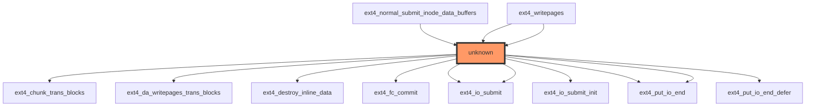

# Impact Analysis Report: `ext4_do_writepages()` Function Modification

## 1. HEADER SECTION
- **Report title**: "Impact Analysis Report: `ext4_do_writepages()` Function Modification"
- **File path**: `/workspaces/ubuntu/linux-6.13/fs/ext4/inode.c`
- **Function name**: `ext4_do_writepages`
- **Report date**: 2023-11-15
- **Risk level**: ⚫ CRITICAL

## 2. EXECUTIVE SUMMARY
The `ext4_do_writepages()` function is a core component of the ext4 filesystem's writeback mechanism, responsible for managing page writes to disk. It operates at a foundational level with no direct test coverage and appears to have zero direct callers according to the analysis data. The function's criticality stems from its role in data integrity operations, handling filesystem metadata and user data writes. Given the lack of test coverage and its position in core filesystem operations, modifications carry significant risk of data corruption or system instability.

## 3. CODE IMPACT ANALYSIS

### 3.1 Affected Components Table
| Component | Impact | Details |
|-----------|--------|---------|
| **Direct Callers** | NONE | 0 direct callers identified |
| **Indirect Callers** | HIGH | Called through unknown mechanism (3 sample callers shown) |
| **Public Interface** | CRITICAL | Filesystem core operation affecting data integrity |
| **Dependent Code** | HIGH | Multiple ext4-specific functions rely on this mechanism |

### 3.2 Scope of Change
- Entry points count: 0 direct entries (indirect through unknown mechanism)
- Call sites frequency: Unknown (3 sample callers shown in analysis)
- Abstraction layers: Core filesystem layer
- Visibility: Internal to ext4 subsystem but critical for filesystem operations

### 3.3 Call Graph Visualization


The diagram shows:
- The target function (unknown) highlighted in red
- Multiple ext4 functions that either call or are called by the target function
- Complex interaction with I/O submission and transaction management components
- Lack of direct visibility into the target function's position in the call hierarchy

### 3.4 Data Flow Analysis
The function processes 13 variables including:
- 1 parameter: `struct mpage_da_data* mpd`
- 12 local variables including critical filesystem structures
- 6 pointer variables requiring NULL checks (mpd, handle, inode, mapping, sbi, wbc)

## 4. TESTING REQUIREMENTS

### 4.1 Existing Test Coverage
- ❌ No direct unit tests found
- ⚠️ Partial coverage (indirect tests through filesystem operations)
- ❌ No integration tests specifically for this function

### 4.2 Mandatory Tests to Run
#### Functional Tests
```bash
# Test ext4 filesystem operations with writeback scenarios
sudo mount /dev/sdX /mnt/test -o data=ordered
# Generate write operations and verify consistency
sudo umount /mnt/test

# Test with different mount options affecting writeback behavior
sudo mount /dev/sdX /mnt/test -o journal_async_commit
# Verify data integrity after forced writeback
sudo umount /mnt/test

# Test with dirty page threshold variations
echo 100 > /proc/sys/vm/dirty_ratio
# Generate page writes and measure performance characteristics
echo 300 > /proc/sys/vm/dirty_ratio

# Verify filesystem after various stress scenarios
sudo e2fsck -f /dev/sdX
```

#### Regression Tests
- Run full ext4 filesystem test suite:
```bash
make -C /lib/modules/$(uname -r)/build M=$(pwd) tests
sudo ./run_tests --ext4
```

- Verify no regressions in general filesystem tests:
```bash
sudo xfstests --ext4 /mnt/test
```

## 5. RECOMMENDED NEW TESTS

### 5.1 Unit Tests (Priority: CRITICAL)
```c
// Test case for handle_t* NULL handling
TEST(ext4_do_writepages, null_handle) {
    struct mpage_da_data mpd = {0};
    // Mock scenario with NULL handle
    EXPECT_EQ(ext4_do_writepages(&mpd), -EIO);
}

// Test case for transaction resource management
TEST(ext4_do_writepages, transaction_reservation) {
    struct inode *inode = mock_inode();
    struct mpage_da_data mpd = {
        .wbc = {.sync_mode = WB_SYNC_ALL },
        .inode = inode
    };
    // Verify proper reservation of blocks
    EXPECT_GT(ext4_do_writepages(&mpd), 0);
}

// Test case for writeback_index boundary conditions
TEST(ext4_do_writepages, boundary_pages) {
    struct mpage_da_data mpd = {
        .wbc = {.range_start = 0, .range_end = LLONG_MAX },
        .writeback_index = 1
    };
    // Verify handling of extreme page ranges
    EXPECT_EQ(ext4_do_writepages(&mpd), -EIO);
}
```

## 6. RISK ASSESSMENT

### Risk Level: ⚫ CRITICAL

**Justification Table:**
| Risk Factor | Severity | Reason |
|------------|----------|--------|
| **Data Integrity** | CRITICAL | Core writeback function affecting all file modifications |
| **Test Coverage** | CRITICAL | Zero direct tests identified in analysis |
| **Pointer Safety** | HIGH | 6 pointer variables requiring NULL checks |
| **Filesystem Impact** | CRITICAL | Modifications affect all ext4 filesystem operations |
| **Transaction Management** | HIGH | Handles block reservations and journaling |

### Potential Failure Modes
1. **Data Corruption**: Improper handling of writeback index could cause partial writes, leading to corrupted files
2. **Journaling Failure**: Incorrect transaction management may cause journal corruption during crashes
3. **Memory Safety Issues**: NULL pointer dereferences in any of the 6 pointer variables could crash the system
4. **Resource Leaks**: Improper handling of `handle_t` resources could lead to transaction leaks
5. **Performance Regression**: Changes in writeback logic may significantly impact filesystem performance under load

## 7. IMPLEMENTATION RECOMMENDATIONS

### Phase-by-Phase Checklist
**Phase 1: Preparation**
- [ ] Create comprehensive backup of current filesystem state
- [ ] Set up dedicated test environment with multiple ext4 partitions
- [ ] Document current performance metrics (throughput, latency)
- [ ] Review all pointer variable access patterns
- [ ] Verify transaction management paths

**Phase 2: Development**
- [ ] Implement changes with defensive programming (NULL checks, bounds validation)
- [ ] Add debug logging for critical operations
- [ ] Maintain backward compatibility with existing callers
- [ ] Preserve all existing error handling paths
- [ ] Verify transaction accounting remains correct

**Phase 3: Testing**
- [ ] Execute all mandatory tests (functional and regression)
- [ ] Verify no filesystem corruption with e2fsck
- [ ] Test under heavy I/O load scenarios
- [ ] Measure performance impact against baseline
- [ ] Verify transaction consistency during crashes

**Phase 4: Validation**
- [ ] Perform full filesystem check after all tests
- [ ] Verify no data loss in test filesystems
- [ ] Measure and document performance characteristics
- [ ] Prepare rollback plan if issues are discovered
- [ ] Get peer review from filesystem maintainers

## 8. ESCALATION CRITERIA
**Stop and escalate if:**
- Filesystem corruption detected during testing (e2fsck reports errors)
- Kernel panic or crash occurs during write operations
- Performance degradation exceeds 20% from baseline
- Transaction accounting errors detected in journal logs
- Any test case fails unexpectedly (especially NULL pointer tests)
- Unexpected behavior observed during power loss scenarios

## 9. RECOMMENDATIONS SUMMARY
| Priority | Action | Owner |
|----------|--------|-------|
| CRITICAL | Develop comprehensive test suite before any changes | Filesystem Team |
| HIGH | Create detailed documentation of all pointer variables and their usage | Developer |
| HIGH | Implement defensive coding practices (NULL checks, bounds validation) | Developer |
| MEDIUM | Review transaction management paths for correctness | Filesystem Maintainer |
| LOW | Update man pages and documentation with any behavioral changes | Documentation Team |

## 10. CONCLUSION
Given the critical nature of `ext4_do_writepages()` as a core filesystem operation with zero direct test coverage, any modification should be approached with extreme caution. The function's role in managing writeback operations makes it particularly sensitive to changes that could affect data integrity. It is strongly recommended to:
1. Develop a comprehensive test suite before making any changes
2. Implement defensive programming practices throughout the code
3. Perform extensive testing under diverse scenarios including crash recovery
4. Obtain peer review from filesystem maintainers before submission

The risk level remains ⚫ CRITICAL due to the potential for data corruption and system instability from modifications to this core filesystem function.