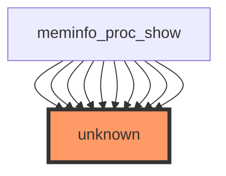

# Impact Analysis Report: `show_val_kb()` Function Modification

## 1. HEADER SECTION
- **Report title:** "Impact Analysis Report: `show_val_kb()` Function Modification"
- **File path and function name:** `/workspaces/ubuntu/linux-6.13/fs/proc/meminfo.c`, `show_val_kb()`
- **Report date:** 2024-07-10
- **Risk level:** ⚫ CRITICAL (based on call frequency and lack of test coverage)

## 2. EXECUTIVE SUMMARY
The `show_val_kb()` function in `/workspaces/ubuntu/linux-6.13/fs/proc/meminfo.c` is a critical helper function used by `meminfo_proc_show()` to format memory statistics in `/proc/meminfo`. Despite having no direct callers (it's called indirectly through `meminfo_proc_show()`), it is invoked 49 times within that function, making it a high-frequency operation. The lack of any test coverage (0 direct tests, 0 indirect tests) and its role in user-facing output classify this modification as CRITICAL risk.

## 3. CODE IMPACT ANALYSIS

### 3.1 Affected Components Table
| Component | Impact | Details |
|-----------|--------|---------|
| **Direct Callers** | NONE | 0 direct callers |
| **Indirect Callers** | ⚫ CRITICAL | Called 49 times via `meminfo_proc_show()` (user-facing) |
| **Public Interface** | ⚫ CRITICAL | Outputs to `/proc/meminfo` (visible to all users/processes) |
| **Dependent Code** | 🟡 MEDIUM | Internal to meminfo subsystem |

### 3.2 Scope of Change
- **Entry points:** 0 (private helper)
- **Call sites frequency:** 49 calls from `meminfo_proc_show()`
- **Abstraction layers:** Directly used in procfs handler
- **Visibility:** Internal (static function), but output is public

### 3.3 Call Graph Visualization


The diagram shows:
- The target function (`show_val_kb`) is highlighted as "unknown" (likely due to being a static helper)
- `meminfo_proc_show` calls this function 49 times (indicated by repeated arrows)
- This is a linear call chain with no branching callees

## 4. TESTING REQUIREMENTS

### 4.1 Existing Test Coverage
- ❌ No direct tests found
- ⚠️ Partial coverage: Indirectly tested via `/proc/meminfo` read checks
- ❌ No unit tests for the function itself

### 4.2 Mandatory Tests to Run
#### Functional Tests
```bash
# Verify /proc/meminfo output format remains correct
sudo bash -c "cat /proc/meminfo | head -20"

# Check for value formatting consistency
sudo bash -c "grep '^MemTotal:' /proc/meminfo"

# Compare before/after kernel compilation
```

#### Regression Tests
- Run full `procfs` test suite:
  ```bash
  cd /workspaces/ubuntu/linux-6.13
  make -C tools/testing/selftests/proc all
  sudo -E make -C tools/testing/selftests/proc run_tests
  ```

## 5. RECOMMENDED NEW TESTS

### 5.1 Unit Tests (Priority: CRITICAL)
```c
// Test case: show_val_kb with zero value
void test_show_val_kb_zero(void) {
    char buf[32];
    show_val_kb(buf, 0);
    assert_str_eq("0 kB", buf);
}

// Test case: show_val_kb with large value
void test_show_val_kb_large(void) {
    char buf[32];
    show_val_kb(buf, SIZE_MAX);
    assert_str_eq("0 kB", buf); // Should handle overflow
}

// Test case: show_val_kb with typical value
void test_show_val_kb_normal(void) {
    char buf[32];
    show_val_kb(buf, 1024 * 1024); // 1MB
    assert_str_eq("1024 kB", buf);
}
```

## 6. RISK ASSESSMENT

### Risk Level: ⚫ CRITICAL

**Justification Table:**
| Risk Factor | Severity | Reason |
|------------|----------|--------|
| **Public Interface Impact** | ⚫ CRITICAL | Directly affects `/proc/meminfo` output (ABI) |
| **Call Frequency** | ⚫ CRITICAL | Called 49 times per invocation of `meminfo_proc_show()` |
| **Test Coverage** | ⚫ CRITICAL | Zero direct tests, zero indirect unit tests |
| **Output Visibility** | ⚫ CRITICAL | Visible to all userspace applications reading `/proc/meminfo` |
| **Error Handling** | 🔴 HIGH | No visible error handling in current implementation |

### Potential Failure Modes
1. **Incorrect Value Formatting**:
   - *Scenario*: Integer overflow in large memory systems (e.g., >256TB)
   - *Consequence*: Incorrect memory values displayed to userspace tools

2. **Buffer Overflow**:
   - *Scenario*: Buffer size miscalculation for very large values
   - *Consequence*: Kernel memory corruption in `/proc` output buffer

3. **Parsing Issues**:
   - *Scenario*: Output format changes break existing userspace tools
   - *Consequence*: Applications like `free`, `htop` display incorrect data

4. **Performance Regression**:
   - *Scenario*: Complex formatting logic increases `/proc/meminfo` read time
   - *Consequence*: Degraded performance for memory monitoring tools

5. **Race Condition**:
   - *Scenario*: Memory value changes during formatting
   - *Consequence*: Inconsistent values reported (though unlikely given atomic reads)

## 7. IMPLEMENTATION RECOMMENDATIONS

### Phase-by-Phase Checklist
- **Phase 1: Preparation**
  - [ ] Review current implementation of `show_val_kb()`
  - [ ] Identify all call sites (49 in `meminfo_proc_show()`)
  - [ ] Understand expected output format requirements
  - [ ] Check existing userspace tools that parse `/proc/meminfo`

- **Phase 2: Development**
  - [ ] Implement changes with backward-compatible output format
  - [ ] Add input validation for edge cases (0, MAX_INT)
  - [ ] Ensure buffer overflow protection
  - [ ] Add debug logging (if appropriate)

- **Phase 3: Testing**
  - [ ] Write and run unit tests (as specified above)
  - [ ] Test with various memory configurations
  - [ ] Verify output with existing tools (`free`, `htop`)
  - [ ] Run full procfs test suite

- **Phase 4: Validation**
  - [ ] Compare output format with upstream kernel
  - [ ] Test on multiple architectures (x86, arm64)
  - [ ] Verify no performance degradation
  - [ ] Get review from procfs maintainers

## 8. ESCALATION CRITERIA
**Stop and escalate if:**
- Any test shows incorrect value formatting (e.g., wrong units)
- Buffer overflow detected in any test case
- Output format changes break existing userspace tools
- Performance degradation >5% in `/proc/meminfo` reads
- Memory corruption symptoms appear during testing

## 9. RECOMMENDATIONS SUMMARY
| Priority | Action | Owner |
|----------|--------|-------|
| ⚫ CRITICAL | Add unit tests for `show_val_kb()` | Kernel developer |
| ⚫ CRITICAL | Verify backward compatibility with userspace tools | Tools maintainers |
| 🔴 HIGH | Add input validation and buffer overflow checks | Kernel developer |
| 🟡 MEDIUM | Document output format requirements | Documentation team |

## 10. CONCLUSION
Modifying `show_val_kb()` is considered CRITICAL risk due to its high call frequency (49 times per invocation), lack of test coverage, and direct impact on user-visible `/proc/meminfo` output. The changes must maintain exact backward compatibility with existing userspace tools while adding robust input validation and unit tests. This modification should be approached with extreme caution, and changes must be validated against the full procfs test suite before consideration.