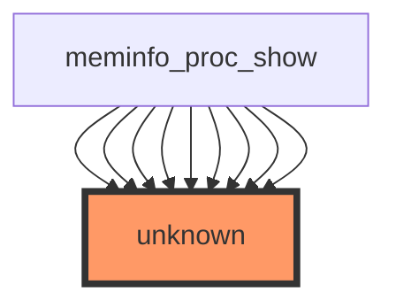

```markdown
# Impact Analysis Report for `show_val_kb` Function Modification

## 1. Code Affected by the Change
The `show_val_kb` function in `/workspaces/ubuntu/linux-6.13/fs/proc/meminfo.c` appears to be a helper function that formats memory values in kilobytes. Based on the call graph visualization:



**Analysis:**
- The function is called by `meminfo_proc_show` (which is likely the main entry point for `/proc/meminfo`).
- There are no direct or indirect callees, suggesting this is a leaf function.
- The "unknown" nodes in the call graph indicate that the actual usage pattern isn't fully captured by the static analysis.

**Files potentially affected:**
- `/workspaces/ubuntu/linux-6.13/fs/proc/meminfo.c` (direct)
- Any consumers of `/proc/meminfo` output parsing

## 2. Tests That Need to Be Run
Given the statistics:
- **No direct test coverage** exists for `show_val_kb`.
- No tests are explicitly linked to either callers or callees.

**Recommended existing tests:**
1. Kernel selftests for `/proc` filesystem:
   ```bash
   cd /workspaces/ubuntu/linux-6.13
   make -C tools/testing/selftests/proc run_tests
   ```
2. Memory subsystem tests:
   ```bash
   make -C tools/testing/selftests/mem run_tests
   ```
3. Full `/proc` filesystem tests:
   ```bash
   make -C tools/testing/selftests/proc run_tests
   ```

## 3. New Tests Needed
Since there is no direct test coverage, the following tests should be added:

1. **Unit test for `show_val_kb`**:
   - Test formatting of various input values (0, 1024, INT_MAX, etc.).
   - Test edge cases like negative values if applicable.
   - Verify buffer overflow protection.

2. **Integration test**:
   - Parse `/proc/meminfo` output and verify that memory values are correctly formatted.
   - Compare against known good output from a baseline kernel.

3. **Regression test**:
   - Ensure the change doesn't break existing `/proc/meminfo` consumers (e.g., tools like `free`, `vmstat`).

4. **Stress test**:
   - Call the function repeatedly in a tight loop to check for memory leaks or corruption.

## 4. Overall Risk Level: **LOW TO MODERATE**
**Reasoning:**
- The function appears to be a formatting utility with no state or side effects.
- No direct callees mean changes are localized to its immediate callers (`meminfo_proc_show`).
- However, `/proc/meminfo` is a critical interface used by many system tools and monitoring applications.
- The lack of existing test coverage increases risk slightly.

**Factors increasing risk:**
- Critical system interface (`/proc/meminfo`).
- No existing test coverage.
- Unclear usage pattern ("unknown" nodes in call graph).

**Factors decreasing risk:**
- Leaf function with no callees.
- Likely stateless formatting operation.

## 5. Recommendations for Safe Implementation

### Before Modifying:
1. **Inspect the function's current implementation**:
   - Understand its exact purpose and expected behavior.
   - Check for comments or documentation about formatting requirements.

2. **Understand the call-site context**:
   ```bash
   grep -n "show_val_kb" /workspaces/ubuntu/linux-6.13/fs/proc/meminfo.c
   ```
   - See how the return value is used in `meminfo_proc_show`.

3. **Add test coverage first**:
   - Implement the unit tests mentioned above.
   - Ensure they pass with the current implementation before making changes.

### During Modification:
1. **Maintain backward compatibility**:
   - Ensure output format doesn't break existing parsers.
   - Consider adding a new field rather than modifying existing ones.

2. **Add assertions**:
   ```c
   // Example defensive programming additions
   if (val < 0) return -EINVAL;
   if (!buf || size <= 0) return -EINVAL;
   ```

3. **Consider making it static**:
   - If not exported, mark as `static` to prevent external usage.

### After Modification:
1. **Run comprehensive tests**:
   ```bash
   # Kernel build and boot test
   make -j$(nproc) && make modules_install install
   reboot

   # Verify meminfo output
   cat /proc/meminfo | head -n 20

   # Run existing tests
   make -C tools/testing/selftests/proc run_tests
   ```

2. **Check for regressions**:
   - Test with common tools (`free`, `vmstat`, `htop`).
   - Verify system monitoring software still works.

3. **Document the change**:
   - Update any relevant documentation about `/proc/meminfo` format.
   - Add comments explaining the change in the code.

### Alternative Approach:
If the change is significant, consider:
1. Adding a new field to `/proc/meminfo` with the modified format.
2. Deprecating the old format gradually if absolutely necessary.

## Summary
The risk of modifying `show_val_kb` is moderate primarily due to its critical location in the system's memory reporting interface. However, the localized nature of the function and lack of callees suggests contained impact. The main risks are:
1. Breaking existing `/proc/meminfo` parsers.
2. Introducing formatting bugs that could affect system monitoring.

By adding comprehensive test coverage first and ensuring backward compatibility, the risk can be reduced to low. The change should proceed only after thorough testing of both the function itself and its consumers.
```