# Ext4 Filesystem: `ext4_map_blocks` Function Impact Analysis Report

## 1. Executive Summary
This report analyzes the impact of modifications to the `ext4_map_blocks` function in the Linux kernel's ext4 filesystem implementation. The analysis reveals critical gaps in test coverage and call graph visibility, resulting in an **UNKNOWN risk level**. The function is central to block mapping operations in ext4, and modifications could compromise data integrity, performance, or system stability. Key findings include:
- No direct test coverage identified for the function
- Conflicting data regarding call graph relationships (0 direct callers vs. 22+ sample callers)
- Potential for widespread impact across filesystem operations
- Urgent need for test coverage and call graph validation

## 2. Function Overview
**Function:** `ext4_map_blocks`  
**File:** `/workspaces/ubuntu/linux-6.13/fs/ext4/inode.c`  
**Purpose:** This critical kernel function handles logical-to-physical block mapping for ext4 filesystem operations. It translates logical block addresses (as used by applications) into physical disk blocks, enabling read/write operations. The function coordinates with other ext4 subsystems to:
- Handle inline data conversion
- Manage extent-based block allocation
- Process journaling operations
- Maintain file system metadata consistency

## 3. Impact Analysis

### 3.1. Call Graph Analysis
The call graph reveals complex dependencies with the ext4 subsystem:
- **Critical Path Dependency:** `ext4_map_blocks` serves as a fundamental block mapping interface for multiple filesystem operations
- **Call Graph Discrepancy:** While the provided statistics report 0 direct callers, the call graph visualization shows multiple entry points:
  - `_ext4_get_block` (core block access function)
  - `ext4_alloc_file_blocks` (allocation operations)
  - `ext4_convert_inline_data_nolock` (data conversion)
  - `ext4_ext_replay_set_iblocks` (journaling operations)
  - `ext4_es_lookup_extent` (extent-based lookup)
- **Subsystem Interactions:** The function interfaces with journaling (`ext4_fc_*`), extent management (`ext4_ext_*`), and metadata operations

### 3.2. Code Path Analysis
The function serves as a critical bridge between:
1. **User-space operations** (via `generic_file_aio_read`/`generic_file_aio_write`)
2. **Block allocation subsystems**
3. **Journaling subsystem** (for transactional integrity)
4. **Extent management** (for efficient large-file handling)

Key execution paths:
- **File read operations:** `ext4_map_blocks` is called via `_ext4_get_block` to locate data blocks
- **File write operations:** Invoked during block allocation for new data
- **Metadata operations:** Involved in inode updates and journal replay
- **Recovery operations:** Critical during filesystem recovery from crashes

### 3.3. Call Graph Visualization

```mermaid
graph TD
    unknown["unknown"]
    style unknown fill:#f96,stroke:#333,stroke-width:4px
    _ext4_get_block["_ext4_get_block"]
    _ext4_get_block --> unknown
    ext4_alloc_file_blocks["ext4_alloc_file_blocks"]
    ext4_alloc_file_blocks --> unknown
    ext4_convert_inline_data_nolock["ext4_convert_inline_data_nolock"]
    ext4_convert_inline_data_nolock --> unknown
    ext4_convert_unwritten_extents["ext4_convert_unwritten_extents"]
    ext4_convert_unwritten_extents --> unknown
    ext4_ext_clear_bb["ext4_ext_clear_bb"]
    ext4_ext_clear_bb --> unknown
    ext4_ext_replay_set_iblocks["ext4_ext_replay_set_iblocks"]
    ext4_ext_replay_set_iblocks --> unknown
    ext4_fc_replay_add_range["ext4_fc_replay_add_range"]
    ext4_fc_replay_add_range --> unknown
    ext4_fc_replay_del_range["ext4_fc_replay_del_range"]
    ext4_fc_replay_del_range --> unknown
    ext4_fc_set_bitmaps_and_counters["ext4_fc_set_bitmaps_and_counters"]
    ext4_fc_set_bitmaps_and_counters --> unknown
    ext4_fc_write_inode_data["ext4_fc_write_inode_data"]
    ext4_fc_write_inode_data --> unknown
    ext4_es_lookup_extent["ext4_es_lookup_extent"]
    unknown --> ext4_es_lookup_extent
    ext4_fc_track_range["ext4_fc_track_range"]
    unknown --> ext4_fc_track_range
    ext4_map_blocks_es_recheck["ext4_map_blocks_es_recheck"]
    unknown --> ext4_map_blocks_es_recheck
    ext4_map_create_blocks["ext4_map_create_blocks"]
    unknown --> ext4_map_create_blocks
    ext4_map_query_blocks["ext4_map_query_blocks"]
    unknown --> ext4_map_query_blocks
```

### 3.4. Risk Assessment
**Current Risk Level:** **UNKNOWN**  
**Criticality:** **HIGH**  
**Impact Scenarios:**
- **Data Corruption:** Incorrect block mapping could lead to data loss or corruption
- **Performance Degradation:** Suboptimal block allocation could cause severe performance issues
- **System Crashes:** Potential for kernel panics during critical operations
- **Journaling Failures:** Compromised transactional integrity during recovery

**Risk Drivers:**
1. **Zero Direct Test Coverage:** No unit tests verify the function's behavior under various conditions
2. **Call Graph Uncertainty:** Discrepancy between statistics (0 direct callers) and actual call graph (22+ callers)
3. **Critical Path Dependency:** The function sits at the heart of filesystem operations
4. **Lack of Regression Coverage:** No evidence of testing for edge cases (e.g., sparse files, journal replay)

### 3.5. Test Coverage Analysis
**Test Status:** **NO DIRECT TEST COVERAGE FOUND**  
**Implications:**
- Modifications could introduce subtle bugs that only manifest during specific workloads
- No validation exists for:
  - Extent conversion scenarios
  - Journal replay operations
  - Block allocation under high fragmentation
  - Metadata consistency checks
- Regression testing for this function cannot be performed

**Test Gap Analysis:**
| Test Type | Coverage | Current Status |
|-----------|----------|----------------|
| Unit Tests | 0% | No direct tests exist |
| Integration Tests | 0% | No coverage of block mapping |
| Regression Tests | 0% | No historical validation |
| Stress Tests | 0% | No tests for extreme workloads |

## 4. Recommendations

### 4.1. Immediate Actions
1. **Implement Basic Unit Tests:**
   - Create test cases for:
     - Small file block allocation
     - Large file extent mapping
     - Journal replay scenarios
     - Inline data conversion
   - Use existing kernel testing frameworks (e.g., `ktest`)

2. **Resolve Call Graph Discrepancy:**
   - Re-run static analysis with `ctfm` or `kprobes` to validate actual call paths
   - Document all direct and indirect callers in the kernel source

3. **Add Regression Tests:**
   - Create test cases for:
     - File system recovery after crash
     - High-fragmentation scenarios
     - Concurrent block allocation operations

### 4.2. Long-Term Improvements
1. **Introduce Test Coverage Metrics:**
   - Implement code coverage tracking for `ext4_map_blocks`
   - Establish minimum coverage requirements for critical functions

2. **Add Diagnostic Logging:**
   - Implement kernel tracepoints for block mapping operations
   - Add debug messages for critical decision points

3. **Create a Test Harness:**
   - Develop an ext4-specific test framework
   - Include scenarios for:
     - Sparse files
     - Journal replay
     - Extent conversion
     - Metadata consistency checks

4. **Document Call Paths:**
   - Create a formal call graph documentation
   - Update `Documentation/` with mapping relationships

## 5. Conclusion
The `ext4_map_blocks` function represents a critical component of the ext4 filesystem architecture. The current analysis reveals significant gaps in testing infrastructure and call graph visibility, resulting in an **UNKNOWN risk level** that cannot be adequately assessed with the current data. Given the function's central role in block mapping operations, modifications could have severe consequences ranging from data corruption to system instability. 

Without proper test coverage and call graph validation, any changes to this function carry substantial risk. Immediate action is required to establish a testable baseline for this critical component, with a focus on creating unit tests for edge cases and validating actual call paths. Until these gaps are addressed, the function should be considered high-risk for modification, and any changes should be accompanied by extensive regression testing and performance validation.

**Recommendation:** **DO NOT MODIFY** `ext4_map_blocks` without first implementing comprehensive test coverage and call graph validation.