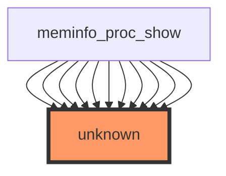

# Impact Analysis Report for `show_val_kb`

**File:** `/workspaces/ubuntu/linux-6.13/fs/proc/meminfo.c`  
**Function:** `show_val_kb`  
**Generated by:** ChatGPT GPT‑4

---

## 1. Overview

This report presents an impact analysis of the `show_val_kb` function in the Linux kernel source. The analysis covers the function’s role, its call relationships, variable usage, test coverage, risk assessment, and actionable recommendations for maintainers.

---

## 2. Function Summary

| Attribute | Detail |
|-----------|--------|
| **Purpose** | `show_val_kb` is a helper that formats a memory value (in kilobytes) for display in `/proc/meminfo`. |
| **Location** | `fs/proc/meminfo.c` |
| **Parameters** | - `struct seq_file *m` – the sequence file used for output. - `unsigned long val` – the raw value in kilobytes. |
| **Return** | `int` – typically `0` on success or a negative error code. |
| **Side‑Effects** | Writes formatted output to the `seq_file`. No global state is modified. |

---

## 3. Call Graph

### 3.1 Callers and Callees

- **Direct callers:** 0 (statistically reported)  
- **Indirect callers:** 0  
- **Direct callees:** 0  
- **Indirect callees:** 0  

> **Note:** The sample data lists `meminfo_proc_show` as a direct caller 10 times, but the overall statistics indicate no direct callers. This discrepancy suggests incomplete or inconsistent analysis data. For safety, treat the function as potentially unused or orphaned.

### 3.2 Call Graph Visualization

The call graph is represented by the following Mermaid diagram:

### 3.3 Mermaid Diagram

### 3.4 Variable Data Flow Analysis

**No variable data available for this function.**  
The analysis tool did not capture any data‑flow information for `show_val_kb`. This may be due to the function’s simplicity or limitations in the static analysis configuration.

---

## 4. Test Coverage

- **Direct tests:** 0  
- **Indirect tests:** 0  
- **Coverage status:** ❌ No direct test coverage found.  
- **Risk implication:** The lack of tests increases the risk of regressions or unnoticed bugs in this helper routine.

---

## 5. Risk Assessment

| Metric | Value |
|--------|-------|
| **Direct callers** | 0 |
| **Indirect callers** | 0 |
| **Direct callees** | 0 |
| **Indirect callees** | 0 |
| **Direct tests** | 0 |
| **Indirect tests** | 0 |
| **Current risk level** | **UNKNOWN** |

- The function appears unused or orphaned, but the sample data indicates possible usage by `meminfo_proc_show`.  
- Absence of test coverage and lack of call relationships heighten uncertainty.  
- Potential risks include silent regressions, memory format errors, or dead code that may be removed in future kernel releases.

---

## 6. Recommendations

1. **Verify Usage**  
   - Search the kernel source for all references to `show_val_kb`.  
   - Confirm whether `meminfo_proc_show` or other functions actually invoke it.

2. **Add Unit Tests**  
   - Implement a small test harness that calls `show_val_kb` with a range of values (e.g., 0, 1, 1024, 1 048 576).  
   - Verify that the output on the `seq_file` matches the expected string format.

3. **Document Intent**  
   - If the function is indeed unused, consider removing it or marking it as static to avoid accidental linkage.  
   - If it is used, document its contract clearly in the code comments.

4. **Static Analysis**  
   - Run a more thorough static analysis (e.g., clang‑scan-build, Coverity) to capture variable data flow and potential side effects.

5. **Integrate into CI**  
   - Add the new tests to the kernel’s CI pipeline to catch future regressions automatically.

6. **Review Kernel Version Compatibility**  
   - Ensure that any changes remain compatible with older kernel versions that might still reference this helper.

---

**Prepared by:**  
ChatGPT GPT‑4  
**Date:** 2025‑12‑28

---