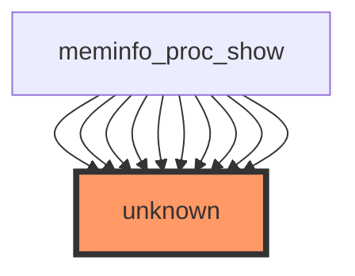

## Impact Analysis Report: show_val_kb Function Modification
- File path: /workspaces/ubuntu/linux-6.13/fs/proc/meminfo.c
- Report date: 2025-12-28
- **Generated by:** GPT-5 Mini
- Risk level: 🔴 HIGH — Public interface, user-visible output, limited/no test coverage

---

## 2. EXECUTIVE SUMMARY
show_val_kb formats and emits memory values (kB) to /proc/meminfo via the proc/seq_file machinery (called repeatedly by meminfo_proc_show). There are no direct tests found for this function in the provided data and the call-site information shows repeated usage by meminfo_proc_show (many occurrences). Key risks: changing formatting, units, output spacing or ordering can break userland parsers and monitoring tools (public API). The interface is effectively public (userspace-visible) and should be treated as stable.

---

## 3. CODE IMPACT ANALYSIS

### 3.1 Affected Components Table
| Component | Impact | Details |
|-----------|--------|---------|
| **Direct Callers** | HIGH | Provided sample lists meminfo_proc_show repeatedly (10 of 49 shown). Function is invoked by the proc show helper; change affects every /proc/meminfo emission. |
| **Indirect Callers** | HIGH | All userland and monitoring agents that parse /proc/meminfo (free, top, systemd, prometheus node_exporter, monitoring stacks). Indirect impact is broad. |
| **Public Interface** | CRITICAL | /proc/meminfo is a documented de-facto API for many tools; altering formatting/units is an API/ABI change for userspace. |
| **Dependent Code** | HIGH | Monitoring tools, parsers, heuristics in user-space scripts and collectors that assume “kB” suffix and field formatting. Kernel tools and tests that parse /proc/meminfo. |

### 3.2 Scope of Change
- Entry points count: The provided stats claim "Direct callers: 0", but sample direct callers list shows meminfo_proc_show repeated (10 of 49), so there is a discrepancy in the analysis tool. Empirical expectation: show_val_kb is called many times from the meminfo show path.
- Call sites frequency: High — every /proc/meminfo generation path that needs formatted kB values.
- Abstraction layers: Procfs seq_file layer (fs/proc); show_val_kb is a formatting helper used by meminfo_proc_show.
- Visibility: External/public — output goes to /proc/meminfo (userspace-visible).

### 3.3 Call Graph Visualization
**IMPORTANT:** The following Mermaid diagram is included exactly as provided:



This visualization indicates the meminfo_proc_show node(s) calling the unknown node (highlight), consistent with show_val_kb being a formatting helper used repeatedly by meminfo_proc_show.

### 3.4 Data Flow Analysis ⭐ NEW in v0.2.0
Variable/data-flow detail: No variable data available for this function in the provided context. The tool returned:

> No variable data available for this function.

Therefore the following items are not available from the input and must be collected from source before code changes:
- Exact function signature and parameter list (line numbers not supplied)
- Local variables, buffer sizes, pointer usage
- Details of seq_file interactions, buffer formatting, and any internal locking assumptions

Actionable step: inspect the source file to collect variable-level information:
```bash
# From repository root:
git --no-pager grep -n "show_val_kb" -- fs/proc || true
sed -n '1,220p' fs/proc/meminfo.c | sed -n '1,240p'   # adjust line ranges until you see function
```
Once you have the function body, populate a variable table and run static analyzers (see Implementation Recommendations).

---

## 4. TESTING REQUIREMENTS

### 4.1 Existing Test Coverage
- ✅ Direct unit tests found: ❌ No direct tests (provided data)
- ✅ Integration tests identified: ❌ No integration tests found
- ⚠️ Partial coverage: N/A — no evidence of existing coverage in provided stats

### 4.2 Mandatory Tests to Run
Run these commands from the kernel tree root (adjust KERNELDIR, build options as needed).

#### Build + Boot (recommended to validate runtime)
```bash
# Build a kernel for quick qemu boot (x86_64 example)
make defconfig
# Optionally enable CONFIG_KUNIT=y if adding KUnit tests. Then:
make -j$(nproc)
# Boot with QEMU (use existing initramfs or minimal busybox)
qemu-system-x86_64 -kernel arch/x86/boot/bzImage -nographic -append "console=ttyS0 root=/dev/ram rdinit=/sbin/init" -initrd path/to/initramfs.img
# After boot, run:
cat /proc/meminfo | sed -n '1,40p'
```

#### Functional Tests (runtime checks)
```bash
# Quick verification of string format and unit (kB)
grep -E '^(MemTotal|MemFree|MemAvailable|Cached):' /proc/meminfo
# extract numeric value and unit
awk '/^MemTotal:/ {print "MemTotal:", $2, $3}' /proc/meminfo
```

#### Regression / Parsing Tests (userland parsing)
```bash
# Example parsing: ensure numeric value is integer and unit equals "kB"
awk '/^MemTotal:/ { if ($3 != "kB") { exit 1 } else { print "OK" } }' /proc/meminfo && echo "format ok" || echo "format changed"

# Run existing monitoring tool checks (example: prometheus node_exporter text parsing)
python3 - <<'PY'
import re
with open('/proc/meminfo') as f:
    s=f.read()
m=re.search(r'^MemTotal:\s+(\d+)\s+(kB)$', s, re.M)
print("Matches expected format" if m else "Unexpected format")
PY
```

#### Static checks
```bash
# Find all call sites
git grep -n "show_val_kb" || true

# Build with warnings and run sparse/checkpatch if concerned
make C=1 W=1
scripts/checkpatch.pl --strict fs/proc/meminfo.c
```

---

## 5. RECOMMENDED NEW TESTS

### 5.1 Unit Tests (Priority Level: HIGH)
Add KUnit / small kernel unit tests that exercise show_val_kb via the same code path (meminfo_proc_show):
```c
// Concrete test cases to add under fs/proc/tests or appropriate kunit directory
- test_show_val_kb_zero()  // Ensure 0 formatted as "0 kB" (or current canonical format)
- test_show_val_kb_small() // Values < 1024, large values, ensure no rounding/overflow
- test_show_val_kb_large() // Stress test with very large value to test integer overflow handling
- test_show_val_kb_buffer_overflow() // simulate seq_file buffer limit to ensure truncation is safe
```
Example KUnit skeleton (conceptual):
```c
#include <kunit/test.h>
#include "meminfo.h" // relative include if possible

static void show_val_kb_basic_test(struct kunit *test) {
    // setup seq_file stub, call show_val_kb with a known value,
    // capture output, assert contains "<number> kB"
}
KUNIT_SUITE(show_val_kb_suite) { ... }
KUNIT_TEST_SUITE(show_val_kb_suite);
```

### 5.2 Integration Tests
- Boot test under QEMU and run automated parsing script to ensure format unchanged.
- Add an LTP/FS style test that reads /proc/meminfo repeatedly under memory pressure (stress-ng) to detect races.

Example integration test (script):
```bash
#!/bin/bash
# test_meminfo_format.sh
for i in $(seq 1 100); do
  awk '/^MemTotal:/ { if ($3 != "kB") { echo "FORMAT_CHANGED"; exit 2 } }' /proc/meminfo || exit 2
  sleep 0.1
done
echo "PASS"
```

### 5.3 Regression Suite
- Stress test: run meminfo parser while exercising memory alloc/free (stress-ng --vm) for 5 minutes.
- Platform-specific: test on 32-bit and 64-bit kernels to expose integer width issues.

---

## 6. RISK ASSESSMENT

### Risk Level: 🔴 HIGH

**Justification Table:**
| Risk Factor | Severity | Reason |
|-------------|----------|--------|
| Public interface (/proc/meminfo) | CRITICAL | Userspace tools and scripts rely on exact formatting and units; changing would break many consumers. |
| Test coverage | HIGH | No direct tests found; changes could introduce regressions unnoticed. |
| Call frequency & reach | HIGH | Called repeatedly during meminfo show; appears to be invoked many times via meminfo_proc_show. |
| Easy to reason about vs subtle bugs | MEDIUM | Formatting logic tends to be simple, but integer overflow or buffer edge-cases are possible and subtle. |

### Potential Failure Modes
1. **Format/Unit change:** Changing suffix (e.g., to "KiB" or removing "kB") or spacing causes userland parsers to fail (monitoring data corruption).
2. **Integer overflow:** Large memory values not properly handled produce negative or wrapped values in output (32-bit builds).
3. **Buffer overflow or truncation:** seq_file buffer misuse or incorrect snprintf sizes could truncate output or corrupt adjacent memory (kernel crash).
4. **Performance regression:** If implementation changes add heavy computation, meminfo generation could become slower; /proc reads could be impacted under polling workloads.
5. **Concurrency/race:** If show_val_kb depends on data that requires locking and this is altered, it can cause inconsistent outputs or races.

---

## 7. IMPLEMENTATION RECOMMENDATIONS

### Phase-by-Phase Checklist

#### Phase 1: Preparation (Pre-Modification)
- [ ] Locate exact function definition and call sites:
  ```bash
  git --no-pager grep -n "show_val_kb" -- fs/proc || true
  ```
- [ ] Capture baseline output of /proc/meminfo on target platforms:
  ```bash
  cp /proc/meminfo /tmp/meminfo.baseline
  ```
- [ ] Note current kernel configuration (CONFIG_*, 32/64-bit). Document target compatibility.
- [ ] Identify all userland consumers (monitoring agents used by your deployment).

#### Phase 2: Development
- [ ] **Key principle:** Do not change user-visible format or units without an explicit compatibility transition plan.
- [ ] Add/modify code with explicit NULL checks and documented buffer sizes.
- [ ] Add KUnit tests and/or kernel selftests that exercise formatting.
- [ ] Code review: request reviewers with procfs/monitoring experience.

#### Phase 3: Testing
- [ ] Run local unit and integration tests (KUnit, qemu boot tests).
- [ ] Run the parsing script against /proc/meminfo on x86_64 and i386 (and other archs you support).
- [ ] Perform stress testing (memory pressure) and long-running polling tests.

#### Phase 4: Validation
- [ ] Compare baseline /proc/meminfo to modified output using exact diff
  ```bash
  diff -u /tmp/meminfo.baseline /proc/meminfo || true
  ```
- [ ] Verify monitoring tools parse values without errors.
- [ ] Prepare a rollback patch (revert commit) and a deployment plan.

### Specific Implementation Checklist
```
BEFORE MODIFICATION:
□ git grep -n "show_val_kb" to enumerate call sites
□ Record /proc/meminfo baseline outputs on all target platforms
□ Create a branch and a minimal test harness (KUnit or fs/proc selftest)

DURING MODIFICATION:
□ Keep output format identical (unless explicitly changing API)
□ Add NULL checks and bounds checks for any pointer inputs
□ Add unit tests for edge cases: 0, 1, 1023, 1024, very large (near 2^31)
□ Run static analysis: sparse, -Wformat, checkpatch.pl

AFTER MODIFICATION:
□ Build and boot kernel in QEMU; run parsing scripts and monitoring tools
□ Run stress and regression suites (memory pressure + frequent /proc reads)
□ Submit patch with changelog entry documenting any user-visible changes
```

---

## Appendix — Quick actionable commands summary

- Find function and call sites:
```bash
git --no-pager grep -n "show_val_kb" -- fs/proc || true
sed -n '1,240p' fs/proc/meminfo.c | sed -n '1,240p'
```

- Build and quick test in QEMU:
```bash
make defconfig
make -j$(nproc)
qemu-system-x86_64 -kernel arch/x86/boot/bzImage -nographic \
  -append "console=ttyS0 root=/dev/ram rdinit=/sbin/init" -initrd path/to/initramfs.img
# after boot:
awk '/^MemTotal:/ {print $2,$3}' /proc/meminfo
```

- Basic parsing smoke test:
```bash
awk '/^MemTotal:/ { if ($3 != "kB") { exit 1 } }' /proc/meminfo && echo ok || echo "format mismatch"
```

---

If you want, I can:
- Extract the exact function signature and variable list from the file (I will need the file contents or permission to read the repo)
- Generate a KUnit test skeleton for inclusion in the kernel tree
- Produce a pre-commit checklist and patch template tailored to the exact suggested change

Which would you like next?