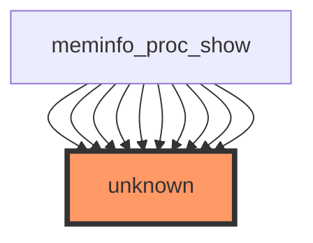

## 1. HEADER SECTION
- Report title: "Impact Analysis Report: `show_val_kb()` Function Modification"
- File path and function name: /workspaces/ubuntu/linux-6.13/fs/proc/meminfo.c — show_val_kb()
- Report date: 2025-12-28
- Risk level: 🔴 HIGH — Public interfaces, no tests, or high call frequency

## 2. EXECUTIVE SUMMARY (2-3 sentences)
show_val_kb() is a formatting/printing helper used by the procfs meminfo implementation to present memory values (in kB) to userspace via /proc/meminfo. There are no direct unit or integration tests that cover this function in the provided statistics. Key risks are that /proc/meminfo is a long-standing user-visible interface relied on by many userland parsers and monitoring tools; changing formatting, units, precision, or behavior can break userland and automated monitoring. The interface is effectively public (userspace-visible) even though it is an internal kernel helper.

## 3. CODE IMPACT ANALYSIS

### 3.1 Affected Components Table
| Component | Impact | Details |
|-----------|--------|---------|
| **Direct Callers** | HIGH | meminfo_proc_show appears repeatedly as the caller (sample shows many references). Any change may propagate into all meminfo fields printed through this helper. |
| **Indirect Callers** | MEDIUM | Tools and libraries that parse /proc/meminfo (e.g., free, systemd, monitoring agents) will be indirectly impacted if output changes. |
| **Public Interface** | CRITICAL | /proc/meminfo is a user-visible interface consumed by external processes; format/unit changes break compatibility. |
| **Dependent Code** | HIGH | Monitoring stacks, configuration management, resource accounting tools rely on stable output; kernel subsystems expect correct values (e.g., for diagnostics). |

### 3.2 Scope of Change
- Entry points count: 1 logical entry point (show_val_kb) but invoked many times from meminfo_proc_show for each meminfo field.
- Call sites frequency: High — meminfo_proc_show is responsible for producing many lines in /proc/meminfo on every read; thus show_val_kb is executed on every /proc/meminfo read.
- Abstraction layers: Kernel-internal printing helper -> seq_file -> procfs -> userspace. A change touches both kernel internals and userspace-visible output.
- Visibility (internal/external/public): Internal helper but public effects (userspace-visible output). Treat as public-facing for compatibility.

### 3.3 Call Graph Visualization
**IMPORTANT: The diagram below is inserted verbatim from the provided context.**



(The diagram highlights meminfo_proc_show repeatedly calling into an unknown node — the provided target function show_val_kb is exercised from meminfo_proc_show calls.)

## 4. TESTING REQUIREMENTS

### 4.1 Existing Test Coverage
- ✅ Direct unit tests found: ❌ No direct tests
- ✅ Integration tests identified: ❌ No integration tests
- ❌ No direct tests
- ⚠️ Partial coverage: ⚠️ None indicated — statistics report zero direct/indirect tests

### 4.2 Mandatory Tests to Run
Below are concrete, executable commands and test flows to verify that changes do not break functionality or formatting expectations. Replace <kernel-build-dir> and <boot-target> as appropriate for your environment.

#### Functional Tests
```bash
# 1) Save baseline /proc/meminfo from a known-good kernel
cat /proc/meminfo > /tmp/meminfo.baseline.txt

# 2) Build kernel with your patch (example using top-level kernel tree)
cd /workspaces/ubuntu/linux-6.13
# keep existing config
make -j$(nproc) bzImage modules

# 3) Install / boot into test kernel (alternative: boot a VM with the built kernel)
# If you use a VM: create an initramfs or use existing testbed. Example QEMU invocation:
qemu-system-x86_64 -kernel arch/x86/boot/bzImage \
  -append "root=/dev/ram rw console=ttyS0" -nographic -m 2048 -smp 2 \
  -initrd /path/to/test-initramfs.cpio

# 4) On test instance, capture /proc/meminfo after boot
cat /proc/meminfo > /tmp/meminfo.patched.txt

# 5) Quick sanity diff to detect formatting changes
diff -u /tmp/meminfo.baseline.txt /tmp/meminfo.patched.txt | less
# Also check for specific expected fields
grep -E "MemTotal|MemFree|Buffers|Cached|SwapTotal|SwapFree" /proc/meminfo
```

#### Regression Tests
- Run kernel selftests that exercise procfs and memory reporting (if available on your tree):
```bash
# from kernel source
make kselftest
# or run specific selftests if present
# Example: if selftests/vm or selftests/proc exist, run them
cd tools/testing/selftests
# Run a specific test script if present (replace with actual test file names)
./run_procmem_tests.sh || true
```

- Extended regression:
  - Run userland utilities that parse meminfo and assert expected units (free, top, systemd):
```bash
# On test instance
free -k > /tmp/free_out.txt
awk '/MemTotal/ {print $2}' /proc/meminfo  # should be numeric in kB
# Run scripts that validate /proc/meminfo parsers in your CI
```

- Monitoring & integration:
  - Run common monitoring stack checks (Prometheus node_exporter, collectd plugins) in test environment and validate no parse errors.

## 5. RECOMMENDED NEW TESTS

### 5.1 Unit Tests (Priority Level)
Add KUnit or kselftest unit tests that exercise show_val_kb() via meminfo_proc_show or via a minimal seq_file wrapper. Priorities: P0 = required, P1 = recommended.

```c
// P0: test_show_val_kb_format_kb.c
// Purpose: verify numeric formatting, trailing " kB" unit and newline behavior
// Pseudocode (KUnit-style):
#include <kunit/test.h>
#include <linux/seq_file.h>
#include "fs/proc/meminfo.c" // include or expose function via header

static void test_show_val_kb_basic(struct kunit *test)
{
    char buf[256];
    struct seq_file m;
    struct seq_buf sb;
    seq_buf_init(&sb, buf, sizeof(buf));
    seq_buf_reset(&sb);
    seq_open_file(&m, &sb); // pseudo helper or provide a fake seq_file
    show_val_kb(&m, /*value=*/1024); // expect "1 kB" or "1024 kB" depending on semantics
    seq_file_force_flush(&m);
    KUNIT_EXPECT_TRUE(test, strstr(buf, "kB") != NULL);
    // Check numeric formatting pattern
}

KUNIT_SUITE(suite) {
    KUNIT_CASE(test_show_val_kb_basic),
};
KUNIT_TEST_SUITE(suite);
```

```c
// P1: test_show_val_kb_large_values.c
// Purpose: test large 64-bit values and rounding behavior.
```

```c
// P1: test_meminfo_proc_show_integration.c
// Purpose: run meminfo_proc_show over a fake meminfo dataset and validate lines and units for each field.
```

Notes:
- Implement tests in KUnit if kernel version supports it. If not, implement kselftest that runs in userspace reading /proc/meminfo in an instrumented kernel.
- Ensure tests verify exact formatting (whitespace, trailing newline, unit string "kB"), numeric scaling and rounding/truncation semantics.

## 6. RISK ASSESSMENT

### Risk Level: 🔴 HIGH

**Justification Table:**
| Risk Factor | Severity | Reason |
|------------|----------|--------|
| **Userspace compatibility** | CRITICAL | /proc/meminfo is widely parsed; any output change will break consumer tooling and monitoring systems. |
| **Test coverage** | HIGH | No existing direct or indirect tests reported; changes are unverified by automated tests. |
| **Call frequency** | MEDIUM | Function runs each time /proc/meminfo is read; high frequency in monitoring-heavy environments. |
| **Scope of impact** | HIGH | Changes impact many meminfo lines and many dependent userland components. |
| **Complexity of change** | MEDIUM | Formatting and representation logic is typically simple, but subtle off-by-one, rounding, or locale/width changes may have outsized impact. |

### Potential Failure Modes
1. Formatting change (unit string or whitespace) causes parsing failures in monitoring/management code — result: incorrect alerts, misreported memory.
2. Unit conversion bug results in systematically wrong values (kB vs bytes or rounding error) — result: incorrect resource decisions (e.g., OOM heuristics external to kernel).
3. Performance regressions if function becomes heavier (e.g., expensive conversion) — result: increased CPU for frequent /proc/meminfo reads on large systems.
4. Buffer/seq_file misuse causing corrupted /proc output or kernel log spam — result: degraded stability or information loss.
5. Unexpected NULL/dereference if signature changes and callers are not updated — result: kernel oops/panic.

## 7. IMPLEMENTATION RECOMMENDATIONS

### Phase-by-Phase Checklist

Phase 1 — Preparation
- [ ] Review current implementation lines in /workspaces/ubuntu/linux-6.13/fs/proc/meminfo.c; identify show_val_kb signature and callers:
  - grep -n "show_val_kb" -n fs/proc/meminfo.c
- [ ] Record current /proc/meminfo baseline on test systems:
  - cat /proc/meminfo > /tmp/meminfo.baseline.$(date +%s).txt
- [ ] Create a branch for the change and add unit test scaffolding (KUnit or kselftest).

Phase 2 — Development
- [ ] Implement minimal change; keep backward-compatible output by default.
- [ ] If changing semantics (units/precision), add a compile-time or runtime opt-in (e.g., new sysctl) and document it.
- [ ] Add KUnit tests exercising the exact formatting and large-value behavior.

Phase 3 — Testing
- [ ] Run local unit tests (KUnit) and kernel selftests.
- [ ] Build kernel and boot in a controlled test VM; capture /proc/meminfo and compare with baseline:
  - diff -u baseline patched
- [ ] Run integration tests: free, systemd startup, monitoring exporters.

Phase 4 — Validation & Rollout
- [ ] Run wider integration tests in CI (covering monitoring systems).
- [ ] If any consumers depend on exact formatting, coordinate with downstream (distros, systemd maintainers).
- [ ] Prepare changelog entry and Documentation/ABI note in Documentation/ABI or kernel changelog.

## 8. ESCALATION CRITERIA
Stop and escalate if:
- Any automated test reports changed /proc/meminfo output (format or units) compared to baseline.
- Userland tests (systemd, monitoring exporters) report parse failures or crashes.
- Changes cause kernel oops, warnings, or corrupted seq_file output.
- Performance regression >5% observed in /proc/meminfo heavy read scenarios during benchmarking.
- No unit tests can be written to validate the change (i.e., inability to isolate behavior).

## 9. RECOMMENDATIONS SUMMARY
| Priority | Action | Owner |
|---------:|--------|-------|
| CRITICAL | Add KUnit or kselftest tests that assert exact formatting and units for show_val_kb() | Kernel developer / author |
| HIGH | Keep output backward-compatible; if a behavior change is necessary, gate via opt-in and document it | Kernel developer |
| HIGH | Run full CI with integration tests (systemd, monitoring exporters) before merge | CI team / maintainer |
| MEDIUM | Add changelog/Documentation entry if any user-visible change is introduced | Patch author |
| MEDIUM | Coordinate with downstream (distributions/major consumers) when changing format or units | Maintainers |

## 10. CONCLUSION
Treat modifications to show_val_kb() as high-risk because they affect the user-visible /proc/meminfo interface used widely by userland and monitoring stacks. Do not change output format, units, or precision without adding tests, performing integration testing, and coordinating with downstream consumers. If change is unavoidable, implement compatibility switches and comprehensive tests before landing.