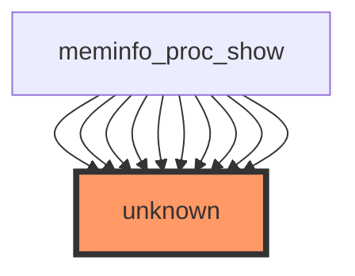

## 1. HEADER SECTION
- **Report title:** Impact Analysis Report: `show_val_kb` Function Modification  
- **File path:** `/workspaces/ubuntu/linux-6.13/fs/proc/meminfo.c`  
- **Report datetime:** 2025-12-28 00:00  
- **Generated by:** GPT-5  
- **Risk level:** 🔴 HIGH  

---

## 2. EXECUTIVE SUMMARY (2-3 sentences)
`show_val_kb` is part of the `/proc/meminfo` reporting path (via `meminfo_proc_show`) and therefore affects a widely consumed user-facing interface used by tools like `free`, `top`, `vmstat`, node exporters, and monitoring agents. The provided analysis indicates **no direct/indirect test coverage** and an unclear call graph resolution (“unknown”), which increases regression risk. Any formatting/units/rounding change can break parsers and dashboards even if the kernel remains functionally correct.

---

## 3. CODE IMPACT ANALYSIS

### 3.1 Affected Components Table
| Component | Impact | Details |
|-----------|--------|---------|
| **Direct Callers** | **HIGH** | Stats show 0, but sample indicates **~49 call sites** from `meminfo_proc_show` (call graph tool unresolved; repeated edges suggest multiple invocations). |
| **Indirect Callers** | **MEDIUM** | Indirectly reached via procfs `seq_file` show path when users read `/proc/meminfo`. Broad user-space reach despite shallow kernel call depth. |
| **Public Interface** | **CRITICAL** | `/proc/meminfo` is a **user-visible ABI** (text interface relied upon by tooling). Field names and formatting stability matter. |
| **Dependent Code** | **HIGH** | External dependencies: monitoring/telemetry agents, scripts, containers, orchestration health checks. Kernel-internal dependencies likely limited to meminfo formatting. |

### 3.2 Scope of Change
- **Entry points count:** Effectively **1 user-visible entry point**: reading `/proc/meminfo` (implemented by `meminfo_proc_show`).
- **Call sites frequency:** Sample indicates **49 invocations** of `show_val_kb` from `meminfo_proc_show` (despite “Direct callers: 0” in stats). This implies the function is used repeatedly to print many fields.
- **Abstraction layers:** procfs → seq_file show callback (`meminfo_proc_show`) → formatting helper (`show_val_kb`).
- **Visibility (internal/external/public):**
  - `show_val_kb` is likely **file-local helper** (commonly `static`) but it influences **public output**.
  - Any output change is effectively an **ABI behavior change**.

### 3.3 Call Graph Visualization


**Notes / interpretation (based on provided evidence):**
- The graph tool did not resolve `show_val_kb` and labeled it `unknown`.
- Repeated `meminfo_proc_show -> unknown` edges strongly suggest multiple calls (consistent with the “10 of 49” sample list).

### 3.4 Data Flow Analysis ⭐ NEW in v0.2.0
*Skipped:* The provided context explicitly states **“No variable data available for this function.”**

---

## 4. TESTING REQUIREMENTS

### 4.1 Existing Test Coverage
- ❌ **No direct unit tests found**
- ❌ **No integration tests identified**
- ⚠️ **High reliance on user-space compatibility**, but no automated coverage provided in the dataset

### 4.2 Mandatory Tests to Run

#### Functional Tests
```bash
# Build (adjust config as needed)
cd /workspaces/ubuntu/linux-6.13
make olddefconfig
make -j"$(nproc)"

# Boot and basic read validation (on target VM or test machine)
cat /proc/meminfo

# Validate stable presence of expected keys (non-exhaustive)
egrep -n '^(MemTotal|MemFree|MemAvailable|Buffers|Cached|SwapTotal|SwapFree|Dirty|Writeback):' /proc/meminfo

# Ensure values are numeric and end with " kB" where expected
awk '
  $1 ~ /:$/ {
    key=$1; val=$2; unit=$3;
    if (unit != "kB") bad=bad key " ";
    if (val !~ /^[0-9]+$/) bad2=bad2 key " ";
  }
  END {
    if (bad != "") { print "Bad unit for:", bad; exit 1 }
    if (bad2 != "") { print "Non-numeric value for:", bad2; exit 1 }
  }' /proc/meminfo
```

#### Regression Tests
```bash
# procfs + seq_file stress smoke (read repeatedly)
for i in $(seq 1 1000); do cat /proc/meminfo > /dev/null || exit 1; done

# Compare before/after output format (run once on baseline kernel, once on modified kernel)
cat /proc/meminfo > /tmp/meminfo.after
# (On baseline kernel)
# cat /proc/meminfo > /tmp/meminfo.before
# diff -u /tmp/meminfo.before /tmp/meminfo.after
```

#### Compatibility Tests
```bash
# Common user-space consumers sanity checks (if installed)
free -k
vmstat -s
top -b -n 1 | head -n 20

# If node_exporter or similar is present, validate it still parses memory stats
# (example service check; adjust to your environment)
curl -s localhost:9100/metrics | egrep 'node_memory_(MemTotal|MemFree|MemAvailable)_bytes' | head
```

---

## 5. RECOMMENDED NEW TESTS

### 5.1 Unit Tests (Priority Level)
**Priority: MEDIUM** (kernel doesn’t typically unit-test proc text formatting, but this is a high-value ABI surface)

If you can factor formatting into a testable helper (or use KUnit where feasible), add tests similar to:

```c
// Proposed KUnit-style cases (illustrative names)
- test_show_val_kb_formats_unit_suffix_kB()     // Ensures " kB" suffix is preserved
- test_show_val_kb_formats_nonnegative_values() // Rejects/handles negative or unexpected inputs
- test_show_val_kb_rounding_consistency()       // Ensures rounding rules match historical behavior
- test_show_val_kb_large_values_no_overflow()   // Very large mem values print correctly
```

### 5.2 Integration Tests
- **procfs ABI snapshot test:** capture `/proc/meminfo` output and compare against a known-good regex schema (keys present, numeric fields, unit suffix).
- **Monitoring parser test:** run a representative parser (e.g., a small script that reads `/proc/meminfo` and exports metrics) in CI against the modified kernel.

### 5.3 Regression Suite
- **Stress read under memory pressure:**
  - run `stress-ng --vm 2 --vm-bytes 80% --timeout 60s` while repeatedly reading `/proc/meminfo`.
- **Cross-arch smoke:** at least x86_64 + arm64 if this change is expected to ship broadly.

Example commands:
```bash
# On a test system with stress-ng installed
stress-ng --vm 2 --vm-bytes 80% --timeout 60s &
for i in $(seq 1 5000); do cat /proc/meminfo > /dev/null || exit 1; done
wait
```

---

## 6. RISK ASSESSMENT

### Risk Level: 🔴 HIGH

**Justification Table:**
| Risk Factor | Severity | Reason |
|------------|----------|--------|
| **User-visible ABI surface (`/proc/meminfo`)** | **CRITICAL** | Small formatting/unit changes can break parsers and monitoring pipelines even without kernel crashes. |
| **High apparent call-site count (~49)** | **HIGH** | Helper is used repeatedly for many fields; a bug affects many lines in output. |
| **No test coverage in provided dataset** | **HIGH** | Increases probability of unnoticed regressions and output incompatibilities. |
| **Tooling ambiguity in call graph (“unknown”)** | **MEDIUM** | Indicates analysis gaps; increases chance of missed dependencies or mis-scoped change. |

### Potential Failure Modes
1. **ABI formatting regression:** Output changes from `"kB"` to something else, spacing changes, or key/value alignment changes → user-space parsers fail or misread values.
2. **Rounding/unit conversion bug:** Values printed in wrong units (bytes vs kB) or wrong rounding → misleading memory reporting and incorrect autoscaling decisions.
3. **Overflow/underflow in formatting path:** Large memory sizes produce negative/garbled numbers → monitoring alerts and diagnostics become unreliable.
4. **Performance regression:** More expensive formatting called ~49 times per read → frequent `/proc/meminfo` polling causes measurable overhead.
5. **Localization/unexpected whitespace:** Extra tabs/spaces/newlines break strict parsers.

---

## 7. IMPLEMENTATION RECOMMENDATIONS

### Phase-by-Phase Checklist

#### Phase 1: Preparation (Pre-Modification)
- [ ] Identify the **exact current signature and behavior** of `show_val_kb` in `/workspaces/ubuntu/linux-6.13/fs/proc/meminfo.c` (capture existing output semantics).
- [ ] Capture a **baseline `/proc/meminfo` snapshot** on an unmodified kernel for diffing:
  ```bash
  cat /proc/meminfo > /tmp/meminfo.before
  ```
- [ ] Enumerate user-space dependencies in your environment (monitoring agents, scripts) that parse `/proc/meminfo`.

#### Phase 2: Development
- [ ] **Key principle:** Preserve `/proc/meminfo` field names, unit suffix (`kB`), and whitespace unless you have a documented ABI reason to change them.
- [ ] Keep changes minimal and localized; if behavior changes, add comments in `meminfo.c` explaining **why** and what compatibility guarantees remain.
- [ ] Require review from maintainers familiar with procfs/meminfo ABI expectations.

#### Phase 3: Testing
- [ ] Build + boot modified kernel and run:
  ```bash
  cat /proc/meminfo
  free -k
  vmstat -s
  ```
- [ ] Run stress read loop and diff against baseline:
  ```bash
  for i in $(seq 1 1000); do cat /proc/meminfo > /dev/null || exit 1; done
  diff -u /tmp/meminfo.before <(cat /proc/meminfo) || true
  ```
- [ ] If your change affects numeric formatting, validate with a strict schema check (numeric + `kB`).

#### Phase 4: Validation
- [ ] Validate **backward compatibility**: ensure unchanged keys and units for all existing lines that use `show_val_kb`.
- [ ] Add a monitoring plan: confirm dashboards/alerts that rely on meminfo do not change unexpectedly after deployment.
- [ ] Prepare rollback: keep the baseline kernel build and a boot entry to revert quickly.

### Specific Implementation Checklist
```
BEFORE MODIFICATION:
□ Locate show_val_kb definition in /workspaces/ubuntu/linux-6.13/fs/proc/meminfo.c and record current behavior
□ Save baseline /proc/meminfo output: cat /proc/meminfo > /tmp/meminfo.before
□ Identify which meminfo fields call show_val_kb (grep within meminfo_proc_show)

DURING MODIFICATION:
□ Preserve "kB" suffix and stable whitespace unless explicitly intended
□ Avoid introducing expensive operations in a frequently-called formatting helper
□ Add comments documenting any behavior change and compatibility rationale

AFTER MODIFICATION:
□ Rebuild kernel: make -j"$(nproc)"
□ Validate output: cat /proc/meminfo | head -n 50
□ Diff vs baseline: diff -u /tmp/meminfo.before <(cat /proc/meminfo)
□ Stress read: for i in $(seq 1 1000); do cat /proc/meminfo >/dev/null || exit 1; done
□ Run common consumers: free -k; vmstat -s; top -b -n 1 | head
```

--- 

### Notes on Data Quality (from provided dataset)
- The stats list **0 direct callers**, but the “Sample Direct Callers (10 of 49)” strongly indicates **many call sites** and that the call graph tool failed to resolve the callee name (`unknown`). Treat this as **higher risk**, and confirm with a local search:
```bash
cd /workspaces/ubuntu/linux-6.13
rg -n '\bshow_val_kb\b' fs/proc/meminfo.c
rg -n '\bshow_val_kb\b' fs/proc
```