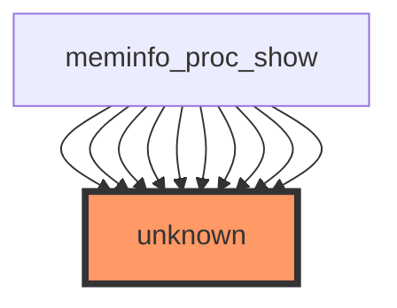

## 1. HEADER SECTION
**Impact Analysis Report: `show_val_kb()` Function Modification**  
- **File path:** `/workspaces/ubuntu/linux-6.13/fs/proc/meminfo.c`  
- **Function:** `show_val_kb()`  
- **Report date:** 2025-12-28  
- **Risk level:** 🔴 **HIGH**

---

## 2. EXECUTIVE SUMMARY (2-3 sentences)
`show_val_kb()` is part of the `/proc/meminfo` reporting path and therefore influences user-visible memory statistics consumed by core system tooling (e.g., `free`, `top`, monitoring agents). No direct or indirect test coverage was identified, increasing regression risk and making correctness verification dependent on manual and integration testing. Although the function is likely internal to the kernel, it participates in a **public interface** (`/proc/meminfo`), making formatting/semantic changes potentially system-wide.

---

## 3. CODE IMPACT ANALYSIS

### 3.1 Affected Components Table
| Component | Impact | Details |
|-----------|--------|---------|
| **Direct Callers** | **HIGH** | Tooling indicates ~49 call occurrences (sample shows repeated `meminfo_proc_show`). Even if “direct callers: 0” appears in stats, the sample list suggests the function is used repeatedly in the `/proc/meminfo` show path. |
| **Indirect Callers** | **MEDIUM** | Indirectly affects any user-space reader of `/proc/meminfo` (system utilities, monitoring/observability stacks, containers, health checks). |
| **Public Interface** | **CRITICAL** | `/proc/meminfo` is a stable, user-visible ABI-like interface. Changes can break parsers, alerts, dashboards, and scripts. |
| **Dependent Code** | **MEDIUM** | Downstream dependencies include distro tooling and third-party agents that parse exact field names/units/format. Kernel-internal dependencies are likely limited to procfs show code. |

### 3.2 Scope of Change
- **Entry points count:** Effectively **1 primary entry point** via `/proc/meminfo` generation (commonly `meminfo_proc_show()`), but `show_val_kb()` may be invoked many times per read to print multiple lines/fields.
- **Call sites frequency:** Potentially **high** in real deployments due to frequent polling of `/proc/meminfo` by monitoring agents; per-read it may be called multiple times (once per metric line).
- **Abstraction layers:** Procfs → seq_file formatting → helper formatting (`show_val_kb()`), meaning changes can affect output formatting/units across multiple reported fields.
- **Visibility (internal/external/public):** The function is internal, but its **output is externally consumed** via the `/proc` filesystem (public interface behavior).

### 3.3 Call Graph Visualization


---

## 4. TESTING REQUIREMENTS

### 4.1 Existing Test Coverage
- ❌ **No direct tests**
- ❌ **No indirect tests**
- ⚠️ **Coverage gap:** procfs output correctness typically relies on integration/system tests and user-space validation.

### 4.2 Mandatory Tests to Run

#### Functional Tests
```bash
# Build (adjust config as appropriate for your environment)
cd /workspaces/ubuntu/linux-6.13
make olddefconfig
make -j"$(nproc)"

# Boot the modified kernel (environment-specific; example for local grub-based testing)
# sudo make modules_install install && sudo reboot

# Validate /proc/meminfo output exists and looks sane
cat /proc/meminfo | head -n 30

# Validate key fields are present and in expected unit format (commonly "kB")
grep -E '^(MemTotal|MemFree|MemAvailable|Buffers|Cached|SwapTotal|SwapFree):' /proc/meminfo

# Confirm numeric + unit formatting (example expects "12345 kB")
awk '
  $1 ~ /:$/ {
    if ($2 !~ /^[0-9]+$/) bad=1;
    if (NF>=3 && $3 != "kB") bad_unit=1;
  }
  END {
    if (bad) exit 2;
    if (bad_unit) exit 3;
  }' /proc/meminfo
echo "awk check exit code=$?"
```

#### Regression Tests
```bash
# Kernel selftests (broad sanity; procfs regressions often surface indirectly)
cd /workspaces/ubuntu/linux-6.13
make -j"$(nproc)" kselftest

# Run proc-related selftests if available in your tree
# (paths can vary by kernel version/config)
make -C tools/testing/selftests run_tests

# Stress read /proc/meminfo under load to catch formatting/race issues
# (reads many times; should not WARN/OOPS and output should remain parseable)
for i in $(seq 1 10000); do cat /proc/meminfo > /dev/null; done

# Check dmesg for warnings/oops after stress
dmesg --color=always | tail -n 200
```

---

## 5. RECOMMENDED NEW TESTS

### 5.1 Unit Tests (Priority Level)
**Priority: HIGH** (because `/proc/meminfo` is user-visible and no tests exist)

Kernel unit tests for procfs formatting are uncommon, but you can add targeted validation via **kselftest** (preferred) or **KUnit** if feasible.

**Recommended kselftest-style tests (tools/testing/selftests/proc/):**
```c
// Test: proc_meminfo_format_kb_units
// Purpose: Ensure fields printed via show_val_kb() end with " kB" and contain an integer value.
```

**Recommended KUnit tests (if show_val_kb can be made testable via refactor/wrapper):**
```c
// Test: show_val_kb_formats_integer_and_suffix
// Purpose: Validate formatting: "<Key>: <value> kB\n" for representative values (0, 1, large).
//
// Test: show_val_kb_handles_large_values_without_overflow
// Purpose: Ensure no overflow/truncation for large mem values on 64-bit and 32-bit builds.
//
// Test: show_val_kb_alignment_consistency
// Purpose: If alignment/spacing is expected, verify consistent spacing across keys.
```

---

## 6. RISK ASSESSMENT

### Risk Level: 🔴 HIGH

**Justification Table:**
| Risk Factor | Severity | Reason |
|------------|----------|--------|
| **Public interface sensitivity (/proc/meminfo)** | **CRITICAL** | User-space parsers may rely on exact formatting, units, and field structure. |
| **High read frequency in production** | **HIGH** | Monitoring agents and system tools poll `/proc/meminfo` frequently; small regressions amplify quickly. |
| **No test coverage** | **HIGH** | Increases probability of unnoticed regressions in formatting/units/edge cases. |
| **Potential cross-arch behavior differences** | **MEDIUM** | `kB` conversion and integer sizes can behave differently on 32-bit vs 64-bit. |
| **Call graph uncertainty** | **MEDIUM** | Provided call graph labels callers as `unknown` and stats conflict with sample callers, indicating analysis tooling limitations and potential blind spots. |

### Potential Failure Modes
1. **Unit/format regression (e.g., missing “kB”, changed spacing, newline differences)**  
   - **Consequence:** Breaks scripts/agents parsing `/proc/meminfo`, causing false alerts or monitoring failures.
2. **Incorrect value conversion to kB (e.g., page-to-kB miscalculation)**  
   - **Consequence:** Misreported memory metrics; capacity planning and OOM diagnostics become unreliable.
3. **Overflow/truncation on 32-bit or large-memory systems**  
   - **Consequence:** Negative/garbled numbers or wraparound leading to nonsensical meminfo output.
4. **Locking/seq_file misuse if the modification changes how printing occurs**  
   - **Consequence:** Kernel warnings, potential deadlocks, or corrupted output under concurrent reads.
5. **Performance regression (extra divisions/formatting overhead in hot path)**  
   - **Consequence:** Increased CPU usage due to frequent polling of `/proc/meminfo`.

---

## 7. IMPLEMENTATION RECOMMENDATIONS

### Phase-by-Phase Checklist

#### Phase 1 — Preparation
- [ ] Identify **all call sites** of `show_val_kb()` in `/workspaces/ubuntu/linux-6.13/fs/proc/meminfo.c` (and any headers) using:
  ```bash
  rg -n "show_val_kb\s*\(" /workspaces/ubuntu/linux-6.13/fs/proc/meminfo.c
  rg -n "show_val_kb\s*\(" /workspaces/ubuntu/linux-6.13
  ```
- [ ] Capture baseline `/proc/meminfo` output from an unmodified kernel for diffing:
  ```bash
  cat /proc/meminfo > /tmp/meminfo.baseline
  ```
- [ ] Confirm whether the change affects **field names**, **units**, **alignment**, or **numeric conversion**.

#### Phase 2 — Development
- [ ] Preserve **backward-compatible formatting** unless there is a strong reason and documentation/coordination plan.
- [ ] Avoid changing field labels or unit suffixes (`kB`) unless you intend an ABI-impacting change.
- [ ] Validate integer types used for the value path (prefer 64-bit-safe types where appropriate).

#### Phase 3 — Testing
- [ ] Run functional checks on `/proc/meminfo` output and parseability (commands in §4.2).
- [ ] Run stress reads and inspect `dmesg` for warnings/oops.
- [ ] Test on at least:
  - [ ] One **x86_64** system
  - [ ] One **32-bit** build/boot (or QEMU) if the change touches integer conversion/printing
  - [ ] One **high-memory** environment (or emulated) if overflow is plausible

#### Phase 4 — Validation
- [ ] Diff baseline vs modified output and confirm only intended changes:
  ```bash
  cat /proc/meminfo > /tmp/meminfo.new
  diff -u /tmp/meminfo.baseline /tmp/meminfo.new | sed -n '1,200p'
  ```
- [ ] Validate common user-space tools still behave:
  ```bash
  free -h
  vmstat 1 5
  top -b -n1 | head -n 20
  ```
- [ ] If any output changes are intentional, document them clearly in the commit message and consider updating relevant documentation.

---

## 8. ESCALATION CRITERIA
**Stop and escalate if:**
- `/proc/meminfo` field names, ordering, or units change unintentionally (especially removal/change of `kB`).
- Any kernel **WARN/OOPS** appears during repeated reads of `/proc/meminfo`.
- Output becomes non-parseable by common tools (`free`, monitoring agents) or breaks CI smoke tests.
- The modification introduces new locking, sleeping, or allocation behavior in the proc show path.
- Differences appear across architectures (32-bit vs 64-bit) suggesting overflow/truncation.

---

## 9. RECOMMENDATIONS SUMMARY
| Priority | Action | Owner |
|---------|--------|-------|
| **CRITICAL** | Ensure `/proc/meminfo` output remains backward-compatible (labels/units/newlines). | Developer |
| **HIGH** | Add at least one **kselftest** to validate meminfo formatting and units. | Developer / QA |
| **HIGH** | Run stress read loop + `dmesg` inspection to catch runtime warnings. | Developer |
| **MEDIUM** | Validate behavior on 32-bit build or QEMU to detect overflow/format issues. | Developer / CI |
| **MEDIUM** | Diff baseline vs new `/proc/meminfo` output and document intentional changes. | Developer |

---

## 10. CONCLUSION
Modifying `show_val_kb()` carries **high risk** primarily because it affects `/proc/meminfo`, a widely consumed user-visible interface, and there is no identified test coverage to catch regressions. Proceed with the change only if output compatibility is preserved (or explicitly managed), and back it with targeted integration validation plus a lightweight kselftest to prevent future formatting/unit regressions.