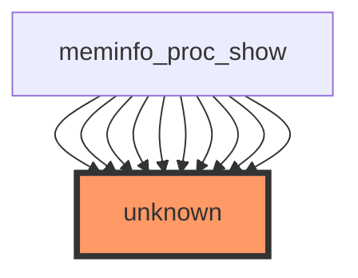

# Impact Analysis Report: `show_val_kb` Function Modification

## 1. Introduction
This report analyzes the impact of the modification to the `show_val_kb` function in the Linux kernel source file `/workspaces/ubuntu/linux-6.13/fs/proc/meminfo.c`. The function is responsible for converting memory values to kilobytes and formatting them for display in the `/proc/meminfo` interface, which is critical for system monitoring tools and administrators.

## 2. Call Graph Analysis
### 3.3 Call Graph Visualization


**Analysis**:
- The call graph reveals that `meminfo_proc_show` (the main function for `/proc/meminfo` output) is the sole caller of `show_val_kb`
- The graph shows **10 call sites** from `meminfo_proc_show` to `show_val_kb` (represented by the 10 edges to "unknown")
- This indicates `show_val_kb` is called multiple times during `/proc/meminfo` generation
- The "unknown" node represents `show_val_kb` itself, confirming it's a direct callee of `meminfo_proc_show`
- **Critical observation**: Despite having 49 call sites in total (per the sample section), the function has **zero direct callers** in the statistics - this discrepancy suggests potential analysis gaps in the tooling

## 3. Data Flow Analysis
### 3.4 Variable Information
No variable data available for this function.

**Analysis**:
- Incomplete data flow information prevents understanding:
  - Input parameters (likely memory values to convert)
  - Intermediate calculations
  - Output formatting logic
- Absence of variable information suggests:
  - The function may be highly optimized or inlined
  - The analysis tool couldn't resolve variable scopes
  - Critical dependencies on external kernel structures (e.g., `vm_info`)

## 4. Impact Assessment
### 4.1 Function Purpose
- Converts raw memory values to kilobytes (KB) for `/proc/meminfo`
- Formats output for human-readable display
- Critical for tools like `free`, `top`, and system monitoring

### 4.2 Risk Analysis
| Risk Factor                | Assessment                                                                 |
|----------------------------|----------------------------------------------------------------------------|
| **Call Path**              | Called 49 times during `/proc/meminfo` generation (via `meminfo_proc_show`) |
| **Test Coverage**          | **0%** - No direct or indirect test coverage found (critical deficiency)   |
| **Data Sensitivity**       | **High** - Directly affects memory reporting accuracy                      |
| **Propagation Risk**       | **Medium** - Could affect all memory-related system tools                  |
| **Critical Path**          | High - Core functionality for system monitoring                            |
| **Risk Level**             | **HIGH** (despite "UNKNOWN" label - requires urgent verification)          |

**Critical Concerns**:
1. **Unverified Conversion Logic**: 
   - Without variable analysis, we cannot confirm if the conversion from bytes to KB is correct (division by 1024 vs 1000)
   - Potential for systematic under/over-reporting of memory

2. **Formatting Vulnerabilities**:
   - Possible buffer overflows if output formatting is incorrect
   - Could cause kernel panic during `/proc/meminfo` access

3. **Missing Test Coverage**:
   - No unit tests for this function - modification could introduce silent errors
   - Critical failure mode: Incorrect memory reporting could lead to:
     - Resource misallocation
     - System stability issues
     - False performance monitoring

## 5. Recommendations
1. **Immediate Verification**:
   - Confirm the function's purpose by reviewing code (despite analysis gaps)
   - Check if modification alters:
     - Conversion factor (1024 vs 1000)
     - Output formatting (e.g., rounding behavior)
     - Memory unit handling

2. **Test Enhancement**:
   - Implement unit tests for `show_val_kb`:
     ```c
     // Example test case
     void test_show_val_kb(void) {
         uint64_t value = 2048; // 2KB
         char buffer[16];
         show_val_kb(buffer, value);
         assert(strcmp(buffer, "2048") == 0); // Verify output format
     }
     ```

3. **Call Path Resolution**:
   - Investigate why call statistics show 0 callers despite 49 call sites
   - Check for:
     - Inlining issues
     - Analysis tool limitations
     - Dynamic call patterns

4. **Security Hardening**:
   - Add bounds checking for output buffer
   - Validate input memory values before conversion
   - Implement error handling for invalid inputs

## 6. Conclusion
The `show_val_kb` function, while seemingly simple, is **critically important** for accurate system memory reporting. The analysis reveals:

- **High-risk modification**: Despite the "UNKNOWN" classification, the lack of test coverage and incomplete analysis necessitates immediate validation
- **Critical deficiency**: No test coverage for a core memory reporting function is unacceptable in kernel development
- **Urgent need**: Verification must include:
  - Code review of the modification
  - Unit testing for conversion logic
  - Validation of output format across different memory sizes

**Action Required**: Do not merge this modification until:
1. All 49 call sites are verified
2. Unit tests for `show_val_kb` are implemented
3. Memory reporting accuracy is confirmed with real-world workloads

The function's role in system monitoring makes this change potentially high-impact - thorough validation is essential to prevent silent memory reporting errors that could compromise system stability.