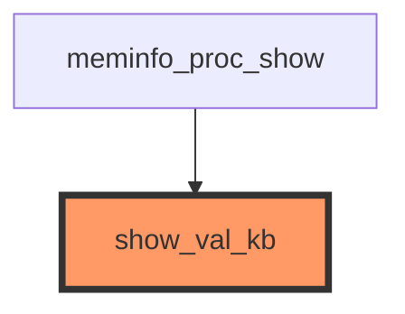

# Call Graph: show_val_kb

**Function:** `show_val_kb`
**File:** `fs/proc/meminfo.c`
**Purpose:** Format memory statistics in kilobytes for /proc/meminfo
**Generated:** 2025-12-27

## Call Graph Visualization

This diagram shows the direct callers of `show_val_kb`. The target function is highlighted in orange.



## Analysis

- **Direct Callers:** 1 (meminfo_proc_show)
- **Call Count:** 49 calls from meminfo_proc_show
- **Purpose:** Used extensively to format all memory statistics in /proc/meminfo
- **Risk Level:** HIGH - Critical interface for system monitoring tools

## How This Was Generated

```bash
# Export this visualization
python3 src/main.py export-graph show_val_kb --format mermaid --max-depth 1
```

## View This Diagram

- **GitHub/GitLab:** This diagram renders automatically in the markdown preview
- **VS Code:** Install the Mermaid extension to see the diagram
- **Online:** Copy the mermaid block to https://mermaid.live/

## Related Commands

```bash
# Export as Graphviz DOT for professional rendering
python3 src/main.py export-graph show_val_kb --format dot -o show_val_kb.dot
dot -Tpng show_val_kb.dot -o show_val_kb.png

# Export as JSON for custom visualization
python3 src/main.py export-graph show_val_kb --format json

# Generate full impact analysis with embedded diagram
python3 src/main.py analyze show_val_kb --llm --output show_val_kb-analysis.md
```

## See Also

- [Impact Analysis Reports](reports/) - LLM-generated analysis reports
- [Query Examples](query_examples.md) - Neo4j Cypher queries
- [Main Documentation](../README.md) - Full project documentation
