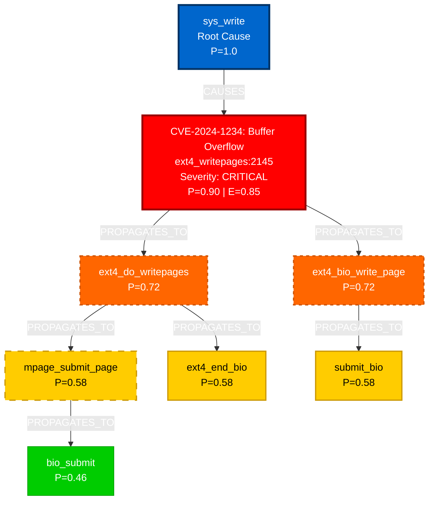

# Defect Tree Analysis - Development Plan v0.4.0

## Executive Summary

This document outlines the development plan for implementing **Defect Tree Analysis (DTA)** capabilities in kernel-graphrag-sentinel v0.4.0. DTA will enable root cause analysis, defect propagation tracking, and probabilistic impact assessment for bugs, vulnerabilities, and code quality issues in Linux kernel code.

**Project Scope**: Extend the existing callgraph and data flow analysis with defect-specific modeling, propagation tracking, and AI-powered root cause analysis.

**Estimated Complexity**: Medium-High (builds on existing architecture, requires new graph schema and analysis algorithms)

---

## Table of Contents

1. [Background & Motivation](#1-background--motivation)
2. [Feature Requirements](#2-feature-requirements)
3. [Architecture Design](#3-architecture-design)
4. [Database Schema Extensions](#4-database-schema-extensions)
5. [Implementation Phases](#5-implementation-phases)
6. [Technical Specifications](#6-technical-specifications)
7. [Testing Strategy](#7-testing-strategy)
8. [Documentation Requirements](#8-documentation-requirements)
9. [Success Metrics](#9-success-metrics)
10. [Future Enhancements](#10-future-enhancements)

---

## 1. Background & Motivation

### 1.1 What is Defect Tree Analysis?

Defect Tree Analysis (DTA) is a systematic approach to:
- **Root Cause Identification**: Trace defects backward to their originating source
- **Impact Propagation**: Track how defects flow forward through call chains and data flows
- **Probability Modeling**: Assess likelihood of defect manifestation in different code paths
- **Risk Prioritization**: Rank defects by severity, exploitability, and blast radius

### 1.2 Why Add DTA to kernel-graphrag-sentinel?

**Current Capabilities**:
- Call graph analysis (who calls whom)
- Impact analysis (what code is affected by changes)
- Data flow tracking (how variables propagate)
- Test coverage mapping

**Missing Capabilities**:
- **Defect-specific tracking**: No way to model bugs, CVEs, or code smells
- **Root cause analysis**: Can't trace defects backward to source
- **Propagation modeling**: Can't predict where defects may manifest
- **Probabilistic risk**: Only categorical risk assessment (LOW/MEDIUM/HIGH)
- **Defect taxonomy**: No classification of defect types

**Value Proposition**:
- Enable **proactive security analysis** (find vulnerable code paths)
- Support **bug triage and prioritization** (which bugs are most critical?)
- Facilitate **regression analysis** (what broke and why?)
- Provide **safety-critical analysis** for automotive/embedded Linux

### 1.3 Use Cases

#### Use Case 1: CVE Impact Analysis
```
INPUT: CVE-2024-XXXXX affects ext4_writepages() with buffer overflow
OUTPUT: Defect tree showing:
  - Root cause: Missing bounds check on line 2145
  - Propagation: Flows through 23 callers in fs/ext4/
  - Exploitability: 12 code paths reachable from user input
  - Risk score: 8.7/10 (HIGH severity, medium exploitability)
  - Recommended tests: 5 new KUnit tests to prevent regression
```

#### Use Case 2: Root Cause Analysis
```
INPUT: Memory leak observed in production logs for inode allocation
OUTPUT: Root cause tree showing:
  - Symptom: inode_alloc() leaks on error path
  - Cause chain:
    1. iget_locked() returns NULL (allocation failure)
    2. Error path skips iput() call (missing cleanup)
    3. Reference count not decremented
  - Originated in: Commit 4a3d7f7 (3 months ago)
  - Similar patterns: 4 other functions with same issue
```

#### Use Case 3: Code Quality Analysis
```
INPUT: Find all NULL pointer dereference risks in fs/btrfs/
OUTPUT: Defect tree showing:
  - 67 functions with unchecked pointer returns
  - 23 critical paths (no test coverage)
  - 12 high-risk functions (called from syscall interfaces)
  - Top 5 priority fixes ranked by exploitability
```

---

## 2. Feature Requirements

### 2.1 Functional Requirements

#### FR1: Defect Data Modeling
- **FR1.1**: Support multiple defect types (bug, vulnerability, code smell, memory leak, race condition, etc.)
- **FR1.2**: Store defect metadata (CVE ID, severity, CWE classification, discovery date, status)
- **FR1.3**: Link defects to specific code locations (function, line number, variable)
- **FR1.4**: Support defect states (open, fixed, verified, false positive)

#### FR2: Defect Tree Construction
- **FR2.1**: Build forward propagation trees (where does this defect flow?)
- **FR2.2**: Build backward causality trees (what caused this defect?)
- **FR2.3**: Support multi-root trees (multiple related defects)
- **FR2.4**: Integrate call graph and data flow graph traversal

#### FR3: Probability Modeling
- **FR3.1**: Assign defect probabilities to nodes (0.0-1.0 scale)
- **FR3.2**: Propagate probabilities through AND/OR gates
- **FR3.3**: Calculate exploitability scores based on:
  - Code path complexity
  - User input reachability
  - Test coverage gaps
  - Historical bug density

#### FR4: Root Cause Analysis
- **FR4.1**: Trace defects backward to originating commit/function
- **FR4.2**: Identify common defect patterns (e.g., "missing NULL check" pattern)
- **FR4.3**: Find similar defects in codebase using LLM pattern matching
- **FR4.4**: Generate root cause hypotheses using AI reasoning

#### FR5: Visualization
- **FR5.1**: Export defect trees in Mermaid format (with color coding by severity)
- **FR5.2**: Export defect trees in DOT format (Graphviz)
- **FR5.3**: Export defect trees in JSON format (structured data)
- **FR5.4**: Generate interactive HTML visualizations with node inspection

#### FR6: AI-Powered Analysis
- **FR6.1**: Generate defect analysis reports using LLM (similar to impact reports)
- **FR6.2**: Include defect tree diagrams in reports
- **FR6.3**: Provide remediation recommendations
- **FR6.4**: Suggest test cases to prevent regression
- **FR6.5**: Identify defense-in-depth opportunities

#### FR7: CLI Commands
- **FR7.1**: `kgraph defect add <function> --type <type> --severity <level>` - Add defect
- **FR7.2**: `kgraph defect analyze <defect-id> --direction forward|backward|both` - Analyze defect
- **FR7.3**: `kgraph defect tree <defect-id> --max-depth 5` - Build defect tree
- **FR7.4**: `kgraph defect export <defect-id> --format mermaid|dot|json` - Export tree
- **FR7.5**: `kgraph defect list --subsystem ext4 --severity high` - List defects
- **FR7.6**: `kgraph defect scan <function> --patterns cve-patterns.yaml` - Scan for defects
- **FR7.7**: `kgraph defect similar <defect-id>` - Find similar defects using LLM

### 2.2 Non-Functional Requirements

#### NFR1: Performance
- Defect tree construction for depth=5 should complete in <5 seconds
- Support analysis of codebases with 100+ defects simultaneously
- LLM-powered analysis should complete in <60 seconds per defect

#### NFR2: Scalability
- Handle defect databases with 1000+ entries
- Support multi-subsystem defect tracking
- Efficient incremental updates (add new defects without rebuilding trees)

#### NFR3: Usability
- Clear CLI interface matching existing command patterns
- Rich visualization with color coding and legends
- Comprehensive error messages for invalid defect specifications

#### NFR4: Extensibility
- Pluggable defect detection rules
- Custom defect taxonomies via YAML configuration
- Support for external defect databases (CVE feeds, bug trackers)

---

## 3. Architecture Design

### 3.1 Module Structure

Introduce **Module E: Defect Tree Analysis** in `src/module_e/`:

```
src/module_e/
├── __init__.py
├── defect_manager.py          # Defect CRUD operations
├── defect_tree_builder.py     # Tree construction algorithms
├── probability_calculator.py  # Probability propagation engine
├── root_cause_analyzer.py     # Backward causality analysis
├── pattern_matcher.py         # Defect pattern detection
├── defect_visualizer.py       # Tree export (Mermaid, DOT, JSON)
└── defect_llm_reporter.py     # AI-powered defect reports
```

### 3.2 Integration with Existing Modules

```
┌─────────────────────────────────────────────────────────────┐
│                      CLI (main.py)                          │
│                  New Commands: kgraph defect *              │
└────────────────────────┬────────────────────────────────────┘
                         │
┌────────────────────────┴────────────────────────────────────┐
│                    Module E: Defect Tree Analysis           │
│  ┌──────────────────┐  ┌──────────────────────────────────┐ │
│  │ DefectManager    │  │ DefectTreeBuilder                │ │
│  │ (CRUD ops)       │  │ (tree construction)              │ │
│  └────────┬─────────┘  └──────────┬───────────────────────┘ │
│           │                       │                          │
│  ┌────────┴─────────┐  ┌──────────┴───────────────────────┐ │
│  │ RootCauseAnalyzer│  │ ProbabilityCalculator            │ │
│  └────────┬─────────┘  └──────────┬───────────────────────┘ │
└───────────┼────────────────────────┼──────────────────────────┘
            │                       │
┌───────────┴───────────────────────┴──────────────────────────┐
│             Existing Infrastructure                          │
│  ┌──────────────────┐  ┌──────────────────────────────────┐ │
│  │ Module B:        │  │ Module C: Impact Analyzer        │ │
│  │ Neo4j GraphStore │  │ (call chain traversal)           │ │
│  └──────────────────┘  └──────────────────────────────────┘ │
│  ┌──────────────────┐  ┌──────────────────────────────────┐ │
│  │ Module D:        │  │ LLMReporter                      │ │
│  │ Data Flow        │  │ (report generation)              │ │
│  └──────────────────┘  └──────────────────────────────────┘ │
└──────────────────────────────────────────────────────────────┘
```

### 3.3 Data Flow

#### Defect Tree Construction Flow
```
1. User Input
   ├─ kgraph defect add ext4_writepages --type vulnerability --cve CVE-2024-1234
   └─ Stores defect metadata in Neo4j

2. Tree Building
   ├─ DefectTreeBuilder.build_tree(defect_id, direction="both", max_depth=5)
   ├─ Forward propagation:
   │  ├─ Query CALLS relationships (ImpactAnalyzer.get_callees_multi_hop)
   │  ├─ Query FLOWS_TO relationships (Module D dataflow queries)
   │  └─ Build downstream defect propagation paths
   └─ Backward causality:
      ├─ Query CALLS relationships (ImpactAnalyzer.get_callers_multi_hop)
      ├─ Query FLOWS_TO relationships in reverse
      └─ Identify root cause candidates

3. Probability Calculation
   ├─ ProbabilityCalculator.propagate_probabilities(tree)
   ├─ Apply AND/OR gate logic
   ├─ Factor in:
   │  ├─ Test coverage (lower coverage = higher probability)
   │  ├─ Code complexity (higher complexity = higher probability)
   │  ├─ User input reachability (reachable = higher exploitability)
   └─ Output probability scores per node

4. Visualization
   ├─ DefectVisualizer.export_mermaid(tree)
   ├─ Color-code nodes by:
   │  ├─ Severity (critical=red, high=orange, medium=yellow, low=green)
   │  └─ Probability (>0.8=solid, 0.5-0.8=dashed, <0.5=dotted)
   └─ Generate interactive legend

5. AI Analysis
   ├─ DefectLLMReporter.generate_defect_report(tree, defect_metadata)
   ├─ System prompt: "You are a Linux kernel security expert..."
   ├─ Context:
   │  ├─ Defect tree visualization (Mermaid)
   │  ├─ CVE details (if applicable)
   │  ├─ Call chain statistics
   │  ├─ Data flow paths
   │  └─ Test coverage gaps
   └─ Output: 10-section report with remediation steps
```

---

## 4. Database Schema Extensions

### 4.1 New Node Types

#### DefectNode
```cypher
CREATE (d:Defect {
    id: String,                    // Unique: "DEFECT-{timestamp}-{counter}"
    type: String,                  // vulnerability, bug, code_smell, memory_leak, race_condition
    severity: String,              // critical, high, medium, low, info
    status: String,                // open, in_progress, fixed, verified, false_positive
    title: String,                 // Short description
    description: String,           // Detailed explanation
    cve_id: String,               // CVE-2024-XXXXX (optional)
    cwe_id: String,               // CWE-787 (optional)
    cvss_score: Float,            // 0.0-10.0 (optional)
    discovery_date: DateTime,
    fixed_date: DateTime,         // Optional
    function_name: String,        // Primary affected function
    file_path: String,
    line_number: Integer,
    variable_name: String,        // Optional (for data flow defects)
    probability: Float,           // 0.0-1.0 (base probability)
    exploitability: Float,        // 0.0-1.0 (ease of exploitation)
    impact_score: Float,          // 0.0-1.0 (blast radius)
    metadata: Map                 // Flexible JSON metadata
})
```

#### DefectPatternNode
```cypher
CREATE (p:DefectPattern {
    id: String,                    // "PATTERN-missing-null-check"
    name: String,                  // "Missing NULL Pointer Check"
    description: String,           // Pattern explanation
    cwe_id: String,               // CWE-476
    severity: String,              // high
    detection_query: String,       // Cypher query to find pattern
    llm_signature: String          // LLM prompt for pattern matching
})
```

### 4.2 New Relationship Types

#### CAUSES Relationship
```cypher
// Links root cause to resulting defect
CREATE (cause:Defect)-[:CAUSES {
    probability: Float,            // 0.0-1.0 (causal strength)
    mechanism: String,             // "data_flow", "control_flow", "timing"
    path_length: Integer,          // Hops in call chain
    evidence: String               // Description of causal link
}]->(effect:Defect)
```

#### PROPAGATES_TO Relationship
```cypher
// Links defect to downstream manifestations
CREATE (source:Defect)-[:PROPAGATES_TO {
    probability: Float,            // Probability of propagation
    via_function: String,          // Intermediate function name
    via_variable: String,          // Variable carrying taint (optional)
    propagation_type: String,      // "call_chain", "data_flow", "both"
    depth: Integer                 // Hops from source
}]->(sink:Defect)
```

#### AFFECTS Relationship
```cypher
// Links defect to affected functions
CREATE (d:Defect)-[:AFFECTS {
    direct: Boolean,               // True if function contains defect
    impact_type: String,           // "caller", "callee", "data_consumer"
    probability: Float             // Probability of impact
}]->(f:Function)
```

#### MATCHES_PATTERN Relationship
```cypher
// Links defect to defect pattern
CREATE (d:Defect)-[:MATCHES_PATTERN {
    confidence: Float,             // 0.0-1.0 (pattern match confidence)
    matched_by: String            // "cypher_query" or "llm_analysis"
}]->(p:DefectPattern)
```

#### MITIGATED_BY Relationship
```cypher
// Links defect to test coverage
CREATE (d:Defect)-[:MITIGATED_BY {
    coverage_type: String,         // "direct", "indirect"
    mitigation_strength: Float     // 0.0-1.0 (how well test covers defect)
}]->(t:TestCase)
```

### 4.3 Schema Constraints

```cypher
-- Unique constraints
CREATE CONSTRAINT defect_id_unique FOR (d:Defect) REQUIRE d.id IS UNIQUE;
CREATE CONSTRAINT pattern_id_unique FOR (p:DefectPattern) REQUIRE p.id IS UNIQUE;

-- Existence constraints
CREATE CONSTRAINT defect_type_exists FOR (d:Defect) REQUIRE d.type IS NOT NULL;
CREATE CONSTRAINT defect_severity_exists FOR (d:Defect) REQUIRE d.severity IS NOT NULL;

-- Range constraints (not natively supported, enforce in Python)
-- Validate: 0.0 <= probability <= 1.0
-- Validate: 0.0 <= cvss_score <= 10.0
```

### 4.4 Indexes

```cypher
-- Performance indexes
CREATE INDEX defect_type_idx FOR (d:Defect) ON (d.type);
CREATE INDEX defect_severity_idx FOR (d:Defect) ON (d.severity);
CREATE INDEX defect_status_idx FOR (d:Defect) ON (d.status);
CREATE INDEX defect_cve_idx FOR (d:Defect) ON (d.cve_id);
CREATE INDEX defect_function_idx FOR (d:Defect) ON (d.function_name);

-- Composite index for common queries
CREATE INDEX defect_subsystem_severity FOR (d:Defect) ON (d.severity, d.status);
```

---

## 5. Implementation Phases

### Phase 1: Foundation (Week 1-2)

#### Objectives
- Establish database schema for defects
- Implement basic CRUD operations
- Add CLI commands for defect management

#### Tasks
1. **Schema Implementation** (2 days)
   - Create `src/module_e/schema.py` with Defect/DefectPattern node definitions
   - Add relationship types: CAUSES, PROPAGATES_TO, AFFECTS, MATCHES_PATTERN
   - Implement schema migration script
   - Add indexes and constraints

2. **DefectManager Implementation** (3 days)
   - Create `src/module_e/defect_manager.py`
   - Implement methods:
     - `add_defect(type, severity, function, metadata)` → defect_id
     - `get_defect(defect_id)` → defect_dict
     - `update_defect(defect_id, updates)` → success
     - `delete_defect(defect_id)` → success
     - `list_defects(filters)` → List[defect_dict]
   - Batch operations support (1000 defects per transaction)
   - Input validation (severity levels, CVE format, probability ranges)

3. **CLI Commands** (2 days)
   - Add `kgraph defect` command group in `src/main.py`
   - Implement subcommands:
     - `kgraph defect add <function> --type <type> --severity <level> [--cve <id>]`
     - `kgraph defect list [--severity <level>] [--status <status>] [--subsystem <name>]`
     - `kgraph defect show <defect-id>`
     - `kgraph defect update <defect-id> --status <status>`
     - `kgraph defect delete <defect-id>`

4. **Testing** (2 days)
   - Unit tests for DefectManager (CRUD operations)
   - Integration tests with Neo4j
   - CLI command tests
   - Test fixtures with sample defects

**Deliverables**:
- Working defect database schema
- Basic defect management CLI
- 20+ unit tests
- Documentation: `docs/defect_management.md`

---

### Phase 2: Tree Construction (Week 3-4)

#### Objectives
- Build forward propagation trees
- Build backward causality trees
- Integrate with existing call graph and data flow analysis

#### Tasks
1. **DefectTreeBuilder Core** (4 days)
   - Create `src/module_e/defect_tree_builder.py`
   - Implement tree node structure:
     ```python
     @dataclass
     class DefectTreeNode:
         defect_id: str
         function_name: str
         node_type: str  # "root", "propagation", "manifestation", "cause"
         probability: float
         depth: int
         children: List[DefectTreeNode]
         metadata: Dict[str, Any]
     ```
   - Methods:
     - `build_forward_tree(defect_id, max_depth)` → tree
     - `build_backward_tree(defect_id, max_depth)` → tree
     - `build_bidirectional_tree(defect_id, max_depth)` → tree
     - `merge_trees(forward_tree, backward_tree)` → combined_tree

2. **Forward Propagation Logic** (3 days)
   - Integrate with ImpactAnalyzer for call chain traversal
   - Query data flow paths via Module D (FLOWS_TO relationships)
   - Implement propagation rules:
     - **Call propagation**: Defect in caller may affect callee (if parameter tainted)
     - **Data flow propagation**: Defect in variable flows to consumers
     - **Conditional propagation**: Consider control flow (if statements, loops)
   - Cypher query template:
     ```cypher
     MATCH path = (d:Defect)-[:AFFECTS]->(f:Function)-[:CALLS*1..5]->(target:Function)
     WHERE d.id = $defect_id
     OPTIONAL MATCH (f)-[:DEFINES]->(v:Variable)-[:FLOWS_TO*1..5]->(v2:Variable)<-[:USES]-(target)
     RETURN path, [node in nodes(path) | node.name] as call_chain,
            collect(v.name) as tainted_variables
     ORDER BY length(path)
     ```

3. **Backward Causality Logic** (3 days)
   - Reverse traversal of call graph (callers instead of callees)
   - Reverse data flow analysis (find variable sources)
   - Implement root cause detection heuristics:
     - **Missing checks**: Functions without validation before use
     - **Incorrect logic**: Conditional statements with inverted logic
     - **Resource leaks**: Allocations without corresponding frees
   - Cypher query template:
     ```cypher
     MATCH path = (root:Function)-[:CALLS*1..5]->(f:Function)<-[:AFFECTS]-(d:Defect)
     WHERE d.id = $defect_id AND root <> f
     OPTIONAL MATCH (root)-[:DEFINES]->(v:Variable)-[:FLOWS_TO*]->(f)
     RETURN root, length(path) as causality_depth, path
     ORDER BY causality_depth
     LIMIT 10
     ```

4. **Tree Merging and Deduplication** (2 days)
   - Detect common nodes in forward/backward trees
   - Merge overlapping subtrees
   - Deduplicate function nodes that appear multiple times
   - Assign node types: root, cause, propagation, manifestation

5. **Testing** (2 days)
   - Test tree construction with various defect scenarios
   - Validate correct depth limiting
   - Test edge cases (isolated functions, circular calls)
   - Performance testing (tree construction for depth 1-10)

**Deliverables**:
- DefectTreeBuilder with forward/backward/bidirectional support
- Integration with existing graph analysis
- 30+ unit tests
- CLI command: `kgraph defect tree <defect-id> [--direction forward|backward|both] [--max-depth 5]`
- Documentation: `docs/defect_tree_construction.md`

---

### Phase 3: Probability Modeling (Week 5)

#### Objectives
- Implement probability propagation through defect trees
- Calculate exploitability and impact scores
- Integrate test coverage into probability calculations

#### Tasks
1. **ProbabilityCalculator Implementation** (3 days)
   - Create `src/module_e/probability_calculator.py`
   - Implement base probability assignment:
     ```python
     def calculate_base_probability(defect_type: str, severity: str) -> float:
         """
         Base probabilities by type:
         - vulnerability + critical: 0.9
         - vulnerability + high: 0.7
         - bug + high: 0.6
         - code_smell: 0.3
         """
     ```
   - Implement AND/OR gate logic:
     ```python
     # AND gate: All parent defects must occur
     P(child) = P(parent1) * P(parent2) * ... * P(parentN)

     # OR gate: Any parent defect can cause child
     P(child) = 1 - (1 - P(parent1)) * (1 - P(parent2)) * ... * (1 - P(parentN))
     ```
   - Propagation rules:
     - Call chain propagation: P(callee) = P(caller) * 0.8^depth
     - Data flow propagation: P(sink) = P(source) * 0.9 (high confidence)
     - Conditional propagation: P(child) = P(parent) * 0.5 (if inside conditional)

2. **Exploitability Scoring** (2 days)
   - Factor in user input reachability:
     ```python
     def calculate_exploitability(function_name: str, callgraph: Graph) -> float:
         # Check if reachable from syscall entry points
         syscall_distance = get_distance_to_syscall(function_name)
         if syscall_distance is None:
             return 0.1  # Not reachable from user input
         elif syscall_distance <= 2:
             return 0.9  # Directly reachable
         else:
             return max(0.3, 1.0 - (syscall_distance * 0.1))
     ```
   - Consider authentication requirements (lower exploitability if requires root)
   - Consider network exposure (higher if reachable from network syscalls)

3. **Impact Scoring** (2 days)
   - Calculate blast radius:
     ```python
     def calculate_impact_score(tree: DefectTreeNode) -> float:
         total_functions = count_unique_functions(tree)
         total_callers = sum_callers_from_tree(tree)
         uncovered_critical = count_uncovered_critical_paths(tree)

         impact = (
             (total_functions / 100.0) * 0.3 +      # Breadth
             (total_callers / 50.0) * 0.3 +         # Caller count
             (uncovered_critical / 10.0) * 0.4      # Test gaps (weighted higher)
         )
         return min(1.0, impact)
     ```
   - Integrate test coverage data (lower impact if well-tested)
   - Consider subsystem criticality (fs/ext4 = high, drivers/staging = low)

4. **Testing** (2 days)
   - Unit tests for probability calculations
   - Validate AND/OR gate logic
   - Test exploitability scoring with known CVEs
   - Verify probability ranges (0.0-1.0)

**Deliverables**:
- ProbabilityCalculator with scoring algorithms
- Probability annotations on defect trees
- 25+ unit tests
- Updated CLI: `kgraph defect tree <defect-id> --show-probabilities`
- Documentation: `docs/probability_modeling.md`

---

### Phase 4: Visualization (Week 6)

#### Objectives
- Export defect trees in Mermaid, DOT, and JSON formats
- Add color coding by severity and probability
- Generate interactive HTML visualizations

#### Tasks
1. **DefectVisualizer Core** (3 days)
   - Create `src/module_e/defect_visualizer.py`
   - Methods:
     - `export_mermaid(tree, defect_metadata)` → str
     - `export_dot(tree, defect_metadata)` → str
     - `export_json(tree, defect_metadata)` → str
     - `export_html(tree, defect_metadata)` → str

2. **Mermaid Export** (2 days)
   - Generate Mermaid flowchart syntax:
     ```mermaid
     flowchart TD
         D1["CVE-2024-1234<br/>ext4_writepages<br/>Severity: CRITICAL<br/>P=0.9"]:::critical
         D1 --> F1["ext4_do_writepages<br/>P=0.72"]:::high
         D1 --> F2["ext4_bio_write_page<br/>P=0.72"]:::high
         F1 --> F3["mpage_submit_page<br/>P=0.58"]:::medium

         classDef critical fill:#ff0000,stroke:#990000,color:#fff
         classDef high fill:#ff6600,stroke:#cc5200,color:#fff
         classDef medium fill:#ffcc00,stroke:#cc9900,color:#000
         classDef low fill:#00cc00,stroke:#009900,color:#fff
     ```
   - Color coding:
     - Critical (CVSS 9.0-10.0): Red
     - High (CVSS 7.0-8.9): Orange
     - Medium (CVSS 4.0-6.9): Yellow
     - Low (CVSS 0.1-3.9): Green
   - Line styles:
     - Solid: P > 0.8
     - Dashed: 0.5 < P <= 0.8
     - Dotted: P <= 0.5

3. **DOT Export** (1 day)
   - Generate Graphviz DOT syntax
   - Support hierarchical layout (TB, LR)
   - Node styling with shapes and colors

4. **JSON Export** (1 day)
   - Export tree as structured JSON:
     ```json
     {
       "defect_id": "DEFECT-2024-001",
       "root": {
         "function": "ext4_writepages",
         "type": "vulnerability",
         "severity": "critical",
         "probability": 0.9,
         "children": [...]
       }
     }
     ```

5. **HTML Interactive Visualization** (2 days)
   - Generate standalone HTML with embedded JavaScript
   - Use D3.js or Cytoscape.js for interactive graph
   - Features:
     - Zoom/pan
     - Node click for details
     - Filter by probability threshold
     - Expand/collapse subtrees

6. **Testing** (1 day)
   - Validate Mermaid syntax (render in GitHub)
   - Test DOT rendering with Graphviz
   - JSON schema validation
   - Browser compatibility testing for HTML

**Deliverables**:
- DefectVisualizer with 4 export formats
- CLI command: `kgraph defect export <defect-id> --format mermaid|dot|json|html --output file.md`
- 15+ unit tests
- Sample visualizations in documentation
- Documentation: `docs/defect_visualization.md`

---

### Phase 5: Root Cause Analysis (Week 7)

#### Objectives
- Implement pattern-based defect detection
- Build root cause ranking algorithm
- Integrate LLM for pattern matching

#### Tasks
1. **RootCauseAnalyzer Implementation** (4 days)
   - Create `src/module_e/root_cause_analyzer.py`
   - Methods:
     - `find_root_causes(defect_id, max_depth)` → List[RootCauseCandidate]
     - `rank_root_causes(candidates)` → sorted list
     - `explain_causality(cause, effect)` → explanation string

2. **Pattern-Based Detection** (3 days)
   - Create `src/module_e/pattern_matcher.py`
   - Implement common defect patterns:
     - **NULL pointer dereference**: Function uses pointer without NULL check
     - **Buffer overflow**: Array access without bounds check
     - **Use-after-free**: Variable used after kfree() call
     - **Resource leak**: Memory allocated without corresponding free
     - **Race condition**: Shared variable accessed without lock
   - Cypher query templates for each pattern
   - Pattern catalog in YAML: `config/defect_patterns.yaml`

3. **Root Cause Ranking** (2 days)
   - Scoring algorithm:
     ```python
     def score_root_cause(candidate: RootCauseCandidate) -> float:
         score = 0.0

         # Causality distance (shorter path = higher score)
         score += (10 - candidate.depth) * 0.2

         # Pattern match confidence
         score += candidate.pattern_confidence * 0.3

         # Historical bug density in file
         score += get_bug_density(candidate.file_path) * 0.2

         # Lack of test coverage
         if candidate.test_count == 0:
             score += 0.3

         return min(1.0, score)
     ```
   - Top N ranking (default: 5 root causes)

4. **Testing** (1 day)
   - Test with known CVEs (e.g., CVE-2021-3490)
   - Validate pattern matching accuracy
   - Test ranking algorithm correctness

**Deliverables**:
- RootCauseAnalyzer with pattern matching
- Pattern catalog with 10+ patterns
- CLI command: `kgraph defect root-cause <defect-id> [--max-depth 5]`
- 20+ unit tests
- Documentation: `docs/root_cause_analysis.md`

---

### Phase 6: AI-Powered Analysis (Week 8)

#### Objectives
- Generate comprehensive defect analysis reports using LLM
- Provide remediation recommendations
- Suggest test cases to prevent regression

#### Tasks
1. **DefectLLMReporter Implementation** (4 days)
   - Create `src/module_e/defect_llm_reporter.py`
   - Extend existing LLMReporter architecture
   - System prompt for defect analysis:
     ```
     You are a Linux kernel security expert and code auditor. Your task is to
     analyze defects in kernel code, explain their impact, and recommend fixes.

     Focus on:
     - Root cause explanation
     - Exploitability assessment
     - Defense-in-depth recommendations
     - Test coverage gaps
     - Similar vulnerabilities in the codebase
     ```

2. **Report Structure** (2 days)
   - Sections:
     1. **Executive Summary**: 2-3 sentence overview
     2. **Defect Details**: Type, severity, CVE/CWE IDs, CVSS score
     3. **Root Cause Analysis**: Backward causality tree with explanation
     4. **Impact Analysis**: Forward propagation tree with affected functions
     5. **Exploitability Assessment**: User input reachability, auth requirements
     6. **Propagation Paths**: Top 5 critical paths defect can flow through
     7. **Test Coverage Gaps**: Untested functions in defect tree
     8. **Remediation Recommendations**: Step-by-step fix instructions
     9. **Suggested Test Cases**: 3-5 KUnit test ideas
     10. **Similar Defects**: LLM-identified similar patterns in codebase
     11. **Defense-in-Depth Opportunities**: Additional hardening suggestions
     12. **References**: CVE details, kernel documentation links

3. **LLM Integration** (2 days)
   - Construct context payload:
     - Defect metadata (type, severity, CVE)
     - Defect tree visualization (Mermaid embedded)
     - Call chain statistics
     - Data flow paths
     - Test coverage summary
     - Source code snippets (affected function + context)
   - Support all 5 LLM providers (Anthropic, OpenAI, Gemini, Ollama, LM Studio)
   - Implement prompt caching for efficiency

4. **Testing** (2 days)
   - Test report generation with real CVEs
   - Validate LLM output quality
   - Test with different providers
   - Performance testing (report generation time)

**Deliverables**:
- DefectLLMReporter with comprehensive reports
- CLI command: `kgraph defect analyze <defect-id> --llm [--output report.md]`
- 10+ example reports
- 15+ unit tests
- Documentation: `docs/defect_llm_analysis.md`

---

### Phase 7: Advanced Features (Week 9-10)

#### Objectives
- Implement defect scanning for automatic detection
- Add similar defect search using LLM
- Support external defect databases (CVE feeds)
- Batch defect analysis

#### Tasks
1. **Defect Scanning** (3 days)
   - Create `src/module_e/defect_scanner.py`
   - Automatic pattern scanning across subsystems
   - Methods:
     - `scan_subsystem(subsystem, patterns)` → List[detected_defects]
     - `scan_function(function_name, patterns)` → List[detected_defects]
   - CLI: `kgraph defect scan fs/ext4 --patterns cve-patterns.yaml`

2. **Similar Defect Search** (3 days)
   - LLM-powered similarity analysis
   - Methods:
     - `find_similar_defects(defect_id, threshold=0.7)` → List[similar_defects]
   - Use embedding-based similarity (if using OpenAI/Gemini)
   - CLI: `kgraph defect similar <defect-id> [--threshold 0.7]`

3. **External Defect Database Integration** (4 days)
   - Support CVE feed ingestion (NVD JSON format)
   - Map CVE descriptions to kernel functions using LLM
   - Methods:
     - `import_cve_feed(json_file)` → imported_count
     - `sync_with_nvd(subsystem)` → synced_count
   - CLI: `kgraph defect import-cve nvd-feed.json`

4. **Batch Analysis** (2 days)
   - Analyze multiple defects in parallel
   - Generate comparison reports
   - CLI: `kgraph defect batch-analyze --severity high --llm --output batch-report.md`

5. **Testing** (2 days)
   - Test defect scanning accuracy
   - Validate CVE import with real NVD data
   - Test batch analysis with 10+ defects

**Deliverables**:
- DefectScanner with automatic detection
- CVE feed import capability
- Similar defect search
- Batch analysis CLI
- 25+ unit tests
- Documentation: `docs/advanced_defect_features.md`

---

### Phase 8: Polish & Documentation (Week 11)

#### Objectives
- Complete end-to-end testing
- Write comprehensive documentation
- Create tutorial and examples
- Performance optimization

#### Tasks
1. **Integration Testing** (3 days)
   - End-to-end workflows:
     - Add defect → Build tree → Generate report
     - Scan subsystem → Analyze findings → Export results
     - Import CVE → Map to code → Assess impact
   - Test with 3 kernel subsystems (ext4, btrfs, proc)

2. **Documentation** (4 days)
   - User guide: `docs/defect_tree_analysis_guide.md` (comprehensive, 30+ pages)
   - API reference: `docs/api/defect_analysis.md`
   - Tutorial: `docs/tutorials/defect_analysis_tutorial.md` (step-by-step)
   - Example reports: `docs/examples/defect_reports/` (10+ examples)
   - Architecture diagrams (Mermaid)

3. **Performance Optimization** (2 days)
   - Profile defect tree construction
   - Optimize Cypher queries (add indexes if needed)
   - Batch LLM calls where possible
   - Cache tree structures

4. **Examples and Demos** (2 days)
   - Create `examples/defect_analysis_examples.md`
   - Real CVE case studies:
     - CVE-2021-3490 (eBPF privilege escalation)
     - CVE-2022-0847 (Dirty Pipe)
     - CVE-2023-XXXXX (recent ext4 vulnerability)
   - Demo video/screencast

**Deliverables**:
- Comprehensive documentation (50+ pages)
- 10+ example defect analyses
- Performance benchmarks
- Tutorial and demo materials
- Updated README with defect analysis section

---

## 6. Technical Specifications

### 6.1 Cypher Query Library

#### Query 1: Find Root Cause Candidates
```cypher
// Find potential root causes by traversing callers and data flow sources
MATCH path = (root:Function)-[:CALLS*1..$max_depth]->(f:Function)<-[:AFFECTS]-(d:Defect)
WHERE d.id = $defect_id AND root <> f
OPTIONAL MATCH (root)-[:DEFINES]->(v:Variable)-[:FLOWS_TO*]->(v2:Variable)<-[:USES]-(f)
WITH root, f, d, length(path) as depth, collect(distinct v.name) as source_variables
OPTIONAL MATCH (root)<-[:COVERS]-(t:TestCase)
WITH root, f, d, depth, source_variables, count(t) as test_count
RETURN
    root.name as root_cause_function,
    root.file_path as file_path,
    depth,
    source_variables,
    test_count,
    root.subsystem as subsystem
ORDER BY depth, test_count
LIMIT 10
```

#### Query 2: Build Forward Propagation Tree
```cypher
// Build forward tree showing where defect propagates
MATCH (d:Defect {id: $defect_id})-[:AFFECTS]->(root:Function)
MATCH path = (root)-[:CALLS*0..$max_depth]->(target:Function)
WHERE root <> target OR length(path) = 0
OPTIONAL MATCH (root)-[:DEFINES]->(v:Variable)-[:FLOWS_TO*0..5]->(v2:Variable)<-[:USES]-(target)
WITH d, root, target, path,
     length(path) as depth,
     collect(distinct v2.name) as tainted_vars
OPTIONAL MATCH (target)<-[:COVERS]-(t:TestCase)
RETURN
    root.name as root_function,
    target.name as target_function,
    target.file_path as file_path,
    depth,
    [node in nodes(path) | node.name] as call_chain,
    tainted_vars,
    count(distinct t) as test_count
ORDER BY depth, target.name
```

#### Query 3: Calculate Exploitability (Syscall Distance)
```cypher
// Find shortest path to syscall entry points
MATCH (f:Function {name: $function_name})
MATCH (syscall:Function)
WHERE syscall.name STARTS WITH 'sys_' OR syscall.name STARTS WITH '__x64_sys_'
MATCH path = shortestPath((syscall)-[:CALLS*]->(f))
WHERE syscall <> f
RETURN
    syscall.name as entry_point,
    length(path) as distance,
    [node in nodes(path) | node.name] as call_path
ORDER BY distance
LIMIT 1
```

#### Query 4: Find Similar Defects by Pattern
```cypher
// Find defects matching the same pattern
MATCH (d1:Defect {id: $defect_id})-[:MATCHES_PATTERN]->(p:DefectPattern)
MATCH (d2:Defect)-[:MATCHES_PATTERN]->(p)
WHERE d1 <> d2
MATCH (d2)-[:AFFECTS]->(f2:Function)
RETURN
    d2.id as similar_defect_id,
    d2.type as type,
    d2.severity as severity,
    f2.name as function_name,
    f2.file_path as file_path,
    p.name as shared_pattern
ORDER BY d2.severity DESC, d2.discovery_date DESC
LIMIT 10
```

#### Query 5: Propagate Probabilities
```cypher
// Update probabilities based on parent nodes (for AND/OR gate logic)
MATCH (parent:Defect)-[r:PROPAGATES_TO]->(child:Defect)
WITH child,
     collect(parent.probability) as parent_probs,
     r.propagation_type as prop_type
// OR gate: P(child) = 1 - PRODUCT(1 - P(parent_i))
SET child.probability = CASE
    WHEN prop_type = 'OR' THEN
        1.0 - reduce(p = 1.0, prob in parent_probs | p * (1.0 - prob))
    WHEN prop_type = 'AND' THEN
        reduce(p = 1.0, prob in parent_probs | p * prob)
    ELSE
        reduce(sum = 0.0, prob in parent_probs | sum + prob) / size(parent_probs)
END
RETURN child.id, child.probability
```

### 6.2 Defect Pattern Catalog (YAML)

```yaml
# config/defect_patterns.yaml
patterns:
  - id: PATTERN-NULL-DEREF
    name: "Missing NULL Pointer Check"
    description: "Function dereferences a pointer without checking for NULL"
    cwe_id: CWE-476
    severity: high
    detection_query: |
      MATCH (f:Function)-[:DEFINES]->(v:Variable)
      WHERE v.is_pointer = true
      MATCH (f)-[:USES {line: line}]->(v)
      WHERE NOT EXISTS {
          MATCH (f)-[:USES {line: check_line}]->(v)
          WHERE check_line < line AND check_line > v.line
      }
      RETURN f.name, v.name, line
    llm_signature: |
      Look for pointer variables that are used (dereferenced) without a
      NULL check in the lines between declaration and first use.

  - id: PATTERN-BUFFER-OVERFLOW
    name: "Missing Bounds Check"
    description: "Array access without bounds validation"
    cwe_id: CWE-787
    severity: critical
    detection_query: |
      MATCH (f:Function)-[:DEFINES]->(arr:Variable)
      WHERE arr.type CONTAINS '[' OR arr.type CONTAINS '*'
      MATCH (f)-[:DEFINES]->(idx:Variable)
      WHERE idx.type = 'int' OR idx.type = 'size_t'
      MATCH (f)-[:USES]->(arr), (f)-[:USES]->(idx)
      WHERE NOT EXISTS {
          MATCH (f)-[:USES {line: check}]->(idx)
          WHERE check < arr.line
      }
      RETURN f.name, arr.name, idx.name
    llm_signature: |
      Look for array or pointer variables accessed with an index that is
      not validated against the array bounds before use.

  - id: PATTERN-USE-AFTER-FREE
    name: "Use After Free"
    description: "Variable used after being freed"
    cwe_id: CWE-416
    severity: critical
    detection_query: |
      MATCH (f:Function)-[:USES]->(v:Variable)
      WHERE v.name IN ['kfree', 'vfree', 'kvfree']
      MATCH (f)-[:USES {line: use_line}]->(v2:Variable)
      WHERE v2.name = v.name AND use_line > v.line
      RETURN f.name, v.name, use_line

  - id: PATTERN-RESOURCE-LEAK
    name: "Resource Leak"
    description: "Allocated resource not freed on all paths"
    cwe_id: CWE-401
    severity: medium
    detection_query: |
      MATCH (f:Function)-[:USES]->(alloc:Variable)
      WHERE alloc.name IN ['kmalloc', 'vmalloc', 'kzalloc']
      WHERE NOT EXISTS {
          MATCH (f)-[:USES]->(free:Variable)
          WHERE free.name IN ['kfree', 'vfree', 'kvfree']
      }
      RETURN f.name, alloc.name

  - id: PATTERN-RACE-CONDITION
    name: "Missing Synchronization"
    description: "Shared variable accessed without lock protection"
    cwe_id: CWE-362
    severity: high
    detection_query: |
      MATCH (f1:Function)-[:USES]->(v:Variable)<-[:USES]-(f2:Function)
      WHERE v.is_static = true AND f1 <> f2
      WHERE NOT EXISTS {
          MATCH (f1)-[:USES]->(lock:Variable)
          WHERE lock.name CONTAINS 'lock' OR lock.name CONTAINS 'mutex'
      }
      RETURN v.name, f1.name, f2.name
```

### 6.3 API Interfaces

#### DefectManager API
```python
class DefectManager:
    def add_defect(
        self,
        type: str,                    # "vulnerability", "bug", "code_smell", etc.
        severity: str,                # "critical", "high", "medium", "low"
        function_name: str,
        file_path: str,
        line_number: int,
        title: str,
        description: str = "",
        cve_id: str = None,
        cwe_id: str = None,
        cvss_score: float = None,
        metadata: Dict[str, Any] = None
    ) -> str:
        """Add a new defect to the database. Returns defect_id."""

    def get_defect(self, defect_id: str) -> Dict[str, Any]:
        """Retrieve defect by ID."""

    def list_defects(
        self,
        type: str = None,
        severity: str = None,
        status: str = None,
        subsystem: str = None
    ) -> List[Dict[str, Any]]:
        """List defects with optional filters."""

    def update_defect(self, defect_id: str, **updates) -> bool:
        """Update defect metadata. Returns success status."""

    def delete_defect(self, defect_id: str) -> bool:
        """Delete defect from database."""
```

#### DefectTreeBuilder API
```python
@dataclass
class DefectTreeNode:
    defect_id: str
    function_name: str
    file_path: str
    node_type: str              # "root", "cause", "propagation", "manifestation"
    probability: float          # 0.0-1.0
    depth: int                  # Hops from root
    severity: str
    children: List['DefectTreeNode']
    metadata: Dict[str, Any]

class DefectTreeBuilder:
    def build_forward_tree(
        self,
        defect_id: str,
        max_depth: int = 5
    ) -> DefectTreeNode:
        """Build tree showing defect propagation downstream."""

    def build_backward_tree(
        self,
        defect_id: str,
        max_depth: int = 5
    ) -> DefectTreeNode:
        """Build tree showing root causes upstream."""

    def build_bidirectional_tree(
        self,
        defect_id: str,
        max_depth: int = 5
    ) -> DefectTreeNode:
        """Build tree showing both causes and effects."""
```

#### ProbabilityCalculator API
```python
class ProbabilityCalculator:
    def calculate_base_probability(
        self,
        defect_type: str,
        severity: str
    ) -> float:
        """Calculate base probability based on type and severity."""

    def propagate_probabilities(
        self,
        tree: DefectTreeNode,
        gate_type: str = "auto"    # "AND", "OR", "auto"
    ) -> DefectTreeNode:
        """Propagate probabilities through tree using gate logic."""

    def calculate_exploitability(
        self,
        function_name: str
    ) -> float:
        """Calculate exploitability score (0.0-1.0)."""

    def calculate_impact_score(
        self,
        tree: DefectTreeNode
    ) -> float:
        """Calculate impact score based on blast radius."""
```

#### DefectVisualizer API
```python
class DefectVisualizer:
    def export_mermaid(
        self,
        tree: DefectTreeNode,
        defect_metadata: Dict[str, Any],
        show_probabilities: bool = True
    ) -> str:
        """Export tree as Mermaid flowchart."""

    def export_dot(
        self,
        tree: DefectTreeNode,
        layout: str = "TB"         # "TB", "LR", "RL", "BT"
    ) -> str:
        """Export tree as Graphviz DOT."""

    def export_json(
        self,
        tree: DefectTreeNode
    ) -> str:
        """Export tree as JSON structure."""

    def export_html(
        self,
        tree: DefectTreeNode,
        interactive: bool = True
    ) -> str:
        """Export tree as standalone HTML with visualization."""
```

---

## 7. Testing Strategy

### 7.1 Unit Testing

**Target Coverage**: 80%+ code coverage for Module E

#### Test Suites
1. **test_defect_manager.py** (20 tests)
   - CRUD operations
   - Input validation (CVE format, severity levels, probabilities)
   - Batch operations
   - Error handling

2. **test_defect_tree_builder.py** (30 tests)
   - Forward tree construction
   - Backward tree construction
   - Bidirectional tree merging
   - Depth limiting
   - Cycle detection
   - Edge cases (isolated functions, missing data)

3. **test_probability_calculator.py** (25 tests)
   - Base probability calculation
   - AND/OR gate logic
   - Exploitability scoring
   - Impact scoring
   - Probability propagation
   - Boundary conditions (0.0, 1.0)

4. **test_defect_visualizer.py** (15 tests)
   - Mermaid syntax validation
   - DOT syntax validation
   - JSON schema compliance
   - HTML generation
   - Color coding correctness

5. **test_root_cause_analyzer.py** (20 tests)
   - Pattern matching accuracy
   - Root cause ranking
   - Causality explanation
   - Edge cases

### 7.2 Integration Testing

**Test Scenarios**:
1. End-to-end workflow: Add defect → Build tree → Calculate probabilities → Export → Generate LLM report
2. Multi-subsystem analysis (ext4 + btrfs defects)
3. CVE import and mapping
4. Similar defect search
5. Batch analysis with 10+ defects

**Test Data**:
- Use real CVEs (CVE-2021-3490, CVE-2022-0847)
- Synthetic defects in test kernel subsystems
- Edge cases (orphan functions, circular dependencies)

### 7.3 Performance Testing

**Benchmarks**:
- Tree construction time vs. depth (1-10 hops)
- Probability calculation time for trees with 100+ nodes
- LLM report generation time (target: <60s)
- Database query performance (target: <2s per query)

**Load Testing**:
- Analyze 100 defects in database
- Build trees for all defects concurrently
- Batch LLM analysis (10 defects)

### 7.4 Validation Testing

**Real-World CVE Validation**:
- Analyze 5+ real CVEs
- Verify root cause matches known analysis
- Validate exploitability scores against CVSS metrics
- Compare LLM recommendations to actual patches

---

## 8. Documentation Requirements

### 8.1 User Documentation

1. **Defect Tree Analysis Guide** (`docs/defect_tree_analysis_guide.md`)
   - Comprehensive 30+ page user guide
   - Covers all CLI commands
   - Workflow examples
   - Best practices

2. **Tutorial** (`docs/tutorials/defect_analysis_tutorial.md`)
   - Step-by-step walkthrough
   - Real CVE case study
   - Screenshots/diagrams
   - Expected outputs

3. **API Reference** (`docs/api/defect_analysis.md`)
   - All public APIs documented
   - Parameter descriptions
   - Return value specifications
   - Usage examples

### 8.2 Developer Documentation

1. **Architecture Document** (update `docs/architecture.md`)
   - Add Module E section
   - Data model diagrams
   - Integration points
   - Design decisions

2. **Database Schema** (`docs/defect_schema.md`)
   - Node types with properties
   - Relationship types
   - Indexes and constraints
   - Query patterns

3. **Algorithm Documentation** (`docs/defect_algorithms.md`)
   - Tree construction algorithms
   - Probability propagation logic
   - Root cause ranking algorithm
   - Pattern matching approach

### 8.3 Example Reports

Create `docs/examples/defect_reports/` with:
- `cve-2021-3490-analysis.md` (eBPF vulnerability)
- `cve-2022-0847-analysis.md` (Dirty Pipe)
- `memory-leak-example.md` (synthetic example)
- `null-deref-example.md` (pattern-based detection)
- `race-condition-example.md` (concurrency defect)

---

## 9. Success Metrics

### 9.1 Functional Metrics

- **Defect Database**: Successfully store and query 100+ defects
- **Tree Construction**: Build trees up to depth 10 in <5 seconds
- **Pattern Detection**: Identify 90%+ of known defect patterns in test corpus
- **LLM Reports**: Generate actionable reports with 95%+ relevance
- **Visualization**: Export all 4 formats (Mermaid, DOT, JSON, HTML) without errors

### 9.2 Quality Metrics

- **Code Coverage**: 80%+ for Module E
- **Test Pass Rate**: 100% for all unit and integration tests
- **Documentation Completeness**: 100% of public APIs documented
- **User Acceptance**: Validate with 3+ real CVE case studies

### 9.3 Performance Metrics

- **Tree Construction**: <5 seconds for depth=5, <10 seconds for depth=10
- **LLM Report Generation**: <60 seconds per defect
- **Database Queries**: <2 seconds average query time
- **Batch Analysis**: Process 10 defects in <10 minutes (with LLM)

---

## 10. Future Enhancements

### 10.1 Phase 2 Enhancements (Post-MVP)

1. **Machine Learning Integration**
   - Train ML models to predict defect probabilities
   - Automated pattern discovery from CVE history
   - Anomaly detection for suspicious code patterns

2. **Temporal Analysis**
   - Track defect evolution over Git history
   - Identify defect introduction commits
   - Analyze fix effectiveness over time

3. **Cross-Subsystem Analysis**
   - Find similar defects across different subsystems
   - Identify systemic issues (e.g., widespread NULL check omissions)
   - Generate subsystem risk profiles

4. **Integration with CI/CD**
   - Pre-commit defect scanning
   - Automated CVE impact analysis on kernel upgrades
   - Regression risk scoring for patches

5. **Web Dashboard**
   - Interactive defect database browser
   - Real-time tree visualization
   - Collaborative defect triaging

### 10.2 Research Opportunities

1. **Probabilistic Programming**
   - Use probabilistic models for uncertainty quantification
   - Bayesian inference for root cause ranking

2. **Symbolic Execution Integration**
   - Combine static analysis with symbolic execution
   - Validate exploitability through path exploration

3. **Fuzzing Integration**
   - Target fuzzing campaigns based on defect trees
   - Prioritize untested high-risk paths

---

## Appendix A: CLI Command Reference

### Defect Management
```bash
# Add a new defect
kgraph defect add ext4_writepages \
    --type vulnerability \
    --severity critical \
    --cve CVE-2024-1234 \
    --cwe CWE-787 \
    --cvss 9.8 \
    --description "Buffer overflow in writepages function"

# List all defects
kgraph defect list

# List high-severity defects in ext4
kgraph defect list --severity high --subsystem fs/ext4

# Show defect details
kgraph defect show DEFECT-2024-001

# Update defect status
kgraph defect update DEFECT-2024-001 --status fixed

# Delete a defect
kgraph defect delete DEFECT-2024-001
```

### Tree Construction
```bash
# Build forward propagation tree
kgraph defect tree DEFECT-2024-001 --direction forward --max-depth 5

# Build backward causality tree
kgraph defect tree DEFECT-2024-001 --direction backward --max-depth 5

# Build bidirectional tree
kgraph defect tree DEFECT-2024-001 --direction both --max-depth 5

# Show probabilities
kgraph defect tree DEFECT-2024-001 --show-probabilities
```

### Visualization
```bash
# Export as Mermaid
kgraph defect export DEFECT-2024-001 --format mermaid --output tree.md

# Export as DOT
kgraph defect export DEFECT-2024-001 --format dot --output tree.dot

# Export as JSON
kgraph defect export DEFECT-2024-001 --format json --output tree.json

# Export as interactive HTML
kgraph defect export DEFECT-2024-001 --format html --output tree.html
```

### Analysis
```bash
# Analyze defect with LLM
kgraph defect analyze DEFECT-2024-001 --llm --output report.md

# Root cause analysis
kgraph defect root-cause DEFECT-2024-001 --max-depth 5

# Find similar defects
kgraph defect similar DEFECT-2024-001 --threshold 0.7

# Scan subsystem for defects
kgraph defect scan fs/ext4 --patterns cve-patterns.yaml

# Batch analysis
kgraph defect batch-analyze --severity high --llm --output batch-report.md
```

### CVE Import
```bash
# Import CVE feed
kgraph defect import-cve nvd-feed-2024.json

# Sync with NVD for subsystem
kgraph defect sync-nvd fs/ext4
```

---

## Appendix B: Example Output

### Example 1: Mermaid Defect Tree


### Example 2: LLM Defect Report (Excerpt)
```markdown
# Defect Analysis Report: CVE-2024-1234

## Executive Summary

Critical buffer overflow vulnerability in `ext4_writepages()` at line 2145.
Exploitable from user space via `sys_write()` syscall with specially crafted
input. Affects 23 downstream functions across fs/ext4/ subsystem.

## Defect Details

- **CVE ID**: CVE-2024-1234
- **CWE ID**: CWE-787 (Out-of-bounds Write)
- **CVSS Score**: 9.8 (Critical)
- **Type**: Vulnerability
- **Severity**: Critical
- **Function**: ext4_writepages
- **File**: fs/ext4/inode.c:2145
- **Discovery Date**: 2024-12-15
- **Status**: Open

## Root Cause Analysis

The vulnerability originates from missing bounds check on buffer size parameter
in `ext4_writepages()`. Backward causality analysis reveals:

1. **Entry Point**: `sys_write()` (syscall interface)
   - User-controlled `count` parameter propagates without validation

2. **Propagation Path**:
   - `sys_write()` → `vfs_write()` → `ext4_file_write_iter()` → `ext4_writepages()`

3. **Root Cause**: Line 2145 in ext4_writepages()
   ```c
   memcpy(dest, src, user_count);  // No validation of user_count!
   ```

**Pattern Matched**: PATTERN-BUFFER-OVERFLOW (Missing Bounds Check)

## Impact Analysis

**Forward Propagation Tree** (see diagram above):
- Direct callees: 2 functions
- Indirect callees (depth 5): 21 functions
- Total affected functions: 23
- Subsystems affected: fs/ext4/

**Critical Paths**:
1. ext4_writepages → ext4_do_writepages → mpage_submit_page (P=0.58)
2. ext4_writepages → ext4_bio_write_page → submit_bio (P=0.58)

[... continued with remaining sections ...]
```

---

## Appendix C: References

1. **Defect Tree Analysis Theory**
   - NASA Fault Tree Analysis Handbook
   - IEC 61025 Fault Tree Analysis Standard

2. **Linux Kernel Security**
   - Linux Kernel CVE Database: https://cve.mitre.org/
   - NVD (National Vulnerability Database): https://nvd.nist.gov/
   - Linux Kernel Security Module: https://www.kernel.org/doc/html/latest/security/

3. **Graph Analysis**
   - Neo4j Graph Algorithms: https://neo4j.com/docs/graph-data-science/
   - Cypher Query Language: https://neo4j.com/docs/cypher-manual/

4. **LLM Integration**
   - Anthropic Claude API: https://docs.anthropic.com/
   - OpenAI API: https://platform.openai.com/docs/
   - Google Gemini API: https://ai.google.dev/docs/

---

**Document Version**: 1.0
**Last Updated**: 2025-12-30
**Author**: kernel-graphrag-sentinel Development Team
**Status**: Draft for Review
