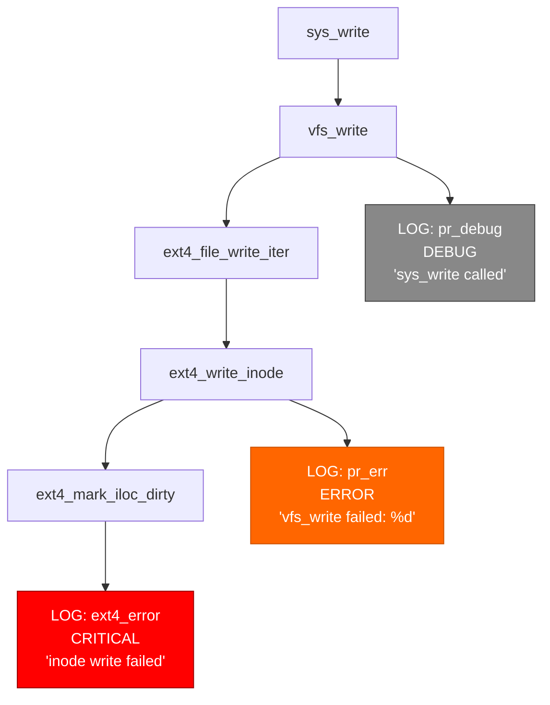

# Log Intention Analysis - Development Plan v0.5.0

## Executive Summary

This document outlines the development plan for implementing **Log Intention Analysis** capabilities in kernel-graphrag-sentinel v0.5.0. This feature will analyze kernel logging statements (printk, pr_err, dev_warn, etc.) within their callgraph context to automatically determine their purpose and group related logs by intention.

**Project Scope**: Extract, classify, and analyze kernel log statements using callgraph and data flow context to understand logging patterns, identify gaps in error coverage, and provide AI-powered insights into log-based system behavior.

**Estimated Complexity**: Medium (leverages existing callgraph and data flow infrastructure, adds new log-specific analysis)

---

## Table of Contents

1. [Background & Motivation](#1-background--motivation)
2. [Feature Requirements](#2-feature-requirements)
3. [Architecture Design](#3-architecture-design)
4. [Database Schema Extensions](#4-database-schema-extensions)
5. [Implementation Phases](#5-implementation-phases)
6. [Technical Specifications](#6-technical-specifications)
7. [Testing Strategy](#7-testing-strategy)
8. [Documentation Requirements](#8-documentation-requirements)
9. [Success Metrics](#9-success-metrics)
10. [Future Enhancements](#10-future-enhancements)

---

## 1. Background & Motivation

### 1.1 What is Log Intention Analysis?

Log Intention Analysis is a systematic approach to:
- **Log Extraction**: Identify and extract all kernel logging statements from source code
- **Context Understanding**: Trace logs through callgraph to understand their execution context
- **Intention Classification**: Determine the purpose of each log (error reporting, debugging, security audit, performance monitoring, etc.)
- **Log Grouping**: Group related logs by intention, feature, or error propagation chains
- **Gap Detection**: Identify missing logs in critical error paths

### 1.2 Kernel Logging Landscape

**75+ Logging Functions** in Linux kernel:
```c
// Core logging (8 severity levels)
printk(KERN_LEVEL "format", ...)
pr_emerg/alert/crit/err/warn/notice/info/debug(fmt, ...)

// Device logging
dev_emerg/alert/crit/err/warn/notice/info/dbg(dev, fmt, ...)

// Variants
printk_once, printk_ratelimited, pr_*_once, pr_*_ratelimited

// Subsystem wrappers (e.g., ext4)
ext4_error/warning/msg/debug(...)
```

**Log Severity Levels**:
- KERN_EMERG (0) - System unusable
- KERN_ALERT (1) - Action needed immediately
- KERN_CRIT (2) - Critical conditions
- KERN_ERR (3) - Error conditions
- KERN_WARNING (4) - Warnings
- KERN_NOTICE (5) - Significant condition
- KERN_INFO (6) - Informational
- KERN_DEBUG (7) - Debug messages

### 1.3 Why Add Log Intention Analysis?

**Current Limitations**:
- **No log awareness**: Logs are treated as regular function calls
- **No context understanding**: Can't trace why a log was emitted
- **No intention classification**: Can't distinguish error logs from debug logs
- **No pattern analysis**: Can't identify redundant or missing logs
- **No log coverage**: Can't measure error logging completeness

**Value Proposition**:
- **Error Coverage Analysis**: Identify unlogged error paths
- **Debug Log Organization**: Group debug logs by feature/subsystem
- **Security Audit Trails**: Track security-relevant log patterns
- **Performance Insights**: Analyze performance monitoring logs
- **Log Optimization**: Find redundant or unnecessary logs
- **Root Cause Correlation**: Link bug reports to relevant log patterns

### 1.4 Use Cases

#### Use Case 1: Error Logging Coverage Analysis
```
INPUT: Analyze ext4_write_inode() for error logging coverage
OUTPUT: Report showing:
  - 12 error paths identified
  - 8 paths have error logs (67% coverage)
  - 4 paths missing logs:
    1. inode_dirty_check() returns NULL → no log
    2. mark_buffer_dirty() fails silently → no log
    3. ...
  - Suggested log placements with severity levels
```

#### Use Case 2: Debug Log Grouping by Feature
```
INPUT: Group all debug logs in fs/ext4 by feature
OUTPUT: Log groups:
  - EXTENT_MANAGEMENT (24 logs): extent allocation, tree operations
  - JOURNALING (18 logs): transaction lifecycle, checkpoint
  - INODE_OPS (15 logs): inode creation, update, deletion
  - BLOCK_ALLOCATION (12 logs): block allocator internals
  - DIRECTORY_OPS (8 logs): directory entry operations
```

#### Use Case 3: Security Audit Trail Analysis
```
INPUT: Find all security-relevant logs in privilege escalation paths
OUTPUT: Audit trail map:
  - sys_setuid() → 3 audit logs (permission checks, uid changes)
  - sys_mount() → 5 audit logs (capability checks, mount options)
  - sys_ptrace() → 2 audit logs (process tracing events)
  - Gaps: sys_chroot() has no audit logs (security gap!)
```

#### Use Case 4: Log-Based Bug Triage
```
INPUT: User reports "EXT4-fs error: inode allocation failed" in dmesg
OUTPUT: Context analysis:
  - Log source: ext4_new_inode() at fs/ext4/ialloc.c:924
  - Log intention: FAULT_DIAGNOSIS (severity: CRITICAL)
  - Callgraph context:
    - Triggered from: sys_open() → ... → ext4_create()
    - Error variable: err = -ENOSPC (disk full)
    - Previous logs in chain:
      1. "No space left on device" (pr_warn)
      2. "Block allocation failed" (ext4_debug)
  - Similar bugs: 3 similar patterns in bug database
  - Recommended fix: Check disk space before inode allocation
```

---

## 2. Feature Requirements

### 2.1 Functional Requirements

#### FR1: Log Statement Extraction
- **FR1.1**: Extract all kernel logging function calls (printk, pr_*, dev_*, subsystem wrappers)
- **FR1.2**: Parse log level/severity (KERN_ERR, KERN_DEBUG, etc.)
- **FR1.3**: Extract format strings and arguments
- **FR1.4**: Identify log variants (once, ratelimited, conditional)
- **FR1.5**: Link logs to source location (function, file, line number)

#### FR2: Context Analysis
- **FR2.1**: Trace backward to understand what triggers each log (call chain)
- **FR2.2**: Trace forward to understand consequences of logging
- **FR2.3**: Extract control flow context (if/error conditions)
- **FR2.4**: Track variables logged (error codes, counters, pointers)
- **FR2.5**: Identify error propagation chains with logs at each level

#### FR3: Intention Classification
- **FR3.1**: Classify logs into 7 intention categories:
  - FAULT_DIAGNOSIS - Error reporting for troubleshooting
  - FEATURE_TRACING - Debug logging for development
  - SECURITY_AUDIT - Security-relevant event logging
  - PERFORMANCE_MONITORING - Metrics and statistics
  - OPERATIONAL_VISIBILITY - State transitions and lifecycle
  - USER_NOTIFICATION - Warnings and notices
  - COMPLIANCE_LOGGING - Regulatory/standards compliance
- **FR3.2**: Assign confidence scores (0.0-1.0) to classifications
- **FR3.3**: Support both rule-based and LLM-enhanced classification
- **FR3.4**: Handle subsystem-specific log patterns

#### FR4: Log Grouping
- **FR4.1**: Group logs by intention category
- **FR4.2**: Group logs by feature/subsystem
- **FR4.3**: Group logs by error propagation chain
- **FR4.4**: Group logs by callgraph context (same entry point)
- **FR4.5**: Create LogGroup nodes with metadata

#### FR5: Coverage Analysis
- **FR5.1**: Identify error paths without logs
- **FR5.2**: Calculate log coverage percentage per function/subsystem
- **FR5.3**: Suggest missing log placements
- **FR5.4**: Detect redundant or duplicate logs

#### FR6: Visualization & Reporting
- **FR6.1**: Export log flow diagrams (Mermaid, DOT, JSON)
- **FR6.2**: Generate LLM-powered log pattern reports
- **FR6.3**: Create log coverage heatmaps
- **FR6.4**: Visualize error propagation chains with logs highlighted

#### FR7: CLI Commands
- **FR7.1**: `kgraph logs extract <subsystem>` - Extract logs from subsystem
- **FR7.2**: `kgraph logs analyze <function>` - Analyze logs in function
- **FR7.3**: `kgraph logs classify [--llm]` - Classify log intentions
- **FR7.4**: `kgraph logs group --by intention|feature|chain` - Group logs
- **FR7.5**: `kgraph logs coverage <subsystem>` - Calculate coverage
- **FR7.6**: `kgraph logs trace <log-id>` - Trace log context
- **FR7.7**: `kgraph logs report --llm --output report.md` - Generate report
- **FR7.8**: `kgraph logs find --message "pattern"` - Search logs by message

### 2.2 Non-Functional Requirements

#### NFR1: Performance
- Log extraction for 1000+ functions should complete in <30 seconds
- Classification (rule-based) should process 100 logs per second
- Callgraph context analysis should complete in <5 seconds per log
- LLM-enhanced classification should process 10-20 logs per minute

#### NFR2: Accuracy
- Rule-based classification should achieve 85%+ accuracy
- LLM-enhanced classification should achieve 95%+ accuracy
- Log coverage analysis should have <5% false positives

#### NFR3: Scalability
- Handle 10,000+ log statements per subsystem
- Support multi-subsystem log analysis
- Efficient incremental updates (add new logs without reprocessing)

#### NFR4: Usability
- Clear CLI interface matching existing command patterns
- Rich log visualization with color coding
- Comprehensive error messages for invalid queries

---

## 3. Architecture Design

### 3.1 Module Structure

Introduce **Module F: Log Intention Analysis** in `src/module_f/`:

```
src/module_f/
├── __init__.py
├── log_extractor.py           # Extract log statements from AST
├── log_parser.py              # Parse log levels, format strings, arguments
├── log_classifier.py          # Classify log intentions (rule-based + LLM)
├── log_context_analyzer.py    # Callgraph context analysis
├── log_grouper.py             # Group logs by various criteria
├── log_coverage_analyzer.py   # Error path coverage analysis
├── log_visualizer.py          # Export log flow diagrams
├── log_llm_reporter.py        # AI-powered log reports
└── log_schema.py              # Neo4j schema for logs
```

### 3.2 Integration with Existing Modules

```
┌─────────────────────────────────────────────────────────────┐
│                      CLI (main.py)                          │
│                  New Commands: kgraph logs *                │
└────────────────────────┬────────────────────────────────────┘
                         │
┌────────────────────────┴────────────────────────────────────┐
│                  Module F: Log Intention Analysis           │
│  ┌──────────────────┐  ┌──────────────────────────────────┐ │
│  │ LogExtractor     │  │ LogClassifier                    │ │
│  │ (AST parsing)    │  │ (intention detection)            │ │
│  └────────┬─────────┘  └──────────┬───────────────────────┘ │
│           │                       │                          │
│  ┌────────┴─────────┐  ┌──────────┴───────────────────────┐ │
│  │ LogContextAnalyz │  │ LogGrouper                       │ │
│  │ (callgraph trace)│  │ (grouping & clustering)          │ │
│  └────────┬─────────┘  └──────────┬───────────────────────┘ │
└───────────┼────────────────────────┼──────────────────────────┘
            │                       │
┌───────────┴───────────────────────┴──────────────────────────┐
│             Existing Infrastructure                          │
│  ┌──────────────────┐  ┌──────────────────────────────────┐ │
│  │ Module A:        │  │ Module C: ImpactAnalyzer         │ │
│  │ CParser          │  │ (call chain traversal)           │ │
│  │ (AST extraction) │  │                                  │ │
│  └──────────────────┘  └──────────────────────────────────┘ │
│  ┌──────────────────┐  ┌──────────────────────────────────┐ │
│  │ Module B:        │  │ Module D: VariableTracker        │ │
│  │ Neo4j GraphStore │  │ (data flow analysis)             │ │
│  └──────────────────┘  └──────────────────────────────────┘ │
│  ┌──────────────────┐                                       │
│  │ LLMReporter      │                                       │
│  │ (AI integration) │                                       │
│  └──────────────────┘                                       │
└──────────────────────────────────────────────────────────────┘
```

### 3.3 Data Flow

#### Log Analysis Pipeline
```
1. Extraction Phase
   ├─ LogExtractor scans C code AST for logging calls
   ├─ Identifies: printk, pr_*, dev_*, ext4_error, etc.
   ├─ LogParser extracts:
   │  ├─ Log function name (e.g., "pr_err")
   │  ├─ Log level (e.g., "KERN_ERR")
   │  ├─ Format string (e.g., "allocation failed: %d")
   │  └─ Arguments (e.g., ["err"])
   └─ Creates LogStatement nodes in Neo4j

2. Context Analysis Phase
   ├─ LogContextAnalyzer.analyze_backward(log_id)
   │  ├─ Uses ImpactAnalyzer to trace callers (5 hops)
   │  ├─ Identifies error conditions that trigger log
   │  └─ Extracts logged variables using VariableTracker
   ├─ LogContextAnalyzer.analyze_forward(log_id)
   │  ├─ Traces what happens after logging
   │  └─ Identifies system actions (abort, retry, etc.)
   └─ Creates TRIGGERED_BY, LOGS_VARIABLE relationships

3. Classification Phase
   ├─ LogClassifier.classify_rule_based(log)
   │  ├─ Rule 1: Level-based (KERN_ERR → FAULT_DIAGNOSIS)
   │  ├─ Rule 2: Context-based (in error path → FAULT_DIAGNOSIS)
   │  ├─ Rule 3: Conditional compilation (#ifdef DEBUG → FEATURE_TRACING)
   │  ├─ Rule 4: Function prefix (audit_* → SECURITY_AUDIT)
   │  └─ Assigns intention + confidence
   ├─ LogClassifier.classify_llm_enhanced(log, context) [optional]
   │  ├─ Constructs prompt with log + callgraph context
   │  ├─ LLM analyzes semantic meaning
   │  └─ Returns intention + confidence + reasoning
   └─ Updates LogStatement.intention property

4. Grouping Phase
   ├─ LogGrouper.group_by_intention(subsystem)
   │  └─ Creates LogGroup nodes: "ext4_FAULT_DIAGNOSIS_group"
   ├─ LogGrouper.group_by_feature(subsystem)
   │  └─ LLM clusters logs by functional area
   └─ LogGrouper.group_by_error_chain(entry_point)
      └─ Groups logs in same error propagation path

5. Coverage Analysis Phase
   ├─ LogCoverageAnalyzer.find_unlogged_error_paths(function)
   │  ├─ Traverses function's error paths (return -ERRNO, goto err_*)
   │  ├─ Checks if path has any log statements
   │  └─ Returns list of unlogged paths
   └─ LogCoverageAnalyzer.calculate_coverage(subsystem)
      └─ Coverage = logged_paths / total_error_paths

6. Reporting Phase
   ├─ LogVisualizer.export_log_flow(function, format="mermaid")
   │  └─ Generates callgraph with logs highlighted
   └─ LogLLMReporter.generate_log_report(subsystem)
      ├─ System prompt: "You are a kernel logging expert..."
      ├─ Context: log groups, coverage stats, patterns
      └─ Output: 8-section report with recommendations
```

---

## 4. Database Schema Extensions

### 4.1 New Node Types

#### LogStatementNode
```cypher
CREATE (l:LogStatement {
    id: String,                    // Unique: "file::function::line"
    function: String,              // Containing function
    file_path: String,             // Source file
    line_number: Integer,          // Line number
    subsystem: String,             // e.g., "fs/ext4"

    // Log details
    log_function: String,          // "printk", "pr_err", "ext4_error", etc.
    log_level: String,             // "KERN_ERR", "KERN_DEBUG", etc.
    severity: Integer,             // 0-7 (EMERG to DEBUG)
    format_string: String,         // "allocation failed: %d"
    arguments: List[String],       // ["err", "size", ...]

    // Variants
    is_once: Boolean,              // printk_once variant
    is_ratelimited: Boolean,       // rate-limited variant
    is_conditional: Boolean,       // Inside #ifdef DEBUG

    // Classification
    intention: String,             // "FAULT_DIAGNOSIS", "FEATURE_TRACING", etc.
    intention_confidence: Float,   // 0.0-1.0
    classification_method: String, // "rule_based", "llm_enhanced"

    // Context
    in_error_path: Boolean,        // Inside error handling code
    error_condition: String,       // "if (err)", "if (!ptr)", etc.

    // Metadata
    extracted_at: DateTime,
    metadata: Map                  // Flexible JSON metadata
})
```

#### LogGroupNode
```cypher
CREATE (g:LogGroup {
    id: String,                    // "ext4_FAULT_DIAGNOSIS_group"
    name: String,                  // Human-readable name
    subsystem: String,             // "fs/ext4"
    grouping_type: String,         // "intention", "feature", "error_chain"
    intention: String,             // If grouped by intention
    feature: String,               // If grouped by feature (e.g., "extent_mgmt")
    entry_point: String,           // If grouped by error chain
    log_count: Integer,            // Number of logs in group
    description: String,           // LLM-generated description
    created_at: DateTime
})
```

#### LogPatternNode
```cypher
CREATE (p:LogPattern {
    id: String,                    // "missing_null_check_pattern"
    name: String,                  // "Missing NULL check logging pattern"
    description: String,           // Pattern explanation
    pattern_type: String,          // "anti_pattern", "best_practice", "gap"
    detection_query: String,       // Cypher query to detect pattern
    severity: String,              // "high", "medium", "low"
    recommendation: String         // How to fix/apply pattern
})
```

### 4.2 New Relationship Types

#### EMITS_LOG Relationship
```cypher
// Links function to logs it emits
CREATE (f:Function)-[:EMITS_LOG {
    line_number: Integer,          // Where in function
    frequency: String              // "always", "conditional", "error_path"
}]->(l:LogStatement)
```

#### LOGS_VARIABLE Relationship
```cypher
// Links log to variables it logs
CREATE (l:LogStatement)-[:LOGS_VARIABLE {
    argument_position: Integer,    // Position in format string
    variable_name: String,
    format_specifier: String      // "%d", "%s", "%p", etc.
}]->(v:Variable)
```

#### PART_OF_LOG_GROUP Relationship
```cypher
// Links log to its group(s)
CREATE (l:LogStatement)-[:PART_OF_LOG_GROUP {
    added_at: DateTime,
    relevance_score: Float        // 0.0-1.0 (how well log fits group)
}]->(g:LogGroup)
```

#### TRIGGERED_BY Relationship
```cypher
// Links log to triggering condition
CREATE (l:LogStatement)-[:TRIGGERED_BY {
    condition: String,             // "err != 0", "ptr == NULL", etc.
    condition_line: Integer,
    probability: Float            // Probability of triggering
}]->(f:Function)  // Caller that triggers
```

#### FOLLOWS_LOG Relationship
```cypher
// Links logs in error propagation chain
CREATE (l1:LogStatement)-[:FOLLOWS_LOG {
    depth: Integer,                // Hops in call chain
    call_path: List[String],       // Functions in between
    shared_error_variable: String  // If same error variable logged
}]->(l2:LogStatement)
```

#### MATCHES_LOG_PATTERN Relationship
```cypher
// Links log to pattern it matches
CREATE (l:LogStatement)-[:MATCHES_LOG_PATTERN {
    confidence: Float,             // 0.0-1.0
    detected_by: String           // "rule_based" or "llm"
}]->(p:LogPattern)
```

### 4.3 Schema Constraints

```cypher
-- Unique constraints
CREATE CONSTRAINT log_id_unique FOR (l:LogStatement) REQUIRE l.id IS UNIQUE;
CREATE CONSTRAINT log_group_id_unique FOR (g:LogGroup) REQUIRE g.id IS UNIQUE;
CREATE CONSTRAINT log_pattern_id_unique FOR (p:LogPattern) REQUIRE p.id IS UNIQUE;

-- Existence constraints
CREATE CONSTRAINT log_function_exists FOR (l:LogStatement) REQUIRE l.log_function IS NOT NULL;
CREATE CONSTRAINT log_intention_exists FOR (l:LogStatement) REQUIRE l.intention IS NOT NULL;

-- Range constraints (enforce in Python)
-- Validate: 0 <= severity <= 7
-- Validate: 0.0 <= intention_confidence <= 1.0
```

### 4.4 Indexes

```cypher
-- Performance indexes
CREATE INDEX log_function_idx FOR (l:LogStatement) ON (l.function);
CREATE INDEX log_subsystem_idx FOR (l:LogStatement) ON (l.subsystem);
CREATE INDEX log_level_idx FOR (l:LogStatement) ON (l.log_level);
CREATE INDEX log_severity_idx FOR (l:LogStatement) ON (l.severity);
CREATE INDEX log_intention_idx FOR (l:LogStatement) ON (l.intention);
CREATE INDEX log_message_idx FOR (l:LogStatement) ON (l.format_string);

-- Composite indexes
CREATE INDEX log_subsystem_intention FOR (l:LogStatement) ON (l.subsystem, l.intention);
CREATE INDEX log_error_path FOR (l:LogStatement) ON (l.in_error_path, l.severity);

-- Full-text search (for message search)
CREATE FULLTEXT INDEX log_message_search FOR (l:LogStatement) ON EACH [l.format_string];
```

---

## 5. Implementation Phases

### Phase 1: Foundation - Log Extraction (Week 1-2)

#### Objectives
- Extract log statements from C source code
- Parse log levels, format strings, and arguments
- Create Neo4j schema for logs

#### Tasks
1. **LogParser Implementation** (3 days)
   - Create `src/module_f/log_parser.py`
   - Log function pattern matching:
     ```python
     LOG_FUNCTIONS = {
         # Core logging
         'printk': {'has_level': True, 'level_pos': 0},
         'pr_emerg': {'has_level': False, 'level': 'KERN_EMERG'},
         'pr_alert': {'has_level': False, 'level': 'KERN_ALERT'},
         'pr_crit': {'has_level': False, 'level': 'KERN_CRIT'},
         'pr_err': {'has_level': False, 'level': 'KERN_ERR'},
         'pr_warn': {'has_level': False, 'level': 'KERN_WARNING'},
         'pr_notice': {'has_level': False, 'level': 'KERN_NOTICE'},
         'pr_info': {'has_level': False, 'level': 'KERN_INFO'},
         'pr_debug': {'has_level': False, 'level': 'KERN_DEBUG'},

         # Device logging
         'dev_emerg': {'has_level': False, 'level': 'KERN_EMERG', 'device_arg': 0},
         'dev_err': {'has_level': False, 'level': 'KERN_ERR', 'device_arg': 0},
         # ... (50+ more)

         # Variants
         'printk_once': {'has_level': True, 'once': True},
         'pr_err_ratelimited': {'has_level': False, 'level': 'KERN_ERR', 'ratelimited': True},
         # ... (20+ more variants)
     }
     ```
   - Methods:
     - `is_log_function(func_name)` → bool
     - `parse_log_level(call_node)` → log_level
     - `extract_format_string(call_node)` → format_string
     - `extract_arguments(call_node)` → List[str]

2. **LogExtractor Implementation** (4 days)
   - Create `src/module_f/log_extractor.py`
   - Extend Module A parser to find log calls
   - Methods:
     ```python
     class LogExtractor:
         def extract_logs_from_file(self, file_path: str) -> List[LogStatement]:
             """Extract all log statements from a file."""

         def extract_logs_from_function(self, function_node) -> List[LogStatement]:
             """Extract logs from a specific function."""

         def is_conditional_log(self, log_call_node) -> bool:
             """Check if log is inside #ifdef or conditional."""

         def extract_error_condition(self, log_call_node) -> Optional[str]:
             """Extract if/error condition that triggers log."""
     ```
   - AST traversal for parent `if_statement` nodes
   - Detection of `#ifdef DEBUG` / `#ifdef CONFIG_*`

3. **Log Schema Implementation** (2 days)
   - Create `src/module_f/log_schema.py`
   - Define LogStatement, LogGroup, LogPattern nodes
   - Define relationship types (EMITS_LOG, LOGS_VARIABLE, etc.)
   - Implement schema migration script
   - Add indexes and constraints

4. **Log Ingestion** (2 days)
   - Create `src/module_f/log_ingestion.py`
   - Batch ingestion (1000 logs per transaction)
   - Create LogStatement nodes
   - Create EMITS_LOG relationships (Function → LogStatement)
   - Input validation (severity 0-7, valid log functions)

5. **CLI Commands** (2 days)
   - Add `kgraph logs` command group in `src/main.py`
   - Implement:
     - `kgraph logs extract <subsystem> [--output logs.json]`
     - `kgraph logs list [--subsystem <name>] [--level <level>]`
     - `kgraph logs show <log-id>`

6. **Testing** (2 days)
   - Unit tests for LogParser (50+ log function variants)
   - Unit tests for LogExtractor (various code patterns)
   - Integration test with ext4 subsystem (100+ logs)
   - Test conditional log detection
   - Test format string parsing

**Deliverables**:
- Working log extraction pipeline
- Neo4j schema for logs
- CLI commands for extraction and listing
- 30+ unit tests
- Documentation: `docs/log_extraction.md`

---

### Phase 2: Context Analysis (Week 3-4)

#### Objectives
- Implement backward/forward callgraph context analysis
- Link logs to error variables
- Detect error propagation chains

#### Tasks
1. **LogContextAnalyzer Implementation** (5 days)
   - Create `src/module_f/log_context_analyzer.py`
   - Methods:
     ```python
     class LogContextAnalyzer:
         def analyze_backward_context(self, log_id: str, max_depth: int = 5):
             """
             Trace backward to find what triggers this log.

             Returns: {
                 'caller_chain': [list of callers],
                 'entry_points': [syscall/entry functions],
                 'error_conditions': [if statements that guard log],
                 'triggering_events': [what must happen for log to emit]
             }
             """

         def analyze_forward_context(self, log_id: str, max_depth: int = 3):
             """
             Trace forward to see consequences of logging.

             Returns: {
                 'subsequent_actions': [what happens after log],
                 'error_propagation': [if error is returned/propagated],
                 'system_state_changes': [remount, abort, etc.],
                 'user_visible_effects': [error codes to userspace]
             }
             """

         def find_error_condition(self, log_statement: LogStatement):
             """Extract if/error condition that guards log."""

         def get_log_call_chain(self, log_id: str):
             """Get full call chain from entry point to log."""
     ```
   - Integration with ImpactAnalyzer for call chain traversal
   - AST analysis for parent if_statement nodes

2. **Error Variable Linking** (3 days)
   - Integrate with Module D (VariableTracker)
   - Link logged variables to their sources
   - Methods:
     ```python
     def link_logged_variables(self, log_statement: LogStatement):
         """
         Create LOGS_VARIABLE relationships.

         For each argument in log:
         - Find Variable node in graph
         - Create relationship with format_specifier
         """

     def trace_error_variable_flow(self, log_id: str):
         """
         Trace error variables backward to source.

         Example: pr_err("failed: %d", err)
         → err = ext4_do_operation()
         → err = -ENOMEM (source)
         """
     ```

3. **Error Propagation Chain Detection** (3 days)
   - Find logs in same error propagation path
   - Create FOLLOWS_LOG relationships
   - Methods:
     ```python
     def find_error_propagation_chain(self, entry_point: str):
         """
         Find all logs in error path from entry point.

         Example:
         sys_write() → vfs_write() [log 1: "write failed"]
                    → ext4_write() [log 2: "ext4 error"]
                    → ext4_block_write() [log 3: "block allocation failed"]

         Returns: List of logs with depth and relationships
         """
     ```

4. **Context Enrichment** (2 days)
   - Update LogStatement nodes with context
   - Set `in_error_path`, `error_condition` properties
   - Create TRIGGERED_BY relationships

5. **Testing** (2 days)
   - Test backward context analysis with real CVEs
   - Test forward impact tracking
   - Test error variable linking
   - Test error chain detection
   - Performance testing (context analysis time)

**Deliverables**:
- LogContextAnalyzer with backward/forward analysis
- Variable linking integration
- Error chain detection
- 25+ unit tests
- CLI command: `kgraph logs trace <log-id> [--direction backward|forward|both]`
- Documentation: `docs/log_context_analysis.md`

---

### Phase 3: Intention Classification (Week 5)

#### Objectives
- Implement rule-based classification
- Implement LLM-enhanced classification
- Achieve 85%+ accuracy (rule-based), 95%+ (LLM)

#### Tasks
1. **Rule-Based Classifier** (4 days)
   - Create `src/module_f/log_classifier.py`
   - Classification rules:
     ```python
     class LogClassifier:
         def classify_rule_based(self, log: LogStatement, context: dict) -> tuple[str, float]:
             """
             Classify log intention using heuristics.

             Returns: (intention, confidence)
             """

             # Rule 1: Severity-based
             if log.severity <= 3:  # EMERG, ALERT, CRIT, ERR
                 if context['in_error_path']:
                     return ('FAULT_DIAGNOSIS', 0.9)

             # Rule 2: Conditional compilation
             if log.is_conditional and 'DEBUG' in context.get('ifdef', ''):
                 return ('FEATURE_TRACING', 0.95)

             # Rule 3: Function prefix
             if log.function.startswith('audit_'):
                 return ('SECURITY_AUDIT', 0.9)

             # Rule 4: Rate limiting (user-facing)
             if log.is_ratelimited:
                 return ('USER_NOTIFICATION', 0.8)

             # Rule 5: Format string patterns
             if self._matches_pattern(log.format_string, ['initialized', 'mounted']):
                 return ('OPERATIONAL_VISIBILITY', 0.8)

             # Rule 6: Performance keywords
             if self._has_performance_keywords(log):
                 return ('PERFORMANCE_MONITORING', 0.7)

             # Rule 7: Compliance keywords (GDPR, PCI, etc.)
             if self._has_compliance_keywords(log):
                 return ('COMPLIANCE_LOGGING', 0.7)

             return ('UNKNOWN', 0.5)

         def _matches_pattern(self, text: str, patterns: List[str]) -> bool:
             """Check if text matches any pattern."""

         def _has_performance_keywords(self, log: LogStatement) -> bool:
             """Check for performance-related terms (latency, throughput, etc.)."""

         def _has_compliance_keywords(self, log: LogStatement) -> bool:
             """Check for compliance terms (audit, compliance, regulatory)."""
     ```

2. **LLM-Enhanced Classifier** (3 days)
   - Extend LLMReporter for log classification
   - System prompt:
     ```
     You are a Linux kernel logging expert. Your task is to classify the
     intention of kernel log statements based on their context.

     Categories:
     1. FAULT_DIAGNOSIS - Error reporting for troubleshooting
     2. FEATURE_TRACING - Debug logging for development
     3. SECURITY_AUDIT - Security-relevant event logging
     4. PERFORMANCE_MONITORING - Metrics and statistics
     5. OPERATIONAL_VISIBILITY - State transitions
     6. USER_NOTIFICATION - Warnings and notices
     7. COMPLIANCE_LOGGING - Regulatory requirements

     Analyze the log statement and its execution context to determine intent.
     ```
   - Methods:
     ```python
     def classify_llm_enhanced(self, log: LogStatement, context: dict) -> tuple[str, float, str]:
         """
         Use LLM to classify log intention.

         Returns: (intention, confidence, reasoning)
         """
         prompt = self._construct_classification_prompt(log, context)
         response = self.llm_client.generate(prompt)
         return self._parse_llm_response(response)
     ```
   - Batch classification for efficiency
   - Prompt caching for repeated contexts

3. **Hybrid Classification Strategy** (2 days)
   - Combine rule-based and LLM approaches
   - Methods:
     ```python
     def classify_hybrid(self, log: LogStatement, context: dict, use_llm: bool = False):
         """
         Hybrid classification strategy.

         1. Apply rule-based classification
         2. If confidence < 0.8 and use_llm=True, use LLM
         3. Return best classification
         """
         rule_result = self.classify_rule_based(log, context)

         if rule_result[1] >= 0.8:  # High confidence
             return rule_result

         if use_llm:
             llm_result = self.classify_llm_enhanced(log, context)
             # Combine both results with weighted average
             return self._combine_results(rule_result, llm_result)

         return rule_result
     ```

4. **Testing & Validation** (2 days)
   - Create labeled test dataset (200 logs with known intentions)
   - Measure accuracy, precision, recall per category
   - Tune rules for edge cases
   - Validate LLM consistency

**Deliverables**:
- LogClassifier with rule-based + LLM classification
- 85%+ accuracy (rule-based), 95%+ (LLM)
- 20+ unit tests
- Labeled test dataset
- CLI command: `kgraph logs classify [--method rule|llm|hybrid] [--subsystem <name>]`
- Documentation: `docs/log_classification.md`

---

### Phase 4: Log Grouping (Week 6)

#### Objectives
- Group logs by intention, feature, and error chain
- Create LogGroup nodes
- Enable log pattern discovery

#### Tasks
1. **Intention-Based Grouping** (2 days)
   - Create `src/module_f/log_grouper.py`
   - Methods:
     ```python
     class LogGrouper:
         def group_by_intention(self, subsystem: str):
             """
             Group logs by intention category.

             Creates groups like:
             - ext4_FAULT_DIAGNOSIS_group
             - ext4_FEATURE_TRACING_group
             - ext4_SECURITY_AUDIT_group
             """

         def create_log_group(self, name: str, logs: List[str], metadata: dict):
             """Create LogGroup node and relationships."""
     ```

2. **Feature-Based Grouping** (3 days)
   - LLM-powered clustering by functional area
   - Methods:
     ```python
     def group_by_feature(self, subsystem: str):
         """
         Use LLM to cluster logs by feature.

         Example for ext4:
         - EXTENT_MANAGEMENT: Logs about extent allocation, trees
         - JOURNALING: Logs about transactions, commits
         - INODE_OPS: Logs about inode operations
         - BLOCK_ALLOCATION: Logs about block allocator
         """

         # 1. Extract log messages and context
         logs = self.get_all_logs(subsystem)

         # 2. Use LLM to cluster
         clusters = self.llm_cluster(logs, num_clusters='auto')

         # 3. LLM generates cluster names/descriptions
         for cluster in clusters:
             name = self.llm_name_cluster(cluster.logs)
             self.create_log_group(name, cluster.logs, cluster.metadata)
     ```

3. **Error Chain Grouping** (3 days)
   - Group logs in same error propagation path
   - Methods:
     ```python
     def group_by_error_chain(self, entry_point: str):
         """
         Group logs that appear in same error propagation chain.

         Example: sys_write() error chain
         - Log 1 (depth 0): "sys_write failed"
         - Log 2 (depth 2): "vfs_write error"
         - Log 3 (depth 4): "ext4_write_inode failed"

         Creates group: "sys_write_error_chain_group"
         """
     ```

4. **Pattern Discovery** (3 days)
   - Identify common log patterns
   - Create LogPattern nodes
   - Methods:
     ```python
     def discover_patterns(self, subsystem: str):
         """
         Discover log patterns (anti-patterns, best practices, gaps).

         Patterns:
         - Missing NULL check logs
         - Redundant error logging (same error logged multiple times)
         - Incomplete error chains (intermediate logs missing)
         - Best practice patterns (proper severity usage)
         """
     ```

5. **Testing** (2 days)
   - Test grouping algorithms
   - Validate LLM clustering quality
   - Test pattern discovery accuracy

**Deliverables**:
- LogGrouper with 3 grouping strategies
- Pattern discovery capability
- LogGroup and LogPattern nodes
- 15+ unit tests
- CLI commands:
  - `kgraph logs group --by intention|feature|chain [--subsystem <name>]`
  - `kgraph logs patterns [--subsystem <name>]`
- Documentation: `docs/log_grouping.md`

---

### Phase 5: Coverage Analysis (Week 7)

#### Objectives
- Identify error paths without logs
- Calculate log coverage metrics
- Suggest missing log placements

#### Tasks
1. **LogCoverageAnalyzer Implementation** (5 days)
   - Create `src/module_f/log_coverage_analyzer.py`
   - Methods:
     ```python
     class LogCoverageAnalyzer:
         def find_unlogged_error_paths(self, function: str):
             """
             Find error paths without log statements.

             Algorithm:
             1. Traverse function's error paths:
                - return -ERRNO statements
                - goto err_label statements
                - error cleanup paths
             2. Check if path contains any LogStatement
             3. Return unlogged paths

             Returns: List[{
                 'path': ast_path,
                 'error_type': 'return_error' | 'goto_error',
                 'line_number': int,
                 'severity_suggestion': 'KERN_ERR' | 'KERN_WARNING'
             }]
             """

         def calculate_coverage(self, subsystem: str):
             """
             Calculate log coverage percentage.

             Coverage = (logged_error_paths / total_error_paths) * 100

             Returns: {
                 'total_functions': int,
                 'total_error_paths': int,
                 'logged_error_paths': int,
                 'coverage_percentage': float,
                 'uncovered_functions': List[str]
             }
             """

         def suggest_log_placement(self, unlogged_path):
             """
             Suggest where to add log and what to log.

             Returns: {
                 'file': str,
                 'line': int,
                 'suggested_log': str,  # e.g., 'pr_err("allocation failed: %d", err)'
                 'severity': str,
                 'reason': str
             }
             """
     ```

2. **Error Path Detection** (3 days)
   - AST traversal for error patterns
   - Patterns to detect:
     ```c
     // Pattern 1: Direct error return
     if (err) {
         return err;  // Should have log before return
     }

     // Pattern 2: goto error label
     if (!ptr) {
         goto err_free;  // Should have log before goto
     }

     // Pattern 3: Error cleanup
     err_free:
         kfree(ptr);
         return -ENOMEM;  // Should have log in cleanup path

     // Pattern 4: NULL return (implicit error)
     if (allocation_failed)
         return NULL;  // Should have log
     ```

3. **Redundant Log Detection** (2 days)
   - Find duplicate/redundant logs
   - Methods:
     ```python
     def find_redundant_logs(self, subsystem: str):
         """
         Find logs that are redundant.

         Patterns:
         - Same error logged at multiple call depths
         - Identical log messages in nearby lines
         - Over-logging (too many logs for single operation)
         """
     ```

4. **Testing** (2 days)
   - Test error path detection
   - Test coverage calculation
   - Validate suggestions with real CVEs
   - Test redundant log detection

**Deliverables**:
- LogCoverageAnalyzer with error path detection
- Coverage metrics calculation
- Log placement suggestions
- Redundant log detection
- 20+ unit tests
- CLI commands:
  - `kgraph logs coverage <subsystem> [--detailed]`
  - `kgraph logs gaps <function> [--suggest]`
  - `kgraph logs redundant <subsystem>`
- Documentation: `docs/log_coverage.md`

---

### Phase 6: Visualization & Reporting (Week 8)

#### Objectives
- Export log flow diagrams
- Generate LLM-powered reports
- Create log coverage heatmaps

#### Tasks
1. **LogVisualizer Implementation** (4 days)
   - Create `src/module_f/log_visualizer.py`
   - Mermaid export:
     ```python
     def export_log_flow_mermaid(self, function: str, max_depth: int = 3):
         """
         Export callgraph with logs highlighted.

         Example:
         ```mermaid
         flowchart TD
             F1[ext4_write_inode]
             F2[ext4_do_update_inode]
             F3[ext4_mark_iloc_dirty]

             L1["LOG: ext4_error<br/>CRITICAL<br/>'inode update failed'"]:::error
             L2["LOG: pr_debug<br/>DEBUG<br/>'marking inode dirty'"]:::debug

             F1 --> F2
             F2 --> L1
             F2 --> F3
             F3 --> L2

             classDef error fill:#ff0000,color:#fff
             classDef debug fill:#888888,color:#fff
         ```
         """
     ```
   - DOT export (similar structure)
   - JSON export (structured data)

2. **Log Coverage Heatmap** (2 days)
   - Generate visual heatmap of coverage
   - Methods:
     ```python
     def export_coverage_heatmap(self, subsystem: str):
         """
         Export coverage as heatmap (Mermaid or HTML).

         Shows each function colored by coverage:
         - Green (>80%): Good coverage
         - Yellow (50-80%): Moderate coverage
         - Red (<50%): Poor coverage
         - Gray: No error paths
         """
     ```

3. **LogLLMReporter Implementation** (3 days)
   - Create `src/module_f/log_llm_reporter.py`
   - Report structure:
     ```markdown
     # Log Analysis Report: {subsystem}

     ## 1. Executive Summary
     - Total logs: {count}
     - Coverage: {percentage}%
     - Dominant intention: {intention}

     ## 2. Log Distribution
     - By intention (pie chart)
     - By severity (bar chart)
     - By subsystem area

     ## 3. Coverage Analysis
     - Overall coverage: {percentage}%
     - Top 5 well-covered functions
     - Top 5 poorly-covered functions
     - Critical gaps

     ## 4. Log Patterns
     - Best practices observed
     - Anti-patterns detected
     - Redundant logs

     ## 5. Intention Analysis
     (For each intention category)
     - Count
     - Example logs
     - Quality assessment

     ## 6. Recommendations
     - Where to add logs
     - Logs to remove/consolidate
     - Severity adjustments

     ## 7. Security & Compliance
     - Audit trail completeness
     - Security-relevant gaps

     ## 8. Appendix
     - Full log list
     - References
     ```
   - LLM integration for insights generation

4. **Testing** (2 days)
   - Validate visualization outputs
   - Test heatmap generation
   - Test report generation with different subsystems

**Deliverables**:
- LogVisualizer with 3 export formats
- Coverage heatmap generation
- LogLLMReporter with comprehensive reports
- 10+ unit tests
- CLI commands:
  - `kgraph logs export <function> --format mermaid|dot|json`
  - `kgraph logs heatmap <subsystem> --output heatmap.html`
  - `kgraph logs report <subsystem> --llm --output report.md`
- Documentation: `docs/log_visualization.md`

---

### Phase 7: Advanced Features (Week 9)

#### Objectives
- Log message search
- Log correlation with bug reports
- Real-time log monitoring integration

#### Tasks
1. **Log Search** (2 days)
   - Full-text search on log messages
   - CLI: `kgraph logs find --message "allocation failed" [--subsystem ext4]`
   - Methods:
     ```python
     def search_logs(self, query: str, filters: dict):
         """
         Search logs by message pattern.

         Uses Neo4j full-text index for efficiency.
         """
     ```

2. **Bug Report Correlation** (3 days)
   - Link bug reports to relevant logs
   - Methods:
     ```python
     def correlate_bug_report(self, bug_description: str, dmesg_excerpt: str):
         """
         Match bug report to logs in database.

         1. Extract log message from dmesg
         2. Find matching LogStatement
         3. Analyze context and suggest fixes
         """
     ```

3. **Log Diff Analysis** (3 days)
   - Compare logs across kernel versions
   - Methods:
     ```python
     def diff_logs(self, subsystem: str, version1: str, version2: str):
         """
         Compare logs between versions.

         Reports:
         - Added logs
         - Removed logs
         - Changed severity/messages
         - New error paths logged
         """
     ```

4. **Testing** (2 days)
   - Test search functionality
   - Test bug correlation
   - Test log diff

**Deliverables**:
- Log search capability
- Bug report correlation
- Log diff analysis
- 15+ unit tests
- CLI commands:
  - `kgraph logs find --message <pattern>`
  - `kgraph logs correlate-bug <description>`
  - `kgraph logs diff <subsystem> --v1 6.12 --v2 6.13`
- Documentation: `docs/advanced_log_features.md`

---

### Phase 8: Polish & Documentation (Week 10)

#### Objectives
- End-to-end testing
- Comprehensive documentation
- Performance optimization

#### Tasks
1. **Integration Testing** (3 days)
   - End-to-end workflows:
     - Extract logs → Classify → Group → Report
     - Coverage analysis → Suggest gaps → Generate patch
     - Bug correlation → Trace context → Generate fix
   - Test with 3 kernel subsystems (ext4, btrfs, mm)

2. **Documentation** (4 days)
   - User guide: `docs/log_intention_analysis_guide.md` (30+ pages)
   - API reference: `docs/api/log_analysis.md`
   - Tutorial: `docs/tutorials/log_analysis_tutorial.md`
   - Example reports: `docs/examples/log_reports/` (5+ examples)
   - Architecture diagrams

3. **Performance Optimization** (2 days)
   - Profile log extraction
   - Optimize classification (batch LLM calls)
   - Cache frequently accessed log contexts

4. **Examples and Demos** (2 days)
   - Real subsystem analysis examples:
     - ext4 log analysis (100+ logs)
     - mm (memory management) log patterns
     - net/ipv4 logging coverage
   - Bug correlation case studies

**Deliverables**:
- Comprehensive documentation (40+ pages)
- 5+ example analyses
- Performance benchmarks
- Tutorial materials
- Updated README

---

## 6. Technical Specifications

### 6.1 Cypher Query Library

#### Query 1: Extract All Logs from Subsystem
```cypher
// Find all logs in a subsystem
MATCH (f:Function {subsystem: $subsystem})-[:EMITS_LOG]->(l:LogStatement)
RETURN l.id, l.log_function, l.log_level, l.format_string, l.intention
ORDER BY l.severity, f.name, l.line_number
```

#### Query 2: Find Error Logs in Call Chain
```cypher
// Find all error logs reachable from entry point
MATCH path = (entry:Function {name: $entry_point})-[:CALLS*1..5]->(f:Function)
MATCH (f)-[:EMITS_LOG]->(l:LogStatement)
WHERE l.severity <= 3  // EMERG, ALERT, CRIT, ERR
RETURN
    entry.name as entry_function,
    [node in nodes(path) | node.name] as call_chain,
    l.log_level as severity,
    l.format_string as message,
    length(path) as depth
ORDER BY depth, severity
```

#### Query 3: Find Unlogged Error Paths
```cypher
// Find functions with error returns but no logs
MATCH (f:Function {subsystem: $subsystem})
WHERE NOT (f)-[:EMITS_LOG]->(:LogStatement {severity: 0..3})
  AND EXISTS {
      // Function has error handling code (has calls to cleanup functions)
      MATCH (f)-[:CALLS]->(cleanup:Function)
      WHERE cleanup.name IN ['kfree', 'iput', 'brelse']
  }
RETURN f.name, f.file_path, count(cleanup) as cleanup_calls
ORDER BY cleanup_calls DESC
LIMIT 20
```

#### Query 4: Group Logs by Intention
```cypher
// Group logs by intention and create LogGroup
MATCH (l:LogStatement {subsystem: $subsystem, intention: $intention})
WITH $subsystem + '_' + $intention + '_group' as group_id,
     $intention as intention,
     collect(l.id) as log_ids,
     count(l) as log_count
MERGE (g:LogGroup {id: group_id})
SET g.name = intention + ' Logs',
    g.subsystem = $subsystem,
    g.grouping_type = 'intention',
    g.intention = intention,
    g.log_count = log_count
WITH g, log_ids
UNWIND log_ids as log_id
MATCH (l:LogStatement {id: log_id})
MERGE (l)-[:PART_OF_LOG_GROUP {relevance_score: 1.0}]->(g)
RETURN g.id, g.log_count
```

#### Query 5: Find Error Propagation Chain
```cypher
// Find logs in error propagation chain
MATCH path = (entry:Function)-[:CALLS*1..8]->(f:Function)
WHERE entry.name STARTS WITH 'sys_'  // Syscall entry
MATCH (f)-[:EMITS_LOG]->(l:LogStatement)
WHERE l.severity <= 3  // Error logs only
WITH entry,
     collect(DISTINCT {
         function: f.name,
         log_message: l.format_string,
         severity: l.log_level,
         depth: length(path)
     }) as error_logs
WHERE size(error_logs) > 1  // At least 2 logs in chain
RETURN entry.name as syscall,
       error_logs
ORDER BY size(error_logs) DESC
```

#### Query 6: Find Logs with Specific Variable
```cypher
// Find logs that log a specific variable (e.g., error codes)
MATCH (l:LogStatement)-[:LOGS_VARIABLE]->(v:Variable {name: $var_name})
OPTIONAL MATCH (v)<-[:DEFINES]-(f:Function)
RETURN l.format_string, l.log_level, f.name as defining_function,
       v.type as variable_type
ORDER BY l.severity
```

### 6.2 Log Classification Rule Set

```python
# config/log_classification_rules.yaml
classification_rules:
  - name: "Critical Error Logging"
    condition:
      severity: [0, 1, 2, 3]  # EMERG, ALERT, CRIT, ERR
      in_error_path: true
    intention: FAULT_DIAGNOSIS
    confidence: 0.9

  - name: "Debug Conditional Logging"
    condition:
      is_conditional: true
      ifdef_pattern: ".*DEBUG.*"
    intention: FEATURE_TRACING
    confidence: 0.95

  - name: "Audit Function Prefix"
    condition:
      function_prefix: "audit_"
    intention: SECURITY_AUDIT
    confidence: 0.9

  - name: "Rate-Limited User Notification"
    condition:
      is_ratelimited: true
      severity: [4, 5]  # WARNING, NOTICE
    intention: USER_NOTIFICATION
    confidence: 0.85

  - name: "Initialization Logging"
    condition:
      format_string_pattern: ".*(initialized|starting|mounting).*"
      severity: [5, 6]  # NOTICE, INFO
    intention: OPERATIONAL_VISIBILITY
    confidence: 0.8

  - name: "Performance Metrics"
    condition:
      format_string_keywords: ["latency", "throughput", "bandwidth", "iops", "trimmed"]
      severity: [6]  # INFO
    intention: PERFORMANCE_MONITORING
    confidence: 0.75

  - name: "Compliance Keywords"
    condition:
      format_string_keywords: ["audit", "compliance", "violation", "policy"]
    intention: COMPLIANCE_LOGGING
    confidence: 0.8
```

### 6.3 API Interfaces

#### LogExtractor API
```python
class LogExtractor:
    def extract_logs_from_file(self, file_path: str) -> List[LogStatement]:
        """Extract all log statements from a file."""

    def extract_logs_from_subsystem(self, subsystem: str) -> List[LogStatement]:
        """Extract all logs from a subsystem."""

    def is_log_function(self, func_name: str) -> bool:
        """Check if function is a logging function."""

    def parse_log_call(self, call_node) -> LogStatement:
        """Parse a log function call into LogStatement."""
```

#### LogClassifier API
```python
class LogClassifier:
    def classify_rule_based(
        self,
        log: LogStatement,
        context: dict
    ) -> tuple[str, float]:
        """Classify using rules. Returns (intention, confidence)."""

    def classify_llm_enhanced(
        self,
        log: LogStatement,
        context: dict
    ) -> tuple[str, float, str]:
        """Classify using LLM. Returns (intention, confidence, reasoning)."""

    def classify_batch(
        self,
        logs: List[LogStatement],
        method: str = "hybrid"
    ) -> List[tuple[str, float]]:
        """Batch classify logs for efficiency."""
```

#### LogContextAnalyzer API
```python
class LogContextAnalyzer:
    def analyze_backward_context(
        self,
        log_id: str,
        max_depth: int = 5
    ) -> dict:
        """Analyze what triggers the log."""

    def analyze_forward_context(
        self,
        log_id: str,
        max_depth: int = 3
    ) -> dict:
        """Analyze consequences of logging."""

    def get_error_condition(self, log: LogStatement) -> Optional[str]:
        """Extract error condition that guards log."""

    def get_logged_variables(self, log: LogStatement) -> List[Variable]:
        """Get variables logged in this statement."""
```

#### LogCoverageAnalyzer API
```python
class LogCoverageAnalyzer:
    def calculate_coverage(self, subsystem: str) -> dict:
        """Calculate log coverage metrics."""

    def find_unlogged_error_paths(self, function: str) -> List[dict]:
        """Find error paths without logs."""

    def suggest_log_placement(self, unlogged_path: dict) -> dict:
        """Suggest where to add log."""

    def find_redundant_logs(self, subsystem: str) -> List[dict]:
        """Find duplicate/redundant logs."""
```

---

## 7. Testing Strategy

### 7.1 Unit Testing

**Target Coverage**: 80%+ code coverage for Module F

#### Test Suites
1. **test_log_parser.py** (30 tests)
   - Test all 75+ log function variants
   - Format string extraction
   - Argument parsing
   - Log level detection

2. **test_log_extractor.py** (25 tests)
   - AST traversal for logs
   - Conditional log detection
   - Error condition extraction
   - Integration with tree-sitter

3. **test_log_classifier.py** (40 tests)
   - Rule-based classification (7 intentions)
   - LLM classification
   - Hybrid classification
   - Edge cases

4. **test_log_context_analyzer.py** (30 tests)
   - Backward context analysis
   - Forward context analysis
   - Error variable linking
   - Error chain detection

5. **test_log_coverage_analyzer.py** (25 tests)
   - Coverage calculation
   - Unlogged path detection
   - Log suggestions
   - Redundant log detection

6. **test_log_grouper.py** (20 tests)
   - Intention grouping
   - Feature grouping
   - Error chain grouping
   - Pattern discovery

### 7.2 Integration Testing

**Test Scenarios**:
1. Full pipeline: Extract → Classify → Group → Report (ext4 subsystem)
2. Coverage analysis: Identify gaps → Suggest placements → Validate
3. Bug correlation: Match dmesg log → Trace context → Generate report
4. Multi-subsystem: Analyze ext4 + btrfs + mm together

**Test Data**:
- ext4: 100+ logs (mix of all intentions)
- btrfs: 80+ logs
- mm: 50+ logs
- Real bug reports with dmesg excerpts

### 7.3 Accuracy Testing

**Classification Accuracy**:
- Create labeled dataset (500 logs with known intentions)
- Measure:
  - Overall accuracy
  - Per-category precision/recall
  - Confusion matrix
- Targets:
  - Rule-based: 85%+ accuracy
  - LLM-enhanced: 95%+ accuracy

**Coverage Analysis Validation**:
- Manually verify unlogged paths in 10 functions
- Measure false positive rate (<5%)
- Validate suggestions with kernel developers

### 7.4 Performance Testing

**Benchmarks**:
- Log extraction: 1000 logs in <30s
- Rule-based classification: 100 logs/second
- LLM classification: 10-20 logs/minute
- Context analysis: <5s per log
- Coverage analysis: <10s per subsystem

---

## 8. Documentation Requirements

### 8.1 User Documentation

1. **Log Intention Analysis Guide** (`docs/log_intention_analysis_guide.md`)
   - Comprehensive 30+ page guide
   - All CLI commands
   - Workflow examples
   - Best practices

2. **Tutorial** (`docs/tutorials/log_analysis_tutorial.md`)
   - Step-by-step walkthrough
   - Real subsystem analysis (ext4)
   - Coverage improvement workflow
   - Bug correlation example

3. **API Reference** (`docs/api/log_analysis.md`)
   - All public APIs
   - Parameter descriptions
   - Usage examples

### 8.2 Developer Documentation

1. **Architecture** (update `docs/architecture.md`)
   - Module F design
   - Integration points
   - Classification algorithms

2. **Log Schema** (`docs/log_schema.md`)
   - Node types
   - Relationships
   - Indexes
   - Query patterns

3. **Classification Rules** (`docs/log_classification_rules.md`)
   - Rule descriptions
   - Tuning guide
   - Adding custom rules

### 8.3 Example Reports

Create `docs/examples/log_reports/`:
- `ext4-log-analysis.md` - Full ext4 analysis
- `mm-coverage-report.md` - Memory management coverage
- `bug-correlation-example.md` - Real bug correlation
- `log-optimization.md` - Before/after optimization

---

## 9. Success Metrics

### 9.1 Functional Metrics

- **Log Extraction**: Successfully extract 95%+ of logs from subsystem
- **Classification Accuracy**: 85%+ (rule-based), 95%+ (LLM)
- **Coverage Detection**: Identify 90%+ of unlogged error paths
- **Grouping Quality**: 90%+ of logs correctly grouped

### 9.2 Performance Metrics

- **Extraction Speed**: 1000 logs in <30 seconds
- **Classification Speed**: 100 logs/second (rule-based)
- **Context Analysis**: <5 seconds per log
- **Report Generation**: <2 minutes per subsystem (with LLM)

### 9.3 Quality Metrics

- **Code Coverage**: 80%+ for Module F
- **Test Pass Rate**: 100%
- **Documentation**: 100% of APIs documented
- **User Validation**: 3+ kernel subsystems analyzed

---

## 10. Future Enhancements

### 10.1 Phase 2 Enhancements (Post-MVP)

1. **Real-Time Log Monitoring Integration**
   - Connect to live kernel logs (dmesg, journalctl)
   - Real-time intention classification
   - Anomaly detection (unexpected logs)

2. **Log Optimization Recommendations**
   - Auto-generate patches to improve logging
   - Suggest log message improvements
   - Recommend severity adjustments

3. **Cross-Kernel-Version Analysis**
   - Track log evolution over versions
   - Identify logging regressions
   - Best practice propagation

4. **Machine Learning Enhancement**
   - Train ML models on classified logs
   - Automated pattern discovery
   - Predictive coverage analysis

5. **Web Dashboard**
   - Interactive log exploration
   - Real-time coverage visualization
   - Collaborative log improvement

### 10.2 Research Opportunities

1. **Semantic Log Analysis**
   - NLP-based log clustering
   - Intent inference from format strings
   - Multi-language log analysis (not just C)

2. **Automated Test Generation**
   - Generate tests to trigger specific logs
   - Coverage-driven test prioritization

3. **Log Forensics**
   - Reverse engineer system state from logs
   - Build execution traces from log sequences

---

## Appendix A: CLI Command Reference

### Log Extraction
```bash
# Extract logs from subsystem
kgraph logs extract fs/ext4 [--output logs.json]

# Extract logs from specific file
kgraph logs extract --file fs/ext4/inode.c

# List all extracted logs
kgraph logs list [--subsystem ext4] [--level KERN_ERR] [--intention FAULT_DIAGNOSIS]

# Show log details
kgraph logs show <log-id>
```

### Context Analysis
```bash
# Trace log context
kgraph logs trace <log-id> --direction backward|forward|both [--max-depth 5]

# Get call chain to log
kgraph logs callchain <log-id>

# Find logs in error chain
kgraph logs chain <entry-point> [--max-depth 8]
```

### Classification
```bash
# Classify logs
kgraph logs classify [--subsystem ext4] [--method rule|llm|hybrid]

# Reclassify with LLM
kgraph logs reclassify <log-id> --method llm
```

### Grouping
```bash
# Group logs by intention
kgraph logs group --by intention [--subsystem ext4]

# Group logs by feature (LLM clustering)
kgraph logs group --by feature --subsystem ext4 [--llm]

# Group logs by error chain
kgraph logs group --by chain --entry-point sys_write
```

### Coverage Analysis
```bash
# Calculate coverage
kgraph logs coverage fs/ext4 [--detailed]

# Find coverage gaps
kgraph logs gaps <function> [--suggest]

# Find redundant logs
kgraph logs redundant <subsystem>
```

### Visualization & Reporting
```bash
# Export log flow diagram
kgraph logs export <function> --format mermaid|dot|json [--output file]

# Generate coverage heatmap
kgraph logs heatmap <subsystem> --output heatmap.html

# Generate LLM report
kgraph logs report <subsystem> --llm --output report.md
```

### Search & Correlation
```bash
# Search logs by message
kgraph logs find --message "allocation failed" [--subsystem ext4]

# Correlate bug report
kgraph logs correlate-bug <description-file>

# Diff logs across versions
kgraph logs diff <subsystem> --v1 6.12 --v2 6.13
```

---

## Appendix B: Example Output

### Example 1: Log Extraction Output
```json
{
  "subsystem": "fs/ext4",
  "total_logs": 127,
  "logs": [
    {
      "id": "fs/ext4/inode.c::ext4_write_inode::2145",
      "function": "ext4_write_inode",
      "file_path": "fs/ext4/inode.c",
      "line_number": 2145,
      "log_function": "ext4_error_inode",
      "log_level": "KERN_CRIT",
      "severity": 2,
      "format_string": "inode #%lu: block %llu: comm %s: %pV",
      "arguments": ["inode->i_ino", "block", "current->comm", "&vaf"],
      "is_once": false,
      "is_ratelimited": false,
      "is_conditional": false,
      "intention": "FAULT_DIAGNOSIS",
      "intention_confidence": 0.95
    }
  ]
}
```

### Example 2: Coverage Report
```markdown
# Log Coverage Report: fs/ext4

## Summary
- Total Functions: 342
- Functions with Error Paths: 156
- Total Error Paths: 428
- Logged Error Paths: 287
- **Coverage: 67.1%**

## Top 5 Well-Covered Functions
1. ext4_write_inode - 100% (12/12 paths)
2. ext4_create - 100% (8/8 paths)
3. ext4_mkdir - 90% (9/10 paths)
4. ext4_rmdir - 88% (7/8 paths)
5. ext4_unlink - 85% (11/13 paths)

## Top 5 Poorly-Covered Functions
1. ext4_mark_iloc_dirty - 0% (0/5 paths) ⚠️
2. ext4_reserve_inode_write - 20% (1/5 paths)
3. ext4_dirty_inode - 25% (1/4 paths)
4. ext4_setattr - 33% (2/6 paths)
5. ext4_get_block - 40% (4/10 paths)

## Critical Gaps
### ext4_mark_iloc_dirty (0% coverage)
**File**: fs/ext4/inode.c:5789

**Unlogged Error Paths**:
1. Line 5795: `return -ENOMEM` (buffer allocation failed)
   - **Suggested**: `pr_err("failed to allocate buffer for inode %lu\n", inode->i_ino);`

2. Line 5802: `return -EIO` (I/O error)
   - **Suggested**: `ext4_error_inode(inode, __func__, __LINE__, 0, "I/O error");`

[... more gaps ...]
```

### Example 3: Mermaid Log Flow


---

## Appendix C: References

1. **Linux Kernel Logging**
   - printk documentation: https://www.kernel.org/doc/html/latest/core-api/printk-basics.html
   - Dynamic debug: https://www.kernel.org/doc/html/latest/admin-guide/dynamic-debug-howto.html

2. **Log Analysis Techniques**
   - "Mining Software Repositories for Log Analysis" (MSR Conference)
   - "Automated Log Analysis for Failure Detection" (OSDI)

3. **Graph Analysis**
   - Neo4j Cypher: https://neo4j.com/docs/cypher-manual/
   - Graph algorithms: https://neo4j.com/docs/graph-data-science/

4. **LLM Integration**
   - Anthropic Claude API: https://docs.anthropic.com/
   - Classification prompting: https://docs.anthropic.com/claude/docs/classification

---

**Document Version**: 1.0
**Last Updated**: 2025-12-30
**Author**: kernel-graphrag-sentinel Development Team
**Status**: Draft for Review
