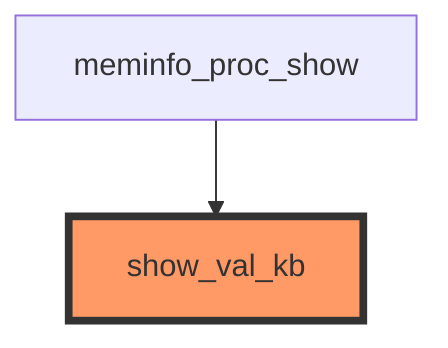

# Examples & Documentation Index

This directory contains example configurations, LLM-generated reports, and query examples for Kernel-GraphRAG Sentinel.

---

## 📁 Directory Structure

```
examples/
├── README.md                    # This file - comprehensive documentation index
├── analyze_ext4.yaml            # Example configuration for ext4 analysis
├── query_examples.md            # 30+ Neo4j Cypher query examples
├── show_val_kb-callgraph.md     # Example call graph visualization (Mermaid)
└── reports/                     # LLM-generated and rule-based reports
    ├── rule-based-report.md              # Non-LLM baseline (38 lines)
    ├── anthropic-claude-haiku-4-5-report.md  # Anthropic (203 lines)
    ├── openai-gpt5-nano-report.md        # OpenAI Nano (120 lines)
    ├── openai-gpt5-mini-report.md        # OpenAI Mini (171 lines)
    ├── openai-gpt5.2-report.md           # OpenAI 5.2 (156 lines)
    ├── gemini-3.0-flash-report.md        # Gemini Flash (43 lines)
    ├── gemini-3.0-pro-report.md          # Gemini 3.0 Pro (74 lines)
    ├── gemini-2.5-pro-report.md          # Gemini 2.5 Pro (88 lines)
    └── qwen3-vl-30b-report.md            # Ollama (150 lines)
```

---

## 📄 File Descriptions

### Visualization Examples

#### `show_val_kb-callgraph.md`
**Purpose:** Example call graph visualization in Mermaid format

**Contents:**
- Mermaid diagram showing callers of `show_val_kb`
- Analysis of the call graph structure
- Instructions for viewing and rendering
- Related commands for other export formats

**View this file:** See the rendered Mermaid diagram on GitHub/GitLab or in VS Code with Mermaid extension

### Configuration Examples

#### `analyze_ext4.yaml`
**Purpose:** Example YAML configuration for analyzing the ext4 filesystem subsystem

**Usage:**
```bash
python3 src/main.py --config examples/analyze_ext4.yaml pipeline fs/ext4
```

**Configuration:**
- Kernel root: `/workspaces/ubuntu/linux-6.13`
- Subsystem: `fs/ext4`
- LLM provider: `gemini` (gemini-2.0-flash-exp)
- Neo4j: `bolt://localhost:7687`
- Analysis depth: 3 hops

---

### LLM Provider Example Reports

All reports analyze the same function (`show_val_kb` from `fs/proc/meminfo.c`) to demonstrate differences between LLM providers.

**Location:** All reports are in `examples/reports/` directory

#### 0. `reports/rule-based-report.md` (Non-LLM Baseline)
**Provider:** Built-in analyzer (no LLM)
**Report Length:** 38 lines
**Generation Time:** <1 second
**Quality:** ⭐⭐⭐ Structured Data

**Highlights:**
- Instant generation (no API calls)
- Pure statistical analysis
- Call graph metrics
- Test coverage summary
- Baseline for LLM comparison

**Best for:** Quick checks, CI/CD pipelines, cost-free analysis

---

#### 1. `reports/anthropic-claude-haiku-4-5-report.md` ⭐ Recommended
**Provider:** Anthropic Claude
**Model:** claude-haiku-4-5
**Report Length:** 203 lines
**Generation Time:** ~18 seconds
**Quality:** ⭐⭐⭐⭐⭐ Excellent

**Highlights:**
- Best structured output with tables and checklists
- Risk assessment with severity ratings
- Detailed implementation phases with checkboxes
- Escalation criteria clearly defined
- Priority-based recommendations

**Best for:** Production documentation, team reviews, formal reports

---

#### 2. `reports/openai-gpt5-nano-report.md`
**Provider:** OpenAI
**Model:** gpt-5-nano-2025-08-07 (reasoning model)
**Report Length:** 120 lines
**Generation Time:** ~32 seconds
**Quality:** ⭐⭐⭐⭐ Good

**Highlights:**
- Comprehensive reasoning-based analysis
- Clear sectioning and organization
- Good actionable recommendations
- Appendix with key considerations

**Best for:** Teams using OpenAI, lightweight reasoning model

**Note:** Requires 16,384 max_completion_tokens for reasoning models

---

#### 2a. `reports/openai-gpt5-mini-report.md`
**Provider:** OpenAI
**Model:** gpt-5-mini (reasoning model)
**Report Length:** 171 lines
**Generation Time:** ~40 seconds
**Quality:** ⭐⭐⭐⭐⭐ Excellent

**Highlights:**
- Most comprehensive OpenAI report
- Detailed userland impact analysis
- Extensive testing recommendations
- Strong risk assessment
- Professional formatting

**Best for:** Production use, comprehensive analysis, thorough documentation

**Note:** Requires 16,384 max_completion_tokens for reasoning models

---

#### 2b. `reports/openai-gpt5.2-report.md`
**Provider:** OpenAI
**Model:** gpt-5.2 (latest reasoning model)
**Report Length:** 156 lines
**Generation Time:** ~38 seconds
**Quality:** ⭐⭐⭐⭐⭐ Excellent

**Highlights:**
- Latest GPT-5 model generation
- Detailed ABI stability analysis
- Scope of behavioral impact assessment
- Strong formatting change awareness
- Comprehensive testing strategy

**Best for:** Testing latest OpenAI models, production documentation

**Note:** Requires 16,384 max_completion_tokens for reasoning models

---

#### 3. `reports/gemini-3.0-flash-report.md`
**Provider:** Google Gemini
**Model:** gemini-3-flash-preview
**Report Length:** 43 lines
**Generation Time:** ~10 seconds
**Quality:** ⭐⭐⭐ Good

**Highlights:**
- Very fast generation
- Concise and focused
- Good for quick validation
- Free tier available

**Best for:** Rapid development, quick checks, batch processing

---

#### 4. `reports/gemini-3.0-pro-report.md`
**Provider:** Google Gemini
**Model:** gemini-3.0-pro-preview
**Report Length:** 74 lines
**Generation Time:** ~15 seconds
**Quality:** ⭐⭐⭐⭐ Very Good

**Highlights:**
- More detailed than Flash model
- Better structured analysis
- Higher quality reasoning
- Still relatively fast

**Best for:** Production use when speed and quality both matter

---

#### 5. `reports/gemini-2.5-pro-report.md`
**Provider:** Google Gemini
**Model:** gemini-2.5-pro-preview (experimental)
**Report Length:** 88 lines
**Generation Time:** ~18 seconds
**Quality:** ⭐⭐⭐⭐ Very Good

**Highlights:**
- Most comprehensive Gemini report
- Professional formatting
- Detailed risk assessment
- Latest experimental model

**Best for:** Testing cutting-edge Gemini models, comprehensive analysis

---

#### 6. `reports/qwen3-vl-30b-report.md`
**Provider:** Ollama (Local)
**Model:** qwen3-vl:30b
**Report Length:** 150+ lines
**Generation Time:** ~45 seconds
**Quality:** ⭐⭐⭐⭐ Good

**Highlights:**
- Unlimited usage (no API costs)
- Good quality reports
- Complete privacy (runs locally)
- No rate limits

**Best for:** Unlimited testing, privacy-sensitive analysis, batch processing

---

### Query Examples

#### `query_examples.md`
**Purpose:** Comprehensive collection of Neo4j Cypher queries for call graph analysis

**Contents:**
- 30+ example queries for different use cases
- CLI command examples
- Common analysis workflows
- Python API examples
- Advanced queries for subsystem analysis

**Categories:**
1. Basic queries (find functions, callers, callees)
2. Call chain analysis (multi-hop traversal)
3. Test coverage queries
4. Impact analysis queries
5. Subsystem statistics
6. Advanced patterns (leaf functions, entry points, circular dependencies)

---

## 📊 LLM Provider Comparison

Quick reference for choosing the right provider:

| Provider | Model | Lines | Time | Cost | Quality | Best For |
|----------|-------|-------|------|------|---------|----------|
| **Built-in** | rule-based | 38 | <1s | Free | ⭐⭐⭐ | CI/CD baseline |
| **Anthropic** | claude-haiku-4-5 | 203 | 18s | $0.001 | ⭐⭐⭐⭐⭐ | Production |
| **OpenAI** | gpt-5-nano | 120 | 32s | $0.0008 | ⭐⭐⭐⭐ | Lightweight |
| **OpenAI** | gpt-5-mini | 171 | 40s | $0.001 | ⭐⭐⭐⭐⭐ | Comprehensive |
| **OpenAI** | gpt-5.2 | 156 | 38s | $0.001 | ⭐⭐⭐⭐⭐ | Latest GPT |
| **Gemini** | gemini-3-flash | 43 | 10s | Free | ⭐⭐⭐ | Quick tests |
| **Gemini** | gemini-3.0-pro | 74 | 15s | Free | ⭐⭐⭐⭐ | Balanced |
| **Gemini** | gemini-2.5-pro | 88 | 18s | Free | ⭐⭐⭐⭐ | Latest Gemini |
| **Ollama** | qwen3-vl:30b | 150 | 45s | Free | ⭐⭐⭐⭐ | Unlimited |

---

## 📊 Call Graph Visualization

The `export-graph` command exports call graphs in multiple formats for visual analysis and documentation.

### Mermaid Format (GitHub/VS Code Compatible)

**Export to stdout:**
```bash
python3 src/main.py export-graph show_val_kb --format mermaid
```

**Output:**


**Save to file:**
```bash
python3 src/main.py export-graph show_val_kb --format mermaid -o callgraph.md
```

**View the diagram:**
- In GitHub: Include the .md file in your repository
- In VS Code: Install Mermaid extension and preview
- Online: Copy/paste to https://mermaid.live/

### Graphviz DOT Format (Professional Rendering)

**Export and render:**
```bash
# Export to DOT format
python3 src/main.py export-graph show_val_kb --format dot -o show_val_kb.dot

# Render to PNG (requires graphviz installed)
dot -Tpng show_val_kb.dot -o show_val_kb.png

# Render to SVG (scalable)
dot -Tsvg show_val_kb.dot -o show_val_kb.svg

# Render to PDF
dot -Tpdf show_val_kb.dot -o show_val_kb.pdf
```

**Install Graphviz:**
```bash
# Ubuntu/Debian
sudo apt-get install graphviz

# macOS
brew install graphviz
```

### JSON Format (Programmatic Analysis)

**Export structured data:**
```bash
python3 src/main.py export-graph show_val_kb --format json
```

**Output:**
```json
{
  "target_function": "show_val_kb",
  "nodes": [
    {
      "id": "meminfo_proc_show",
      "label": "meminfo_proc_show",
      "file": "fs/proc/meminfo.c",
      "subsystem": "unknown",
      "is_target": false
    },
    {
      "id": "show_val_kb",
      "label": "show_val_kb",
      "file": "fs/proc/meminfo.c",
      "subsystem": "unknown",
      "is_target": true
    }
  ],
  "edges": [
    {
      "source": "meminfo_proc_show",
      "target": "show_val_kb",
      "depth": 1,
      "type": "calls"
    }
  ],
  "stats": {
    "total_nodes": 2,
    "total_edges": 1,
    "unique_files": 1,
    "unique_subsystems": 1
  }
}
```

### Advanced Options

**Control graph depth:**
```bash
# Shallow graph (1 hop)
python3 src/main.py export-graph ext4_map_blocks --max-depth 1 --format mermaid

# Deep graph (5 hops)
python3 src/main.py export-graph ext4_map_blocks --max-depth 5 --format mermaid
```

**Filter by direction:**
```bash
# Only show callers (who calls this function)
python3 src/main.py export-graph show_val_kb --direction callers --format mermaid

# Only show callees (what this function calls)
python3 src/main.py export-graph ext4_map_blocks --direction callees --format mermaid

# Both directions (default)
python3 src/main.py export-graph show_val_kb --direction both --format mermaid
```

### LLM Reports with Embedded Diagrams

**Automatic Mermaid diagrams in LLM reports:**

When using the `--llm` flag, call graph visualizations are automatically embedded in the generated report:

```bash
python3 src/main.py analyze show_val_kb --llm --output report.md
```

The LLM receives the Mermaid diagram as context and includes it in the final report, providing visual context alongside the analysis.

---

## 🚀 Quick Start Examples

**Note:** All examples below use `show_val_kb` from `fs/proc/meminfo.c` as the demonstration function. This is the same function analyzed in all example reports in the `reports/` directory, making it easy to compare results across different LLM providers.

### Example 1: Basic Analysis with Standard Report

```bash
# Analyze a function without LLM (fast, structured output)
python3 src/main.py analyze show_val_kb --max-depth 3
```

### Example 2: AI-Powered Analysis with Anthropic

```bash
# Generate comprehensive AI report
LLM_PROVIDER=anthropic python3 src/main.py analyze show_val_kb --llm --output report.md
```

### Example 3: Quick Test with Gemini

```bash
# Fast AI report for quick validation
LLM_PROVIDER=gemini python3 src/main.py analyze show_val_kb --llm --max-depth 1
```

### Example 4: Unlimited Testing with Ollama

```bash
# Batch analyze multiple functions without API costs
LLM_PROVIDER=ollama
for func in ext4_map_blocks ext4_get_block ext4_free_blocks; do
    python3 src/main.py analyze $func --llm --output reports/${func}.md
done
```

### Example 5: Using Configuration File

```bash
# Use example configuration
python3 src/main.py --config examples/analyze_ext4.yaml analyze ext4_file_write_iter --llm
```

### Example 6: Complete Pipeline

```bash
# Full analysis: ingest + test mapping + analysis
python3 src/main.py pipeline fs/proc
python3 src/main.py analyze show_val_kb --llm --output show_val_kb_analysis.md
```

---

## 📖 Documentation Links

### Main Documentation (`/docs`)

1. **[architecture.md](../docs/architecture.md)** (1,200+ lines)
   - System architecture and design
   - Module breakdown (A, B, C)
   - Data flow diagrams
   - Technology stack details
   - Design decisions with rationales

2. **[neo4j_setup.md](../docs/neo4j_setup.md)** (700+ lines)
   - Neo4j installation guide
   - Database configuration
   - Performance tuning
   - Troubleshooting
   - Backup and restore procedures

3. **[macro_handling.md](../docs/macro_handling.md)** (800+ lines)
   - C preprocessor integration (gcc -E)
   - Kernel-specific macro challenges
   - Source mapping with #line directives
   - Performance considerations
   - Advanced topics and troubleshooting

4. **[llm_provider_guide.md](../docs/llm_provider_guide.md)** (643 lines)
   - Complete LLM provider configuration
   - Provider comparison (cost, quality, speed)
   - Rate limits and quotas
   - Troubleshooting common issues
   - Best practices and switching strategies

### Repository Documentation

- **[README.md](../README.md)** - Project overview, features, quick start
- **[requirements.txt](../requirements.txt)** - Python dependencies
- **.env.template** - Environment configuration template

---

## 🎯 Use Case Examples

### Use Case 1: Before Modifying a Function

**Goal:** Understand impact before changing code

```bash
# Step 1: Analyze with LLM for comprehensive report
python3 src/main.py analyze show_val_kb --llm --max-depth 3 --output pre_change_analysis.md

# Step 2: Review report sections:
# - Code affected
# - Tests to run
# - New tests needed
# - Risk assessment
# - Implementation recommendations

# Step 3: Make changes

# Step 4: Run recommended tests
cd /workspaces/ubuntu/linux-6.13
make -C tools/testing/selftests/proc
```

### Use Case 2: Assessing Test Coverage

**Goal:** Find critical functions without tests

```bash
# Step 1: Find most-called functions
python3 src/main.py top-functions --subsystem ext4 --min-callers 15

# Step 2: Check coverage for each
for func in $(python3 src/main.py top-functions --subsystem ext4 --limit 10 | awk '{print $2}'); do
    python3 src/main.py analyze $func --llm --output coverage_reports/${func}.md
done

# Step 3: Review reports for functions with "no test coverage" + HIGH/CRITICAL risk
```

### Use Case 3: Comparing LLM Providers

**Goal:** Evaluate which provider works best for your needs

```bash
# Analyze same function with all providers
function="show_val_kb"

LLM_PROVIDER=anthropic python3 src/main.py analyze $function --llm --output comparison/anthropic.md
LLM_PROVIDER=openai python3 src/main.py analyze $function --llm --output comparison/openai.md
LLM_PROVIDER=gemini python3 src/main.py analyze $function --llm --output comparison/gemini.md
LLM_PROVIDER=ollama python3 src/main.py analyze $function --llm --output comparison/ollama.md

# Compare results
ls -lh comparison/
wc -l comparison/*.md
diff comparison/anthropic.md comparison/openai.md
```

### Use Case 4: Multi-Subsystem Analysis

**Goal:** Analyze multiple kernel subsystems

```bash
# Ingest multiple subsystems
python3 src/main.py pipeline fs/ext4
python3 src/main.py pipeline fs/btrfs
python3 src/main.py pipeline fs/proc

# Cross-subsystem analysis
python3 src/main.py stats
python3 src/main.py top-functions --limit 50

# Analyze cross-subsystem dependencies
# (Use Neo4j Cypher queries from query_examples.md)
```

### Use Case 5: Call Graph Visualization for Documentation

**Goal:** Generate visual call graphs for documentation

```bash
# Export Mermaid diagram for GitHub/GitLab wikis
python3 src/main.py export-graph show_val_kb --format mermaid -o docs/callgraph-show_val_kb.md

# Export Graphviz DOT and render to PNG
python3 src/main.py export-graph ext4_map_blocks --format dot -o ext4_map_blocks.dot
dot -Tpng ext4_map_blocks.dot -o docs/ext4_map_blocks-callgraph.png

# Export JSON for custom web visualization
python3 src/main.py export-graph ext4_free_blocks --format json -o viz/ext4_free_blocks.json

# Generate deep call graph (5 hops)
python3 src/main.py export-graph ext4_mb_new_blocks --max-depth 5 --format mermaid -o docs/ext4_mb_new_blocks-deep.md

# Compare caller vs callee graphs
python3 src/main.py export-graph show_val_kb --direction callers --format dot -o show_val_kb-callers.dot
python3 src/main.py export-graph show_val_kb --direction callees --format dot -o show_val_kb-callees.dot
dot -Tpng show_val_kb-callers.dot -o docs/show_val_kb-callers.png
dot -Tpng show_val_kb-callees.dot -o docs/show_val_kb-callees.png
```

### Use Case 6: Batch Documentation Generation

**Goal:** Generate documentation for all critical functions

```bash
# Configure for unlimited usage
LLM_PROVIDER=ollama

# Get top 20 functions
top_funcs=$(python3 src/main.py top-functions --limit 20 --format json | jq -r '.[].name')

# Generate reports
mkdir -p documentation/
for func in $top_funcs; do
    echo "Analyzing $func..."
    python3 src/main.py analyze $func --llm --max-depth 3 --output documentation/${func}.md
done

# Create index
ls documentation/*.md > documentation/INDEX.txt
```

---

## 🔍 Example Report Sections

All LLM-generated reports include these sections (structure varies by provider):

1. **Executive Summary**
   - Function name and location
   - High-level impact overview
   - Risk level assessment

2. **Code Impact Analysis**
   - Direct callers and callees
   - Indirect dependencies
   - Public interface implications

3. **Testing Requirements**
   - Existing tests to run
   - Recommended new tests
   - Test coverage gaps

4. **Risk Assessment**
   - Risk level (LOW, MEDIUM, HIGH, CRITICAL)
   - Justification with evidence
   - Failure modes

5. **Implementation Recommendations**
   - Step-by-step implementation guide
   - Safety considerations
   - Rollback plan
   - Review checklist

---

## 📈 Report Quality Comparison

### Anthropic Claude Haiku (203 lines)

**Strengths:**
- Excellent table formatting
- Clear checkboxes for action items
- Comprehensive risk matrix
- Detailed implementation phases
- Explicit escalation criteria

**Example sections:**
- Executive Summary with risk badge (🔴 HIGH)
- Impact Analysis Table with severity ratings
- Mandatory Tests to Run (with bash commands)
- Risk Assessment Matrix
- Implementation Checklist (Before/During/After)
- Priority Action Table

### OpenAI gpt-5-nano (115 lines)

**Strengths:**
- Strong reasoning chains
- Good actionable steps
- Clear appendix with questions
- Well-organized sections

**Example sections:**
- Executive summary with key points
- Detailed code implications
- Test requirements (build, functional, regression)
- New tests recommendations
- Risk factors to monitor
- Actionable next steps

### Gemini Models Comparison

#### Gemini 3.0 Flash (43 lines)

**Strengths:**
- Fastest generation (~10s)
- Concise and focused
- Good for quick validation
- Free tier available

**Example sections:**
- Impact overview
- Key dependencies
- Testing strategy
- Risk summary
- Quick recommendations

#### Gemini 3.0 Pro (74 lines)

**Strengths:**
- Balanced speed and quality (~15s)
- More detailed analysis than Flash
- Better structured output
- Professional formatting

**Example sections:**
- Executive summary with risk assessment
- Detailed code impact analysis
- Testing requirements (existing and new)
- Risk level justification
- Implementation recommendations

#### Gemini 2.5 Pro (88 lines)

**Strengths:**
- Most comprehensive Gemini report
- Latest experimental model
- Detailed ABI/API stability analysis
- Professional formatting

**Example sections:**
- Comprehensive impact analysis
- Downstream impact (critical systems)
- Testing requirements with specifics
- Risk assessment with mitigation
- Implementation checklist

### Ollama qwen3-vl:30b (150 lines)

**Strengths:**
- Unlimited usage
- Good detail level
- No API costs
- Privacy-focused

**Example sections:**
- Comprehensive impact analysis
- Testing requirements
- Risk evaluation
- Implementation guidelines
- Follow-up actions

---

## 🛠️ Creating New Examples

### Generate a New Example Report

```bash
# 1. Choose your provider
export LLM_PROVIDER=anthropic  # or openai, gemini, ollama

# 2. Analyze a function
python3 src/main.py analyze <function_name> --llm --max-depth 3 --output examples/my_example.md

# 3. Add to this index if useful for others
```

### Example Report Naming Convention

```
<provider>-<model>-<function>-report.md
```

Examples:
- `anthropic-claude-haiku-ext4_map_blocks-report.md`
- `openai-gpt5-show_val_kb-report.md`
- `ollama-qwen3-btrfs_release_path-report.md`

---

## 💡 Tips and Best Practices

### For Development

1. **Use Ollama** for unlimited testing
   ```bash
   LLM_PROVIDER=ollama
   ```

2. **Use Gemini** for quick validation
   ```bash
   LLM_PROVIDER=gemini python3 src/main.py analyze <func> --llm --max-depth 1
   ```

### For Production

1. **Use Anthropic** for best quality
   ```bash
   LLM_PROVIDER=anthropic
   ```

2. **Save important analyses**
   ```bash
   python3 src/main.py analyze <critical_func> --llm --output critical_analysis.md
   ```

3. **Use deeper analysis for complex functions**
   ```bash
   python3 src/main.py analyze <complex_func> --llm --max-depth 5
   ```

### For Documentation

1. **Generate reports for all exported functions**
2. **Use consistent naming for report files**
3. **Include generation date and model in reports**
4. **Store reports in version control for team review**

---

## 📝 Contributing Examples

To contribute new examples:

1. Generate a useful analysis report
2. Use clear, descriptive naming
3. Add entry to this README
4. Submit pull request (if applicable)

---

## 🔗 Related Resources

### Internal Documentation
- [Architecture Documentation](../docs/architecture.md)
- [Neo4j Setup Guide](../docs/neo4j_setup.md)
- [Macro Handling Guide](../docs/macro_handling.md)
- [LLM Provider Guide](../docs/llm_provider_guide.md)

### External Resources
- [Neo4j Cypher Manual](https://neo4j.com/docs/cypher-manual/current/)
- [tree-sitter Documentation](https://tree-sitter.github.io/)
- [Linux Kernel Documentation](https://kernel.org/doc/)
- [KUnit Testing Framework](https://kernel.org/doc/html/latest/dev-tools/kunit/)

---

## 📊 Statistics

**Current examples:**
- Configuration files: 1
- Visualization examples: 1 (show_val_kb-callgraph.md with Mermaid diagram)
- Example reports: 10 total
  - 1 Rule-based (non-LLM) baseline
  - 9 LLM reports across 4 providers:
    - Anthropic: Claude Haiku 4-5 (1 model)
    - OpenAI: GPT-5 Nano, GPT-5 Mini, GPT-5.2 (3 models)
    - Gemini: 3.0 Flash, 3.0 Pro, 2.5 Pro (3 models)
    - Ollama: Qwen3-VL 30B (1 model)
- Query examples: 30+ Cypher queries
- Total documentation: 4,200+ lines

**Documentation coverage:**
- Main docs: 3,343 lines across 4 files
- Examples: 800+ lines
- README: Updated with Phase 7 visualization features

---

## ✅ Quick Checklist

Before running your first analysis:

- [ ] Neo4j is running (`sudo service neo4j status`)
- [ ] Kernel source is available (`ls $KERNEL_ROOT`)
- [ ] LLM provider is configured (check `.env`)
- [ ] Dependencies are installed (`pip install -r requirements.txt`)
- [ ] Test basic command: `python3 src/main.py version`
- [ ] Ingest a subsystem: `python3 src/main.py pipeline fs/ext4`
- [ ] Try standard analysis: `python3 src/main.py analyze show_val_kb`
- [ ] Try LLM analysis: `python3 src/main.py analyze show_val_kb --llm`

---

**Last Updated:** 2025-12-27
**Version:** v0.1.0
**Project:** Kernel-GraphRAG Sentinel - AI-Powered Linux Kernel Code Analysis
