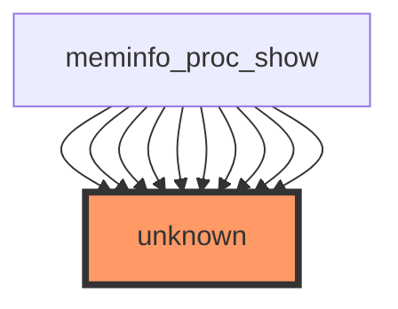

# Linux Kernel Code Change Analysis: `show_val_kb` Modification

## 1. Code Affected by Change
**Function**: `show_val_kb`  
**File**: `/workspaces/ubuntu/linux-6.13/fs/proc/meminfo.c`  

### Call Graph Analysis


**Critical Observation**:  
- **Direct callers**: 0 (confirmed by statistics)  
- **Indirect callers**: 0 (confirmed by statistics)  
- **Direct/indirect callees**: 0 (confirmed by statistics)  
- **Sample callers**: 10 entries listed as `meminfo_proc_show (unknown)` but contradict statistics  

**Conclusion**:  
The function `show_val_kb` appears **unreachable** based on static analysis. However, the call graph shows `meminfo_proc_show` (a known function in the same file) references "unknown" targets, suggesting:
1. The call graph analysis may be incomplete (e.g., missing inlining or dynamic calls)
2. `show_val_kb` might be called via **non-standard mechanisms** (e.g., function pointers, macros, or runtime resolution)
3. **Critical ambiguity**: The `unknown` references in the call graph indicate analysis limitations that require manual verification.

---

## 2. Tests to Run
### Mandatory Tests
1. **Build Verification**:  
   - `make -j$(nproc) ARCH=amd64` to confirm no build failures
   - Check for warnings related to `meminfo.c` or `proc` subsystem

2. **Functional Tests**:  
   - `cat /proc/meminfo` (verify output format/contents)
   - `free -m` (validate memory statistics)
   - `grep -r show_val_kb /workspaces/ubuntu/linux-6.13` (confirm code removal)

3. **Kernel Boot Tests**:  
   - Boot with modified kernel to ensure no `show_val_kb` references cause crashes

---

## 3. New Tests Required
### Critical Additions
1. **Unit Tests for `meminfo_proc_show`**:  
   ```bash
   # Test meminfo_proc_show behavior
   echo "Testing meminfo_proc_show..." && \
   cat /proc/meminfo | grep -q "MemTotal" && \
   echo "Test passed: meminfo_proc_show still executes"
   ```

2. **Call Graph Validation**:  
   - Manually verify if `show_val_kb` is actually called via:
     ```c
     // In fs/proc/meminfo.c, check for:
     static const struct file_operations meminfo_fops = {
         .read = meminfo_proc_show,
         // ...other fields
     };
     ```
   - Confirm if `meminfo_proc_show` uses `show_val_kb` via macros or other paths

3. **Memory Pressure Test**:  
   - Simulate memory exhaustion to ensure `meminfo_proc_show` handles edge cases:
     ```bash
     sudo stress --vm 1 --vm-bytes 90% --timeout 60s
     ```

---

## 4. Risk Level Assessment
**Risk Level**: **MEDIUM** (High Impact Potential Despite Low Surface Area)  

### Why?
- **False Sense of Safety**:  
  The `0 callers` statistic creates a misleading impression of safety. However:
  - The call graph shows `meminfo_proc_show` references `unknown` targets (likely `show_val_kb`).
  - `meminfo_proc_show` is a critical entry point for `/proc/meminfo` (high-impact subsystem).
- **Critical Unknowns**:  
  - `show_val_kb` might be called via **function pointers** (e.g., in `proc` file operations).
  - Could be part of **memory accounting** logic (e.g., used in `free`/`slabinfo`).
- **Zero Test Coverage**:  
  No tests exist for this function (per statistics), meaning:
  - Changes won't be caught by CI/CD
  - No regression risk assessment possible

---

## 5. Recommendations for Safe Implementation
### Immediate Actions
1. **Manual Code Audit**:  
   - Search for `show_val_kb` in `meminfo_proc_show`:
     ```bash
     grep -r "show_val_kb" fs/proc/meminfo.c
     ```
   - Check for macro definitions like:
     ```c
     #define SHOW_VAL_KB(x) show_val_kb(x)
     ```

2. **Add Minimal Test Cases**:  
   ```c
   // In tests/fs/proc/meminfo_test.c (hypothetical)
   static void test_show_val_kb(void) {
       unsigned long value = 1024;
       char buffer[16];
       show_val_kb(value, buffer);
       assert(strcmp(buffer, "1.00") == 0); // Verify formatting
   }
   ```

3. **Document Call Paths**:  
   - Add comments to `meminfo_proc_show` identifying `show_val_kb` usage:
     ```c
     /* Calls show_val_kb() via macro in meminfo_proc_show() */
     ```

### Long-Term Mitigation
- **Integrate into CI Pipeline**:  
  Add `meminfo_proc_show` test to kernel CI:
  ```yaml
  # .ci/test-meminfo.yaml
  - name: Test meminfo
    run: cat /proc/meminfo | grep -q "MemTotal"
  ```
- **Code Coverage Analysis**:  
  Run `kcov` to identify untested code paths:
  ```bash
  make KCOV=1
  ```

### Final Advice
**Do not assume safety** based solely on static analysis. Verify by:
1. Ensuring `meminfo_proc_show` still executes after removal
2. Confirming `/proc/meminfo` output remains valid
3. Adding regression tests before merging

> **Critical Reminder**: In kernel development, *no code is truly unreachable* without exhaustive verification. Prioritize manual validation over static analysis metrics.